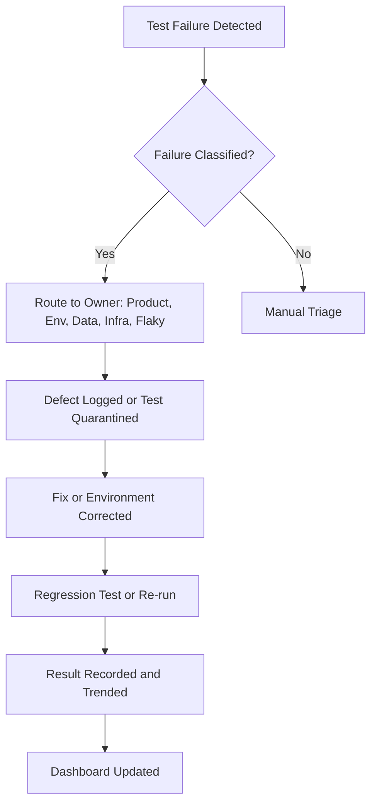
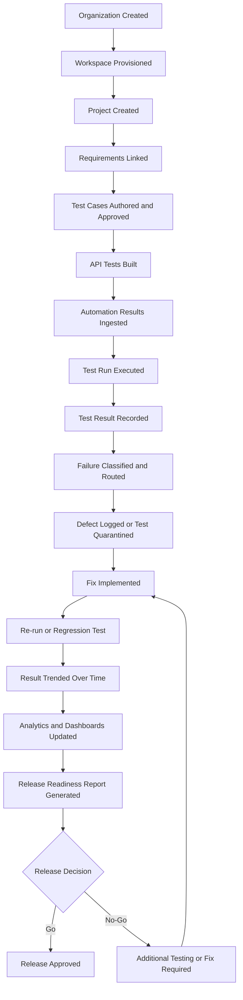
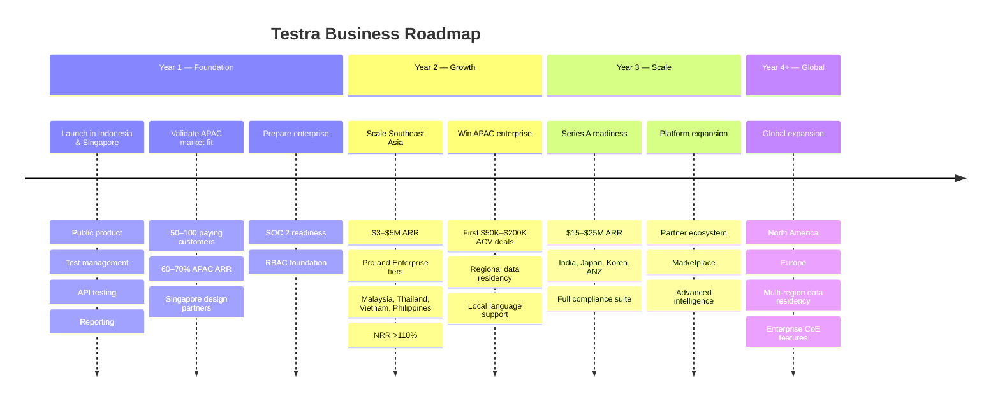

# Testra — Business Requirements Document (BRD)

**Version:** 1.0  
**Status:** Approved for Business Review  
**Document Owner:** Principal Business Analyst  
**Date:** July 2026  
**Classification:** Internal — Confidential

---

## Revision History

| Version | Date | Author | Description |
|---|---|---|---|
| 0.1 | July 2026 | Principal Business Analyst | Initial draft from approved Product Discovery |
| 0.2 | July 2026 | Principal Business Analyst | Stakeholder and requirements refinement |
| 1.0 | July 2026 | Principal Business Analyst | Approved BRD for implementation planning |

---

## Table of Contents

1. [Executive Summary](#1-executive-summary)
2. [Business Overview](#2-business-overview)
3. [Business Background](#3-business-background)
4. [Business Vision](#4-business-vision)
5. [Business Objectives](#5-business-objectives)
6. [Business Problems](#6-business-problems)
7. [Business Opportunities](#7-business-opportunities)
8. [APAC Market Strategy](#8-apac-market-strategy)
9. [Business Drivers](#9-business-drivers)
10. [Stakeholders](#10-stakeholders)
11. [Business Process Overview](#11-business-process-overview)
12. [Business Functional Requirements](#12-business-functional-requirements)
13. [Business Non-Functional Requirements](#13-business-non-functional-requirements)
14. [Business Rules](#14-business-rules)
15. [Business Constraints](#15-business-constraints)
16. [Assumptions](#16-assumptions)
17. [Dependencies](#17-dependencies)
18. [Business Risks](#18-business-risks)
19. [Risk Mitigation](#19-risk-mitigation)
20. [Business Success Metrics](#20-business-success-metrics)
21. [KPIs](#21-kpis)
22. [Acceptance Criteria](#22-acceptance-criteria)
23. [Business Glossary](#23-business-glossary)
24. [Business Workflow](#24-business-workflow)
25. [Business Roadmap](#25-business-roadmap)
26. [Appendix](#26-appendix)

---

## 1. Executive Summary

**Testra** is an Intelligent Quality Engineering Platform positioned to replace the fragmented collection of testing tools used by modern software teams. The business need is straightforward: engineering organizations waste significant time, budget, and institutional knowledge managing testing across disconnected point solutions. Quality signals arrive late, release decisions rely on incomplete data, and compliance evidence is assembled manually.

Testra unifies test management, API testing, automation result ingestion, defect tracking, reporting, and analytics in a single SaaS platform. By doing so, it reduces tool sprawl, shortens feedback loops, creates a single source of truth for quality, and generates actionable intelligence from historical test data — without dependence on external AI providers.

The business case targets mid-market SaaS companies and regulated enterprise verticals. Year 1 targets are $500K–$1M ARR, 50–100 paying customers, and a foundation for Series A growth. The platform is expected to deliver measurable returns through reduced engineering overhead, fewer production defects, faster release cycles, and defensible compliance documentation.

---

## 2. Business Overview

### 2.1 Product Identity

| Attribute | Description |
|---|---|
| **Product Name** | Testra |
| **Tagline** | One Platform. Every Test. |
| **Category** | Intelligent Quality Engineering Platform |
| **Delivery Model** | Cloud-native SaaS |
| **Primary Packaging** | Subscription tiers (Free, Starter, Pro, Enterprise) |
| **Geographic Focus** | APAC-first launch (Southeast Asia, India, East Asia); global scalability designed from inception; North America and Europe expansion in Year 3+ |

### 2.2 Business Context

Testra enters a market where the typical customer manages 4–7 separate testing tools. This fragmentation is not merely an operational nuisance; it is a measurable business cost reflected in slower release velocity, higher defect escape rates, duplicated effort, and weakened institutional memory. Testra's business model depends on consolidating these workflows into one platform, thereby capturing budget currently distributed across multiple vendors while delivering superior intelligence and user experience.

### 2.3 Strategic Position

Testra competes as a **platform consolidator** rather than a point solution. The strategic bet is that teams will prefer one unified quality platform over a stack of narrowly focused tools, provided the unified experience matches or exceeds the depth of each individual incumbent.

---

## 3. Business Background

### 3.1 Market Conditions

The global software testing market is valued at approximately $60B and growing at 14% CAGR. Automation, API testing, and test management subsegments are growing faster, driven by CI/CD adoption, microservices proliferation, and enterprise consolidation mandates. Despite this growth, the tooling landscape remains fragmented and largely unchanged for over a decade.

### 3.2 Why the Business Needs Testra Now

Several market forces converge to create a favorable entry window:

- **CI/CD is now mainstream.** Daily or hourly releases require quality signals at the same velocity.
- **QA is professionalizing.** Dedicated QA Engineering functions need professional-grade tooling, not spreadsheets.
- **CFOs are cutting tool sprawl.** Consolidation mandates create urgency for unified platforms.
- **Legacy tools are stagnant.** Incumbents were built for waterfall delivery and have not kept pace with modern workflows.
- **Shift-left testing demands tighter collaboration.** Developers and QA engineers need shared visibility earlier in the lifecycle.

### 3.3 Business History

Testra is a new venture. The Product Discovery phase validated problem-solution fit through market analysis, competitive review, and persona research. This BRD translates the approved Product Discovery into business requirements for implementation.

---

## 4. Business Vision

> **To become the single platform where every software team manages, executes, and understands their quality engineering — replacing the fragmented tools of the past with one intelligent, unified experience.**

### 4.1 Long-Term Business Vision

Testra envisions a market in which quality engineering is a continuous, data-driven discipline embedded throughout the software delivery lifecycle. Quality is no longer an afterthought or isolated function; it is a visible, measurable, and strategic capability supported by a single platform.

### 4.2 Business Mission

> **Testra's mission is to unify software testing — eliminating the tool sprawl that slows teams down — by delivering a modern, intelligent platform that makes quality engineering faster, clearer, and more impactful for every team.**

### 4.3 Strategic Value Proposition

For customers, Testra replaces multiple paid tools, reduces manual reporting, shortens release cycles, and produces audit-ready evidence. For Testra, the platform captures a larger share of customer testing budgets and creates switching costs through compounding data intelligence.

---

## 5. Business Objectives

### 5.1 Financial Objectives

| Timeframe | Objective | Target |
|---|---|---|
| Year 1 | Validate product-market fit and generate first revenue | $500K–$1M ARR |
| Year 2 | Scale mid-market revenue and close first enterprise deals | $3–$5M ARR |
| Year 3 | Achieve Series A readiness | $15–$25M ARR |
| Ongoing | Maintain healthy unit economics | <18 month payback period, >110% NRR |

### 5.2 Market Objectives

| Timeframe | Objective |
|---|---|
| Year 1 | Acquire 50–100 paying customers; establish 3–5 enterprise design partners |
| Year 2 | Launch Pro and Enterprise tiers; achieve first $50K+ ACV contracts |
| Year 3 | Expand to 3+ geographic markets; build partner ecosystem |

### 5.3 Operational Objectives

- Reduce customer testing tool count by at least 50% within six months of adoption.
- Reduce manual quality reporting effort by at least 40% for active users.
- Reduce average time-to-triage for test failures by at least 30%.
- Enable customers to generate compliance evidence packages in under one hour.

### 5.4 Strategic Objectives

| Objective | Rationale |
|---|---|
| Become the default QA platform for mid-market SaaS companies | Largest accessible segment with clear budget authority and fast sales cycles |
| Build deep enterprise capability for regulated industries | Highest ACV, strongest retention, and compliance-driven switching costs |
| Create network effects through team collaboration features | More users per account increases stickiness and expansion revenue |
| Establish Testra as the intelligence layer for quality | Proprietary quality models create a durable competitive moat |

---

## 6. Business Problems

### 6.1 Core Business Problem

> *There is no single platform purpose-built for the full spectrum of modern software testing. Teams are forced to assemble fragile, disconnected tool stacks — losing time, context, and confidence in quality at every handoff.*

### 6.2 Specific Business Problems

| Problem | Business Impact |
|---|---|
| **Tool Sprawl** | Teams subscribe to, manage, and train on 4–7 separate tools. Costs multiply. Context-switching reduces productivity. |
| **No Single Source of Truth for Quality** | Release decisions are made with incomplete, stale, or manually assembled data — increasing risk of poor decisions. |
| **Manual, Error-Prone Test Management** | Spreadsheets and duplicated test cases create rework, coverage gaps, and untracked changes. |
| **Unactionable Reporting** | Pass/fail reports describe what happened but not why, obscuring the next action. |
| **Slow Feedback Loops** | Every test failure requires manual triage, delaying releases and consuming engineering capacity. |
| **No Institutional Memory** | Testing knowledge walks out the door when team members leave. |
| **Quality Engineering is Undervalued** | QA teams cannot quantify their contribution, making them vulnerable to budget cuts. |
| **Compliance and Audit Challenges** | Regulated teams spend days or weeks assembling evidence from disconnected systems, increasing audit risk and cost. |

### 6.3 Problem Validation

The Product Discovery documented these problems through market research, persona analysis, and competitive review. They are not hypothetical; they are observable in the current tool stacks of target customers.

---

## 7. Business Opportunities

### 7.1 Market Opportunity

| Segment | Estimated Value (2025) | Growth Rate |
|---|---|---|
| Global Software Testing Market | ~$60B | ~14% CAGR |
| Test Automation Tools | ~$25B | ~18% CAGR |
| API Testing Market | ~$1.2B | ~22% CAGR |
| Test Management Software | ~$4B | ~12% CAGR |

### 7.2 Customer Opportunity

- **APAC Primary ICP (Year 1):** Southeast Asian mid-market SaaS, fintech, e-commerce, and logistics companies with 20–200 engineers and 3–30 QA engineers, currently using fragmented tools or outgrowing spreadsheets.
- **APAC Secondary ICP (Year 2):** Asia-Pacific engineering organizations in India, Japan, South Korea, and Australia/New Zealand with 50–500+ engineers, including IT services firms, product companies, and regional enterprises.
- **Global Long-Term ICP (Year 3+):** North American and European mid-market SaaS and regulated enterprises, entered after APAC product-market fit and references are established.
- **Entry Wedge:** Test management + API testing + reporting, which directly displaces the most common and least differentiated tools.

### 7.3 Revenue Opportunity

Consolidation economics create a compelling value story. A mid-market team spending $15K–$40K annually on fragmented testing tools can often justify a unified platform at a comparable or lower total cost while gaining intelligence features unavailable elsewhere.

### 7.4 Differentiation Opportunity

No incumbent occupies the unified, intelligence-rich platform position. Direct competitors are either narrow point solutions or broad but low-intelligence legacy platforms. Testra has an opportunity to own the top-right quadrant: **broad scope with high intelligence and modern user experience**.

---

## 8. APAC Market Strategy

### 8.1 Why Asia-Pacific Is the Initial Target Market

Testra will launch as an APAC-first business while retaining global scalability from day one. The Asia-Pacific region offers a favorable combination of growth, openness to cloud SaaS, and relative under-penetration by entrenched testing-tool incumbents. Starting in APAC allows Testra to:

- Capture growth in the world's fastest-expanding software markets before global incumbents localize.
- Build reference customers in high-growth SaaS and fintech economies.
- Validate the product in markets with diverse collaboration preferences, compliance regimes, and languages, which hardens the platform for later global expansion.
- Establish local brand presence and partnerships before North American and European competitors turn their attention to the region.
- Benefit from a large, mobile-first, API-driven software economy where quality engineering is professionalizing rapidly but tooling remains fragmented.

### 8.2 Market Opportunity

| Market Segment | Estimated Value / Growth | Relevance to Testra |
|---|---|---|
| Asia-Pacific Software Testing Market | Growing faster than global average (~16–18% CAGR) | Large, under-penetrated opportunity for unified QA platforms |
| Southeast Asia SaaS Ecosystem | Rapid expansion in fintech, e-commerce, logistics, and proptech | Primary ICP density for mid-market, automation-first teams |
| India IT Services and Product Engineering | Massive QA workforce, strong automation adoption, volume-rich | Secondary market for mid-market and services-led adoption |
| North Asia Enterprise Digital Transformation | Japan and South Korea enterprises modernizing legacy QA and adopting cloud | Long-term enterprise expansion target |

### 8.3 Software Industry Growth Drivers

- **Digital-first economy:** APAC accounts for a significant share of global internet users and mobile-first consumers, driving continuous software investment.
- **Startup funding:** Southeast Asia, India, and South Korea continue to produce well-funded B2B and consumer technology companies that need modern engineering tooling.
- **Remote and distributed engineering:** APAC teams are often distributed across cities and countries, increasing the need for a single source of truth for quality.
- **API-first architecture:** Fintech, e-commerce, and logistics platforms in APAC are predominantly API-driven, creating strong demand for native API testing.
- **Enterprise digital transformation:** Banks, insurers, telecoms, and government agencies across APAC are modernizing legacy systems and adopting agile, DevOps, and cloud practices.

### 8.4 Startup Ecosystem

| Region | Characteristics | Testra Fit |
|---|---|---|
| Indonesia | Largest economy in Southeast Asia; vibrant fintech, e-commerce, and SME SaaS; growing engineering hubs in Jakarta and Bandung | Strong mid-market SaaS fit; localization and mobile-first UX important |
| Singapore | Mature startup ecosystem, strong fintech, deep tech, and B2B SaaS; English-speaking; regional HQ for many companies | Ideal launch market; high willingness to pay; referenceable logos |
| Malaysia | Growing tech sector; strong government digital initiatives; multilingual workforce | Mid-market opportunity; cost-conscious but quality-aware |
| Thailand | Expanding e-commerce, travel tech, and banking; Bangkok as regional hub | Good mid-market fit; emerging enterprise demand |
| Vietnam | Rapidly maturing engineering talent; strong outsourcing and product companies; cost-sensitive | High-volume, PLG-friendly market |
| Philippines | Large BPO and IT services sector; growing startup scene; English-speaking | Services-led and mid-market SaaS opportunity |
| India | Massive engineering base; strong test automation culture; price-sensitive; large services and product mix | Volume market; land-and-expand via teams and services partnerships |
| Japan | Conservative but massive enterprise market; aging legacy tools; cloud adoption accelerating | Long-term enterprise target; requires deep localization and trust |
| South Korea | Advanced technology sector; strong gaming, fintech, and manufacturing software; high quality standards | Mid-market and enterprise opportunity; requires local language and support |

### 8.5 Enterprise Adoption

Enterprise adoption in APAC is accelerating as:

- Regional banks, insurers, and telecommunications companies pursue digital transformation.
- Governments in Singapore, Indonesia, Malaysia, and Thailand invest in digital infrastructure and smart-nation initiatives.
- Multinational corporations base regional shared-services centers in APAC, creating demand for standardized tooling across countries.
- Compliance expectations (PDPA, PDP Law, etc.) are maturing, making audit-ready quality platforms more attractive.
- Enterprises seek to consolidate tooling to reduce vendor management overhead and improve cross-border visibility.

### 8.6 Digital Transformation Trends

| Trend | Business Implication for Testra |
|---|---|
| Cloud-first strategies | Reduces on-premise bias; accelerates SaaS adoption |
| API-first architectures | Increases need for native API testing and service connectivity |
| Agile and DevOps adoption | Creates demand for CI/CD-integrated quality signals |
| Quality engineering centers of excellence | Creates demand for cross-team governance dashboards |
| Data sovereignty awareness | Requires regional data residency options |
| Remote and hybrid teams | Increases need for a single, accessible quality platform |

### 8.7 Regional Business Considerations

#### Indonesia

| Factor | Consideration |
|---|---|
| Enterprise software adoption | Growing rapidly in fintech, e-commerce, and government; procurement becoming more professional |
| QA maturity | Mixed; leading companies have dedicated QA, many still rely on manual testing and spreadsheets |
| Cloud adoption | Strong public-cloud growth; data sovereignty concerns increasing under PDP Law |
| Compliance expectations | Personal Data Protection Law (PDP Law) requires lawful data handling; evidence of process control valued |
| Preferred collaboration tools | WhatsApp, Slack, Microsoft Teams, Lark |
| Localization needs | Bahasa Indonesia UI, local billing methods, mobile-first behavior, regional support hours |

#### Singapore

| Factor | Consideration |
|---|---|
| Enterprise software adoption | Very high; regional HQ for global and local enterprises |
| QA maturity | Mature in financial services and SaaS; automation adoption high |
| Cloud adoption | Near-universal; strong trust in SaaS with proper security credentials |
| Compliance expectations | PDPA, MAS TRM, and sector-specific standards; SOC 2 and ISO 27001 expected |
| Preferred collaboration tools | Slack, Microsoft Teams, email |
| Localization needs | English sufficient; SGD billing; APAC business hours support; strong security documentation |

#### Malaysia

| Factor | Consideration |
|---|---|
| Enterprise software adoption | Growing, especially in banking, government, and Islamic finance |
| QA maturity | Improving; larger enterprises have formal QA, mid-market catching up |
| Cloud adoption | Accelerating with government cloud policies |
| Compliance expectations | Malaysia PDPA, BNM guidelines for financial services |
| Preferred collaboration tools | Microsoft Teams, WhatsApp, Slack |
| Localization needs | Malay and English support; MYR billing; awareness of local holidays and business hours |

#### Thailand

| Factor | Consideration |
|---|---|
| Enterprise software adoption | Strong in banking, retail, and telecom; Bangkok startup ecosystem growing |
| QA maturity | Moderate; financial services lead, startups often less formal |
| Cloud adoption | Growing steadily; some regulatory caution |
| Compliance expectations | PDPA (Thailand) in effect; sector regulators increasing oversight |
| Preferred collaboration tools | LINE, Microsoft Teams, Slack |
| Localization needs | Thai language UI important for broad adoption; THB billing; LINE integration for notifications |

#### Vietnam

| Factor | Consideration |
|---|---|
| Enterprise software adoption | Growing product companies and outsourcing firms; enterprise less mature |
| QA maturity | Strong in outsourcing; product companies maturing quickly |
| Cloud adoption | Strong among tech companies; some enterprise caution |
| Compliance expectations | Cybersecurity Law and Decree 13 on personal data protection; evolving |
| Preferred collaboration tools | Zalo, Slack, Microsoft Teams |
| Localization needs | Vietnamese UI for broad adoption; VND billing; cost-sensitive packaging; local partnerships |

#### Philippines

| Factor | Consideration |
|---|---|
| Enterprise software adoption | Strong BPO and IT services sector; enterprise modernization underway |
| QA maturity | Services sector has mature QA; domestic SaaS less formal |
| Cloud adoption | Growing, especially in services and offshore delivery centers |
| Compliance expectations | Data Privacy Act of 2012; clients often require SOC 2 evidence |
| Preferred collaboration tools | Microsoft Teams, Slack, Viber |
| Localization needs | English widely used; PHP billing; support for offshore working hours |

#### India

| Factor | Consideration |
|---|---|
| Enterprise software adoption | Massive; mix of global enterprises, domestic conglomerates, and product startups |
| QA maturity | High in IT services and product companies; automation skills widely available |
| Cloud adoption | Strong and accelerating across enterprises and startups |
| Compliance expectations | DPDP Act 2023; sector regulators such as RBI and SEBI; SOC 2 increasingly expected |
| Preferred collaboration tools | Slack, Microsoft Teams, Google Chat |
| Localization needs | English sufficient for business users; INR billing; price-sensitive tiers; local support channels |

#### Japan

| Factor | Consideration |
|---|---|
| Enterprise software adoption | Very high, but conservative; incumbent relationships are sticky |
| QA maturity | High, but often process-heavy and reliant on legacy tooling |
| Cloud adoption | Accelerating; SaaS acceptance improving among younger companies |
| Compliance expectations | Stringent; industry-specific standards, APPI for privacy, strong audit culture |
| Preferred collaboration tools | Slack, Microsoft Teams, LINE Works, Chatwork |
| Localization needs | Japanese UI mandatory; JPY billing; local sales and support; formal security reviews |

#### South Korea

| Factor | Consideration |
|---|---|
| Enterprise software adoption | High in technology, gaming, finance, and manufacturing |
| QA maturity | High; strong engineering quality culture; automation common |
| Cloud adoption | Strong in tech sector; enterprise and government gradually moving |
| Compliance expectations | PIPA; sector-specific requirements; high expectations for security and reliability |
| Preferred collaboration tools | KakaoTalk (enterprise), Slack, Microsoft Teams, Jandi |
| Localization needs | Korean UI important; KRW billing; local support hours; integration with local tools |

### 8.8 Target Customers

Testra's go-to-market sequencing is deliberately APAC-first while the platform architecture supports global scalability from inception.

#### Primary Market — Southeast Asia

| Attribute | Detail |
|---|---|
| **Countries** | Indonesia, Singapore, Malaysia, Thailand, Vietnam, Philippines |
| **Company Profile** | Growth-stage and mid-market SaaS, fintech, e-commerce, logistics, proptech |
| **Engineering Team** | 20–200 engineers |
| **QA Team Size** | 3–30 QA engineers |
| **Key Pain** | Tool fragmentation, manual reporting, no unified quality visibility, cost sensitivity |
| **Buying Trigger** | Team growth, new QA lead hire, compliance readiness, digital transformation |
| **Go-to-Market** | Product-led growth supported by inside sales and local partnerships |

#### Secondary Market — Asia-Pacific

| Attribute | Detail |
|---|---|
| **Countries** | India, Japan, South Korea, Australia, New Zealand |
| **Company Profile** | Mature product companies, IT services firms, regional enterprises, multinational subsidiaries |
| **Engineering Team** | 50–500+ engineers |
| **QA Team Size** | 10–100 QA engineers |
| **Key Pain** | Legacy tool modernization, compliance documentation, cross-team standardization, automation ROI |
| **Buying Trigger** | Tool consolidation mandate, regulatory audit, regional CoE initiative |
| **Go-to-Market** | Inside sales and solutions engineering; local partners in Japan and Korea |

#### Long-Term Market — North America and Europe

| Attribute | Detail |
|---|---|
| **Timing** | Year 3 onward, after APAC product-market fit and enterprise references are established |
| **Company Profile** | Mid-market SaaS and regulated enterprises |
| **Key Pain** | Same global problems: tool sprawl, compliance, slow feedback loops |
| **Rationale for Delay** | Incumbents are stronger; APAC-first builds revenue, references, and localization muscle before direct competition |
| **Entry Strategy** | Land via distributed teams of APAC-headquartered multinationals; expand to local customers |

### 8.9 Business Localization Requirements

Localization is a business requirement because it directly affects adoption, sales conversion, and retention in APAC markets. Testra must be architected so that localization can be rolled out market by market without re-platforming.

| Requirement | Business Rationale | Markets Most Affected |
|---|---|---|
| **Multi-language support** | UI must support Bahasa Indonesia, Thai, Vietnamese, Japanese, Korean, and Simplified Chinese in future releases to reach non-English-first users. | Indonesia, Thailand, Vietnam, Japan, Korea |
| **Time zone awareness** | Scheduling, run history, audit timestamps, and support SLAs must display in the user's local time zone. | All APAC markets |
| **Regional holidays** | Release calendars, SLA clocks, and support availability must account for local public holidays. | All APAC markets |
| **Currency localization** | Billing must be offered in local currencies (IDR, SGD, MYR, THB, VND, PHP, INR, JPY, KRW, USD) to reduce procurement friction. | All APAC markets |
| **Date and time formatting** | Localized date/time formats reduce user friction and demonstrate regional commitment. | All APAC markets |
| **Number formatting** | Number, percentage, and decimal conventions must match local expectations. | All APAC markets |
| **Local communication integrations** | Notifications should integrate with regionally dominant tools (e.g., LINE, Zalo, KakaoTalk, Lark) where commercially viable. | Thailand, Vietnam, Korea, Indonesia |
| **Local support channels** | In-app support, documentation, and customer success must be available in local languages and business hours as markets mature. | Japan, Korea, Indonesia, Thailand, Vietnam |

### 8.10 Regional Compliance Considerations

Compliance in APAC is discussed at the business level as a go-to-market enabler, not a technical implementation specification. Testra must be able to satisfy regional data-protection and evidence requirements to sell into regulated APAC customers.

| Region / Regulation | Business Requirement |
|---|---|
| **Singapore PDPA** | Personal data must be handled in accordance with Singapore's data protection principles; customers must be able to fulfill consent, access, and correction obligations. |
| **Indonesia PDP Law** | Personal data protection requirements must be addressed; data localization preferences may influence hosting strategy for Indonesian customers. |
| **Malaysia PDPA** | Similar consent, purpose-limitation, and security requirements must be supported in customer agreements and data practices. |
| **Thailand PDPA** | Customer data subject rights and breach-notification obligations must be supported. |
| **India DPDP Act 2023** | Consent-based data processing and data principal rights must be accommodated for Indian customers. |
| **Japan APPI** | Personal information handling must align with Japan's Act on the Protection of Personal Information for enterprise deals. |
| **South Korea PIPA** | Privacy protections and data-handling practices must satisfy PIPA expectations. |
| **GDPR Readiness** | Although APAC-first, Testra must maintain GDPR-ready data practices to support European customers and multinational APAC subsidiaries without re-architecture. |
| **SOC 2 Readiness** | SOC 2 Type II remains a baseline expectation for enterprise customers across all APAC markets and must be completed before enterprise sales scale. |

### 8.11 APAC Go-to-Market Approach

| Phase | Markets | Focus |
|---|---|---|
| **Phase 1 — Launch** | Indonesia, Singapore | Validate product-market fit, build reference customers, establish localized sales motion |
| **Phase 2 — Expansion** | Malaysia, Thailand, Vietnam, Philippines | Scale PLG and inside sales; build local partnerships |
| **Phase 3 — APAC Depth** | India, Japan, South Korea, Australia/New Zealand | Enter larger markets with tailored localization and enterprise capability |
| **Phase 4 — Global** | North America, Europe | Leverage APAC traction and product maturity to compete in incumbent-heavy markets |

---

## 9. Business Drivers

### 9.1 Internal Business Drivers

| Driver | Rationale |
|---|---|
| Revenue Growth | Build a scalable, recurring revenue SaaS business with expansion potential |
| Market Positioning | Establish Testra as the category leader for unified quality engineering |
| Customer Retention | Create switching costs through data accumulation and team collaboration |
| Operational Efficiency | Deliver a platform that replaces multiple tools, reducing customer churn risk from fragmented alternatives |
| Investor Readiness | Demonstrate product-market fit, revenue traction, and enterprise credibility for Series A |

### 9.2 External Business Drivers

| Driver | Rationale |
|---|---|
| Tool Consolidation Mandates | CFOs and Engineering VPs are actively reducing SaaS vendor count |
| CI/CD Velocity | Faster release cycles require faster, more integrated quality signals |
| Regulatory Pressure | Financial services, healthcare, and government require documented quality evidence |
| QA Professionalization | Dedicated QA Engineering functions demand modern, purpose-built tooling |
| Remote and Distributed Teams | Need for a single, accessible source of truth across locations and time zones |

### 9.3 Customer Business Drivers

| Driver | Rationale |
|---|---|
| Reduce Tool Spend | Eliminate redundant subscriptions and overlapping tools |
| Ship Faster with Confidence | Shorten the path from code change to quality signal |
| Reduce Production Defects | Improve coverage visibility and failure triage |
| Demonstrate QA Value | Quantify QA team contribution to leadership |
| Pass Audits Efficiently | Produce traceability and evidence with minimal manual effort |

---

## 10. Stakeholders

### 10.1 Stakeholder Matrix

| Stakeholder | Influence | Interest | Primary Concern |
|---|---|---|---|
| Executive (CEO/CTO) | High | High | Revenue, strategic positioning, market timing |
| QA Lead | High | High | Team productivity, quality visibility, career advocacy |
| QA Engineer | Medium | High | Daily usability, test organization, defect workflow |
| Automation Engineer | Medium | High | CI/CD integration, flaky test detection, result ingestion |
| Developer | Medium | Medium | Fast feedback, clear failure ownership, minimal workflow friction |
| DevOps | Medium | Medium | Pipeline integration, reliability, operational overhead |
| Engineering Manager | High | High | Release confidence, team metrics, budget justification |
| System Administrator | Medium | High | Access control, provisioning, audit logs, data security |
| Enterprise Customer | High | High | Compliance, security, support, contract terms |
| Compliance Team | Medium | High | Traceability, audit evidence, data retention |
| Support Team | Low | Medium | Customer onboarding, issue escalation, renewal support |
| Sales Team | High | High | Competitive positioning, proof points, deal velocity |
| Investor | High | High | Traction, market size, moat, path to scale |

### 10.2 Detailed Stakeholder Profiles

#### Executive (CEO / CTO)

| Item | Description |
|---|---|
| **Responsibilities** | Define company strategy, allocate capital, build investor confidence, hire leadership |
| **Goals** | Build a category-defining business, achieve Series A metrics, maintain product vision integrity |
| **Pain Points** | Unclear product-market fit, long enterprise sales cycles, burn rate vs. revenue trajectory |
| **Success Criteria** | Revenue growth, retention, customer logos, competitive wins, product differentiation |
| **Influence Level** | High |
| **Interest Level** | High |

#### QA Lead

| Item | Description |
|---|---|
| **Responsibilities** | Own test strategy, manage QA team, report quality health, advocate for resources |
| **Goals** | Build reliable test suites, demonstrate QA value, reduce release-blocking defects |
| **Pain Points** | 30%+ of time spent reporting and coordination; no unified quality dashboard; difficulty proving impact |
| **Success Criteria** | Live quality health dashboard; automated test runs in CI/CD; clear defect trend data |
| **Influence Level** | High |
| **Interest Level** | High |

#### QA Engineer

| Item | Description |
|---|---|
| **Responsibilities** | Execute test plans, log defects, maintain test cases, track coverage |
| **Goals** | Work efficiently, reduce duplicate effort, advance technical skills |
| **Pain Points** | Test cases scattered across tools; no traceability; repetitive defect logging |
| **Success Criteria** | Organized test cases, fast defect logging, personal progress visibility |
| **Influence Level** | Medium |
| **Interest Level** | High |

#### Automation Engineer

| Item | Description |
|---|---|
| **Responsibilities** | Build and maintain automated test suites, integrate with CI/CD, analyze failures |
| **Goals** | Fast, reliable suites; reduced flaky tests; seamless pipeline integration |
| **Pain Points** | Flaky tests waste time; no failure classification; test results buried in CI logs |
| **Success Criteria** | All automated results visible in one place; flaky tests automatically identified; failures linked to defects |
| **Influence Level** | Medium |
| **Interest Level** | High |

#### Developer

| Item | Description |
|---|---|
| **Responsibilities** | Ship features, maintain code quality, fix defects, participate in code review |
| **Goals** | Fast feedback on changes, clear ownership of failures, minimal workflow disruption |
| **Pain Points** | Test results not surfaced in their workflow; unclear which tests cover their changes |
| **Success Criteria** | Test results surfaced in PRs; API tests runnable locally; clear ownership of failures |
| **Influence Level** | Medium |
| **Interest Level** | Medium |

#### DevOps

| Item | Description |
|---|---|
| **Responsibilities** | Maintain CI/CD pipelines, infrastructure, release automation, observability |
| **Goals** | Reliable pipelines, minimal operational overhead, clear incident signals |
| **Pain Points** | Fragile integrations, alert fatigue, tooling that adds operational burden |
| **Success Criteria** | Test results flow automatically from pipelines; integrations are stable; minimal maintenance |
| **Influence Level** | Medium |
| **Interest Level** | Medium |

#### Engineering Manager

| Item | Description |
|---|---|
| **Responsibilities** | Lead engineering delivery, make release decisions, manage team performance, report upward |
| **Goals** | Confident release decisions, fewer incidents, demonstrable engineering reliability |
| **Pain Points** | Quality data arrives late; no single dashboard; cannot measure QA ROI |
| **Success Criteria** | Real-time quality health dashboard; trend data on defect rates and coverage; go/no-go release signals |
| **Influence Level** | High |
| **Interest Level** | High |

#### System Administrator

| Item | Description |
|---|---|
| **Responsibilities** | Provision users, manage access, enforce security policies, support audit requests |
| **Goals** | Secure access, compliant configuration, efficient user lifecycle management |
| **Pain Points** | Manual user provisioning; lack of audit trails; weak access controls |
| **Success Criteria** | SSO/SAML works; roles and permissions are granular; audit logs are exportable |
| **Influence Level** | Medium |
| **Interest Level** | High |

#### Enterprise Customer

| Item | Description |
|---|---|
| **Responsibilities** | Procure and deploy software at scale; manage vendor risk; ensure regulatory adherence |
| **Goals** | Reduce vendor count, pass audits, secure sensitive data, obtain reliable support |
| **Pain Points** | Procurement complexity, compliance documentation burden, vendor lock-in risk |
| **Success Criteria** | SOC 2 evidence, SSO, data residency options, SLA, dedicated support, audit-ready exports |
| **Influence Level** | High |
| **Interest Level** | High |

#### Compliance Team

| Item | Description |
|---|---|
| **Responsibilities** | Ensure testing evidence meets regulatory and internal policy requirements |
| **Goals** | Audit-ready traceability, documented test execution, attributable actions |
| **Pain Points** | Manual evidence assembly; missing timestamps; inconsistent documentation |
| **Success Criteria** | Traceability matrices, timestamped audit trails, structured evidence export |
| **Influence Level** | Medium |
| **Interest Level** | High |

#### Support Team

| Item | Description |
|---|---|
| **Responsibilities** | Onboard customers, resolve issues, escalate product feedback, support renewals |
| **Goals** | High customer satisfaction, fast resolution, strong renewal signals |
| **Pain Points** | Complex onboarding, unclear escalation paths, limited visibility into customer health |
| **Success Criteria** | >90% CSAT, <24 hour first response, clear health signals for renewals |
| **Influence Level** | Low |
| **Interest Level** | Medium |

#### Sales Team

| Item | Description |
|---|---|
| **Responsibilities** | Acquire customers, expand accounts, build pipeline, communicate value |
| **Goals** | Hit quota, shorten sales cycles, win competitive deals, increase ACV |
| **Pain Points** | Displacing entrenched tools, enterprise procurement delays, missing enterprise proof points |
| **Success Criteria** | Competitive win rate, shorter sales cycles, enterprise references, healthy pipeline |
| **Influence Level** | High |
| **Interest Level** | High |

#### Investor

| Item | Description |
|---|---|
| **Responsibilities** | Provide capital, evaluate strategy, support governance, assess growth |
| **Goals** | Return on investment, market leadership, disciplined growth, exit potential |
| **Pain Points** | Unclear differentiation, slow traction, excessive burn, weak moat |
| **Success Criteria** | Strong ARR growth, high retention, expanding TAM, clear path to category leadership |
| **Influence Level** | High |
| **Interest Level** | High |

---

## 11. Business Process Overview

### 11.1 Current-State Process: Fragmented Quality Workflow

Today, a typical QA team operates across multiple disconnected tools:

**Business problems in the current state:**

- Handoffs between tools create data loss and delay.
- No one view shows whether a release is ready.
- Failure triage is manual and repetitive.
- Compliance evidence requires days of manual assembly.

### 11.2 Future-State Process: Unified Quality Workflow with Testra

With Testra, the same team works within one platform:

### 11.3 Business Process Change Summary

| Activity | Before Testra | After Testra |
|---|---|---|
| Test case management | Spreadsheets / legacy tools | Unified, searchable, versioned repository |
| API testing | Separate API client | Native API testing integrated with test management |
| Automation results | Buried in CI logs | Ingested, linked to test cases, trended over time |
| Failure triage | Manual, inconsistent | Classified, prioritized, routed to the right owner |
| Reporting | Manually assembled | Real-time, role-appropriate dashboards |
| Compliance evidence | Days of manual export | One-click audit-ready packages |
| Release readiness | Gut feel | Data-driven recommendation |

### 11.4 Key Business Process Flow: From Test Failure to Resolution

---

## 12. Business Functional Requirements

### 12.1 Requirement Format

Each requirement is stated at the business level and includes:

- **ID:** Unique business requirement identifier
- **Description:** What the business needs the product to do
- **Business Goal:** Why the business needs it
- **Business Value:** Expected outcome
- **Priority:** Must-have / Should-have / Could-have
- **Success Metric:** How to measure success

### 12.2 Business Functional Requirements

| ID | Description | Business Goal | Business Value | Priority | Success Metric |
|---|---|---|---|---|---|
| **BFR-001** | Provide a unified repository to create, organize, version, and search test cases and test suites. | Eliminate fragmented test case storage and reduce reliance on spreadsheets. | Higher QA productivity, stronger data foundation for analytics, reduced churn. | Must-have | >80% of active accounts store and manage test cases in Testra within 30 days. |
| **BFR-002** | Support manual test execution cycles with pass/fail recording, evidence capture, and step-by-step guidance. | Make Testra the daily workspace for manual QA engineers. | Increased weekly active users and daily engagement. | Must-have | >60% of QA engineer users execute at least one manual test run per week. |
| **BFR-003** | Provide native API testing capabilities for REST, GraphQL, and SOAP endpoints. | Replace standalone API testing tools and capture that budget. | Higher feature adoption breadth, displacement of Postman. | Must-have | >50% of accounts create at least one API test within the first month. |
| **BFR-004** | Allow teams to define environments and variables that can be reused across tests. | Reduce configuration errors and increase stickiness. | Higher test reliability, deeper platform integration. | Must-have | >70% of API test accounts configure at least two environments. |
| **BFR-005** | Ingest automated test results from major frameworks (e.g., Playwright, Cypress, Selenium, JUnit, Pytest). | Become the central destination for all test results regardless of framework. | Higher engagement from automation-heavy teams, faster adoption. | Must-have | >50% of automation-heavy accounts connect at least one automation result source. |
| **BFR-006** | Integrate with common CI/CD pipelines so test results flow automatically into Testra. | Remove manual effort and ensure results are always current. | Faster feedback loops, higher enterprise credibility. | Must-have | >60% of enterprise accounts have at least one CI/CD integration active. |
| **BFR-007** | Log, track, and manage defects natively, with optional synchronization to Jira, Linear, or GitHub Issues. | Reduce context switching and keep QA workflows inside Testra. | Higher user engagement, fewer lost defects. | Must-have | >70% of failed tests result in a logged defect or documented disposition. |
| **BFR-008** | Link test cases to requirements or user stories and generate traceability reports. | Satisfy compliance and audit requirements. | Unlock regulated verticals, justify enterprise pricing. | Must-have | >80% of enterprise accounts produce at least one traceability report per quarter. |
| **BFR-009** | Provide real-time, role-appropriate quality dashboards. | Give leadership and QA leads an at-a-glance view of quality health. | Faster release decisions, executive sponsorship within accounts. | Must-have | >75% of Engineering Manager users view the dashboard weekly. |
| **BFR-010** | Display test run history and trend analysis over time. | Help teams understand whether quality is improving or degrading. | Stronger retention as historical value compounds. | Must-have | >50% of accounts with 90+ days history view trend reports monthly. |
| **BFR-011** | Detect and flag flaky tests based on historical result patterns. | Reduce time wasted on false alarms and restore trust in automation. | Faster triage, higher automation ROI. | Should-have | >30% reduction in flaky-test-related support escalations in pilot accounts. |
| **BFR-012** | Classify failures into categories such as product defect, environment issue, test data issue, infrastructure failure, or flaky test. | Route failures to the correct owner without manual triage. | Faster resolution, shorter release cycles. | Should-have | >60% of failures are auto-categorized with user-acceptable accuracy. |
| **BFR-013** | Assign and compute risk scores for test suites and features based on business impact and historical failure rates. | Focus testing effort where risk is highest. | More efficient use of QA capacity, stronger release confidence. | Should-have | >40% of QA Lead users reference risk scores in release planning. |
| **BFR-014** | Visualize test coverage with heatmaps and gap identification. | Make coverage blind spots obvious and actionable. | Higher coverage quality, premium tier differentiation. | Should-have | >50% of Pro/Enterprise accounts view coverage heatmaps monthly. |
| **BFR-015** | Compute and display a composite test suite health score. | Provide QA leads with a defensible, repeatable quality metric for leadership. | Better QA advocacy, stronger platform stickiness. | Should-have | >60% of QA Lead users can cite health score in status reports. |
| **BFR-016** | Generate a release readiness report summarizing test status, open defects, untested requirements, and risk-weighted recommendation. | Enable data-driven go/no-go release decisions. | Fewer release incidents, faster decision making. | Should-have | >50% of accounts generate a release readiness report per major release. |
| **BFR-017** | Provide a custom report builder with filters, metrics, date ranges, and export options. | Meet diverse enterprise reporting needs without custom development. | Faster enterprise deal closure, scalable reporting. | Should-have | >30% of Enterprise accounts create custom reports. |
| **BFR-018** | Maintain a timestamped, attributable audit trail of all quality-related actions and allow structured export for compliance. | Satisfy regulatory audit requirements. | Premium enterprise positioning, reduced audit cost for customers. | Must-have | 100% of enterprise audit exports accepted by compliance teams in pilot. |
| **BFR-019** | Provide team activity feeds and configurable notifications (in-app, email, Slack, Microsoft Teams). | Keep teams aligned without status meetings. | Higher weekly active users, faster response to failures. | Should-have | >40% of active users enable at least one notification channel. |
| **BFR-020** | Preserve full version history for test cases with change attribution and revert capability. | Support root-cause analysis and compliance. | Higher trust, reduced risk from erroneous changes. | Should-have | >50% of QA Lead users reference version history quarterly. |
| **BFR-021** | Offer bulk import and migration tooling from TestRail, Excel, CSV, and other common sources. | Remove adoption friction for teams with existing test assets. | Higher trial-to-paid conversion, shorter sales cycles. | Must-have | >60% of migrating accounts complete import without support escalation. |
| **BFR-022** | Support multi-project and workspace structures under a single organization. | Serve enterprise customers with multiple teams and products. | Prerequisite for enterprise sales, expansion revenue. | Must-have | >80% of Enterprise accounts use multiple projects. |
| **BFR-023** | Enforce role-based access control at organization, project, and suite levels. | Meet enterprise security and governance requirements. | Pass procurement reviews, reduce insider risk. | Must-have | 100% of Enterprise accounts configure RBAC. |
| **BFR-024** | Support single sign-on via SAML and OAuth identity providers. | Align with enterprise identity management and security standards. | Close enterprise deals above $50K ACV. | Must-have | >90% of Enterprise accounts enable SSO. |
| **BFR-025** | Support custom fields, tags, and labels for test cases and defects. | Adapt to each team's existing taxonomy and reporting needs. | Higher adoption in teams with established conventions. | Should-have | >40% of accounts configure custom fields. |
| **BFR-026** | Provide a guided onboarding experience that delivers first value within 30 minutes. | Maximize activation and reduce early churn. | Higher trial conversion, Day 30 retention. | Must-have | >70% onboarding completion rate; <30 minute TTFV. |
| **BFR-027** | Expose integration endpoints that allow enterprise customers to build custom workflows and data exchanges. | Transform Testra from a product into a platform ecosystem. | Broader addressable use cases, deeper enterprise integration. | Could-have | >10% of Enterprise accounts use custom integrations by Year 3. |

### 12.3 Business Requirement Priority Summary

| Priority | Count | Rationale |
|---|---|---|
| Must-have | 17 | Core value proposition, compliance, and enterprise viability |
| Should-have | 9 | Differentiation, premium tier value, and retention drivers |
| Could-have | 1 | Ecosystem expansion for Year 3+ |

---

## 13. Business Non-Functional Requirements

Non-functional requirements are expressed in business terms, describing the qualities the platform must exhibit to meet customer and market expectations.

### 13.1 Availability

| ID | Requirement | Business Rationale |
|---|---|---|
| **BNFR-AVL-001** | The platform must be available during standard business hours across target geographies (North America, Europe). | QA teams and CI/CD pipelines depend on Testra for daily work. |
| **BNFR-AVL-002** | Enterprise customers must have access to an SLA with defined uptime commitments and compensation terms. | Enterprise procurement requires contractual uptime guarantees. |

### 13.2 Usability

| ID | Requirement | Business Rationale |
|---|---|---|
| **BNFR-USA-001** | A new QA engineer must be able to create and run their first test case without training. | Reduces onboarding cost and accelerates time to first value. |
| **BNFR-USA-002** | The interface must provide progressive disclosure so advanced features do not overwhelm novice users. | Balances simplicity for adoption with depth for power users. |
| **BNFR-USA-003** | Dashboards and reports must be interpretable by non-technical stakeholders such as Product Managers and executives. | Expands the audience and buying coalition within customer accounts. |

### 13.3 Accessibility

| ID | Requirement | Business Rationale |
|---|---|---|
| **BNFR-ACC-001** | The platform must conform to recognized accessibility standards (e.g., WCAG 2.1 AA) to support inclusive hiring and enterprise accessibility policies. | Required by some enterprise customers and reduces legal risk. |

### 13.4 Performance

| ID | Requirement | Business Rationale |
|---|---|---|
| **BNFR-PER-001** | Common user actions — loading dashboards, searching test cases, viewing test runs — must complete within seconds under normal load. | Slow feedback undermines the value proposition of faster quality signals. |
| **BNFR-PER-002** | Report generation and exports must complete within acceptable timeframes for business users. | Prevents reporting from becoming a bottleneck near release deadlines. |

### 13.5 Reliability

| ID | Requirement | Business Rationale |
|---|---|---|
| **BNFR-REL-001** | Test execution and result ingestion must be reliable; data loss or duplication must be prevented. | Customers will not trust Testra as a source of truth if results are unreliable. |
| **BNFR-REL-002** | Failure classification and intelligence signals must be transparent and correctable by users. | Builds trust and allows customers to improve signal quality over time. |

### 13.6 Security

| ID | Requirement | Business Rationale |
|---|---|---|
| **BNFR-SEC-001** | Customer data must be encrypted in transit and at rest. | Baseline expectation for SaaS products; required for enterprise trust. |
| **BNFR-SEC-002** | Role-based access control must restrict access to sensitive test data and configuration. | Protects intellectual property and reduces insider risk. |
| **BNFR-SEC-003** | Audit logs must capture user actions with timestamps and identities. | Supports security investigations and compliance audits. |
| **BNFR-SEC-004** | Enterprise tiers must support single sign-on and user lifecycle management via identity providers. | Aligns with enterprise security policies and simplifies administration. |

### 13.7 Compliance

| ID | Requirement | Business Rationale |
|---|---|---|
| **BNFR-COM-001** | The platform must support generation of compliance evidence including traceability matrices, execution records, and audit trails. | Required for regulated industries and high ACV enterprise deals. |
| **BNFR-COM-002** | The vendor must pursue SOC 2 Type II certification and make security documentation available to enterprise customers. | Standard enterprise procurement requirement. |
| **BNFR-COM-003** | Data residency options must be available for customers with geographic data sovereignty requirements. | Expands addressable market in EU and other regulated regions. |

### 13.8 Maintainability

| ID | Requirement | Business Rationale |
|---|---|---|
| **BNFR-MAI-001** | The platform must support non-disruptive updates and clear communication of changes. | SaaS customers expect continuous improvement without business disruption. |
| **BNFR-MAI-002** | Configuration and customization must be manageable by customer administrators without vendor intervention. | Reduces support burden and improves customer self-sufficiency. |

### 13.9 Scalability

| ID | Requirement | Business Rationale |
|---|---|---|
| **BNFR-SCA-001** | The platform must support organizations ranging from small teams to thousands of users. | Required to serve both mid-market and enterprise segments. |
| **BNFR-SCA-002** | The platform must handle high volumes of test results during peak release periods without degradation. | Enterprise release windows create usage spikes that cannot fail. |
| **BNFR-SCA-003** | Pricing and packaging must scale naturally as customers grow. | Supports land-and-expand revenue model. |

### 13.10 Localization

| ID | Requirement | Business Rationale |
|---|---|---|
| **BNFR-LOC-001** | The platform must support multi-currency billing and region-appropriate data residency. | Enables expansion into European and APAC markets. |
| **BNFR-LOC-002** | The user interface must be architected to support additional languages in future releases. | Supports international growth beyond English-speaking markets. |
| **BNFR-LOC-003** | The platform must support local time zone display, regional holiday awareness, and localized date/time/number formatting. | Required for credible operation across APAC markets. |
| **BNFR-LOC-004** | The platform must be capable of integrating with regionally dominant communication and collaboration tools. | Improves adoption in markets where LINE, Zalo, KakaoTalk, Lark, or similar tools are preferred. |
| **BNFR-LOC-005** | Customer support, documentation, and onboarding must be available in local languages and business hours as markets mature. | Required for enterprise adoption in Japan, Korea, Indonesia, Thailand, and Vietnam. |

---

## 14. Business Rules

Business rules define the policies, constraints, and decisions that govern how Testra operates as a business system.

### 14.1 Organization and Workspace Rules

| Rule ID | Rule |
|---|---|
| **BR-ORG-001** | An organization is the top-level billing and administrative entity. All workspaces, users, and projects belong to exactly one organization. |
| **BR-ORG-002** | Organization ownership can be transferred to another user with appropriate administrative privileges. |
| **BR-WS-001** | A workspace is a collaboration boundary within an organization. Projects and test assets reside within workspaces. |
| **BR-WS-002** | Workspace membership is managed by organization administrators or workspace owners. |

### 14.2 Permission Rules

| Rule ID | Rule |
|---|---|
| **BR-PER-001** | Access is governed by role-based permissions at organization, workspace, and project levels. |
| **BR-PER-002** | Roles must include at minimum: Viewer, Tester, Engineer, Lead, and Admin. |
| **BR-PER-003** | A user cannot escalate their own privileges or bypass role restrictions. |
| **BR-PER-004** | External contractors or guests must be restricted to specific projects or assets. |

### 14.3 Test Approval Workflow

| Rule ID | Rule |
|---|---|
| **BR-TAW-001** | Test cases and test plans may require approval before execution in regulated configurations. |
| **BR-TAW-002** | Approvals must be attributable to a specific user and timestamped. |
| **BR-TAW-003** | Changes to approved tests may invalidate approval status until re-approved. |

### 14.4 Defect Workflow Rules

| Rule ID | Rule |
|---|---|
| **BR-DEF-001** | Defects must progress through defined lifecycle states such as New, Triaged, In Progress, Resolved, and Closed. |
| **BR-DEF-002** | Defect severity must be classified at creation and may be adjusted by authorized users. |
| **BR-DEF-003** | Defects linked to test failures must preserve the relationship for traceability. |
| **BR-DEF-004** | If integrated with an external issue tracker, status changes must synchronize according to configured rules. |

### 14.5 Project Lifecycle Rules

| Rule ID | Rule |
|---|---|
| **BR-PRJ-001** | Projects are created within workspaces and contain test assets, runs, and defects. |
| **BR-PRJ-002** | Projects may be archived but not deleted if they contain compliance-relevant historical data. |
| **BR-PRJ-003** | Project-level settings override workspace defaults only where explicitly configured. |

### 14.6 Team Invitation Rules

| Rule ID | Rule |
|---|---|
| **BR-INV-001** | Invitations to an organization or workspace are issued by administrators or authorized members. |
| **BR-INV-002** | Invited users assume the default role unless assigned otherwise at invitation time. |
| **BR-INV-003** | Pending invitations expire after a configurable period for security reasons. |

### 14.7 Subscription and Billing Rules

| Rule ID | Rule |
|---|---|
| **BR-SUB-001** | Each organization subscribes to one active plan tier: Free, Starter, Pro, or Enterprise. |
| **BR-SUB-002** | Annual subscriptions receive a defined discount over monthly subscriptions. |
| **BR-SUB-003** | Usage beyond plan limits (users, projects, storage, run history) triggers upgrade prompts or overages according to the published pricing model. |
| **BR-SUB-004** | Plan downgrades cannot remove existing data but may restrict access to features until the plan is upgraded. |

### 14.8 Trial Limitations

| Rule ID | Rule |
|---|---|
| **BR-TRL-001** | Trial accounts have access to a defined subset of Pro-tier features for a limited evaluation period. |
| **BR-TRL-002** | Trial accounts are limited in the number of users, projects, and historical run retention. |
| **BR-TRL-003** | Trial conversion to a paid plan must preserve all data and configuration. |

### 14.9 Data Ownership Rules

| Rule ID | Rule |
|---|---|
| **BR-DAT-001** | Customer test data, results, and configuration belong to the customer organization. |
| **BR-DAT-002** | Customers must be able to export their data in standard formats at any time. |
| **BR-DAT-003** | Customer data must be removed from active systems within defined periods after account termination, subject to legal retention requirements. |

---

## 15. Business Constraints

### 15.1 Budget Constraints

| ID | Constraint |
|---|---|
| **BC-BUD-001** | Development must be funded within the approved startup budget and revenue trajectory. |
| **BC-BUD-002** | Enterprise-grade security and compliance investments must be prioritized within available capital. |
| **BC-BUD-003** | Customer acquisition spend must maintain a payback period below 18 months. |

### 15.2 Timeline Constraints

| ID | Constraint |
|---|---|
| **BC-TIM-001** | A publicly available product must launch within Year 1 to validate market assumptions. |
| **BC-TIM-002** | Enterprise-ready features must be available by Year 2 to support larger ACV deals. |
| **BC-TIM-003** | Series A milestones require demonstrable revenue traction by Year 3. |

### 15.3 Resource Constraints

| ID | Constraint |
|---|---|
| **BC-RES-001** | Initial team size is limited; scope discipline is essential to avoid feature bloat. |
| **BC-RES-002** | Enterprise sales and solutions engineering resources will be added only after product-market fit is demonstrated. |
| **BC-RES-003** | Design and UX research capacity must keep pace with development to ensure usability. |

### 15.4 Technology Independence Constraints

| ID | Constraint |
|---|---|
| **BC-TEC-001** | Testra must remain a standalone platform and not require any single external tool to function. | |
| **BC-TEC-002** | Customers must be able to migrate into and out of Testra without vendor lock-in. | |

### 15.5 No LLM Dependency Constraint

| ID | Constraint |
|---|---|
| **BC-LLM-001** | Intelligence features must be built on customer-owned historical data, statistical methods, and machine learning — not on external large language model APIs. | |
| **BC-LLM-002** | This constraint preserves data privacy, reduces dependency risk, and creates proprietary switching costs. | |

### 15.6 Compliance Constraints

| ID | Constraint |
|---|---|
| **BC-COM-001** | Compliance features must be designed from the start, not added later as retrofits. | |
| **BC-COM-002** | Audit trails and evidence export must satisfy common regulated industry expectations. | |
| **BC-COM-003** | Testra must be able to address Singapore PDPA, Indonesia PDP Law, Malaysia PDPA, and Thailand PDPA obligations for customers in those markets. | |
| **BC-COM-004** | Data residency options must be available for Indonesia, Singapore, Japan, and other markets with sovereignty expectations. | |
| **BC-COM-005** | GDPR-ready data practices must be maintained from inception to avoid re-architecture when entering Europe. | |

### 15.7 Data Ownership Constraints

| ID | Constraint |
|---|---|
| **BC-DAT-001** | Customer data portability and deletion rights must be honored. | |
| **BC-DAT-002** | Data residency requirements must be addressable for EU and other regulated markets. | |

---

## 16. Assumptions

| ID | Assumption | Validation Method |
|---|---|---|
| **BA-001** | Teams using 4+ testing tools experience meaningful pain from fragmentation. | Customer interviews, NPS surveys |
| **BA-002** | QA Leads have budget authority or strong influence over tool purchasing. | Sales discovery; procurement mapping |
| **BA-003** | Teams will migrate test cases from TestRail/Excel if migration tooling is provided. | Pilot cohort analysis; migration completion rates |
| **BA-004** | Engineering Managers will pay a premium for a real-time quality dashboard. | Willingness-to-pay interviews |
| **BA-005** | Flaky test detection is a top-5 pain point for automation-heavy teams. | Quantitative survey |
| **BA-006** | Regulated industry teams will pay a premium for built-in compliance traceability. | Enterprise sales discovery; RFP analysis |
| **BA-007** | Testra can achieve meaningful intelligence from a single customer's historical data. | Prototype testing with pilot datasets |
| **BA-008** | Mid-market teams will adopt Testra via self-serve product-led growth. | Sign-up and activation funnel metrics |
| **BA-009** | B2B SaaS vertical is the most immediately convertible early adopter segment. | Win rate analysis by vertical |
| **BA-010** | Customers will prefer a unified platform over best-of-breed point solutions if the unified experience is sufficiently deep. | Trial-to-paid conversion and NPS |

---

## 17. Dependencies

| ID | Dependency | Owner | Impact |
|---|---|---|---|
| **BD-001** | Availability of 3–5 enterprise design partners for co-development and validation | Sales / CEO | Required to refine enterprise features and generate references |
| **BD-002** | SOC 2 Type II audit readiness | Security / Operations | Required to sell to regulated enterprise customers |
| **BD-003** | CI/CD and issue tracking vendor relationships or standard integration mechanisms | Partnerships / Product | Accelerates native integration coverage |
| **BD-004** | Cloud infrastructure and data residency capabilities | Engineering / Operations | Required for availability, security, and localization |
| **BD-005** | Customer success and support tooling | Customer Success | Required to onboard and retain paying customers |
| **BD-006** | Pricing and packaging validation with target customers | Product / Sales | Required to finalize go-to-market model |
| **BD-007** | Investor funding milestones | CEO / Finance | Determines pace of hiring and market expansion |
| **BD-008** | Legal and privacy framework for data residency and deletion | Legal | Required for EU and regulated market entry |

---

## 18. Business Risks

| ID | Risk | Likelihood | Impact | Consequence |
|---|---|---|---|---|
| **BRK-001** | Slow enterprise sales cycles delay revenue | High | High | Cash runway pressure, slower growth trajectory |
| **BRK-002** | Difficulty displacing entrenched incumbents (TestRail, Jira ecosystem) | High | High | Lower win rates, longer sales cycles |
| **BRK-003** | Pricing pressure from well-funded competitors | Medium | High | Compressed margins, need to compete on price |
| **BRK-004** | Enterprise procurement complexity stalls deals | High | Medium | Longer time-to-revenue, higher sales cost |
| **BRK-005** | Insufficient revenue to fund engineering | Medium | Critical | Reduced runway, need for additional capital or downsizing |
| **BRK-006** | Platform complexity deters adoption | High | High | Low activation, high churn, negative word of mouth |
| **BRK-007** | Intelligence layer produces low-quality signals | Medium | High | Loss of trust, feature abandonment |
| **BRK-008** | Integration maintenance becomes a bottleneck | High | Medium | Customer dissatisfaction, engineering capacity drain |
| **BRK-009** | UX fails to differentiate from legacy tools | Medium | High | Weak word of mouth, failed PLG motion |
| **BRK-010** | Feature bloat dilutes core value | Medium | High | Confusing product, higher support burden, slower growth |
| **BRK-011** | Data privacy concerns limit enterprise adoption | Low–Medium | High | Lost enterprise deals, reputational risk |
| **BRK-012** | APAC language and cultural diversity slows user adoption | High | Medium | Low activation, high support burden, weak word of mouth |
| **BRK-013** | Different enterprise procurement processes across APAC countries stall deals | High | Medium | Longer sales cycles, inconsistent revenue |
| **BRK-014** | Local data protection regulations (PDPA, PDP Law, etc.) create compliance complexity | Medium | High | Lost deals in Indonesia, Singapore, Malaysia, Thailand |
| **BRK-015** | Regional competitors or well-funded global players localize faster than Testra | Medium | High | Loss of first-mover advantage, pricing pressure |
| **BRK-016** | Limited local brand awareness and references delay enterprise trust | Medium | Medium | Slow enterprise adoption, reliance on discounting |

---

## 19. Risk Mitigation

| Risk ID | Mitigation Strategy | Owner |
|---|---|---|
| **BRK-001** | Build mid-market self-serve motion alongside enterprise sales; use design partners to shorten enterprise cycles. | Sales / Product |
| **BRK-002** | Target greenfield teams or active tool migrations; lead with test management + reporting as low-friction entry points. | Sales / Marketing |
| **BRK-003** | Compete on product depth, intelligence, and consolidation value rather than price. | Product / Marketing |
| **BRK-004** | Build compliance and security features early; prepare SOC 2 and security review documentation ahead of sales. | Security / Sales |
| **BRK-005** | Prioritize design partners who pay for early access; target profitable unit economics from Series A close. | CEO / Finance |
| **BRK-006** | Invest heavily in onboarding, progressive disclosure, and time-to-first-value optimization. | Product / Design |
| **BRK-007** | Start with transparent, rule-based logic before advanced ML; let users correct signals to improve models. | Product / Engineering |
| **BRK-008** | Build a flexible integration framework and prioritize integrations by customer demand; enable community contributions. | Engineering / Partnerships |
| **BRK-009** | Run continuous UX research; hire designers with developer tools experience; benchmark against modern SaaS. | Design / Product |
| **BRK-010** | Enforce strict scope discipline using Core Product Principles; sunset features that do not drive retention. | Product |
| **BRK-011** | Pursue SOC 2 Type II, offer data residency, and implement strong encryption and access controls. | Security / Legal |
| **BRK-012** | Prioritize English-first APAC launch markets (Singapore, India, Philippines) and add localized UI, docs, and onboarding in priority sequence. | Product / Localization |
| **BRK-013** | Build local sales and partnerships in Indonesia, Thailand, Vietnam, Japan, and Korea; adapt contract and payment terms per market. | Sales / Legal |
| **BRK-014** | Engage local legal counsel early; design data handling, consent, and deletion workflows to satisfy PDPA, PDP Law, and comparable regimes. | Legal / Security |
| **BRK-015** | Move fast on product-market fit and references; build proprietary intelligence moat that is harder for point-solution competitors to replicate. | Product / Marketing |
| **BRK-016** | Invest in customer marketing, case studies, and local community/events; leverage design partners as public references. | Marketing / Sales |

---

## 20. Business Success Metrics

### 20.1 North Star Metrics

| Metric | Definition | Year 1 Target |
|---|---|---|
| Weekly Active Users (WAU) | Unique users performing a meaningful action per week | +15% month-over-month growth |
| Test Runs Executed | Total test runs processed per month | Indicator of deep engagement |
| Test Cases Under Management | Total active test cases stored in Testra | Indicator of test management adoption |

### 20.2 Financial Metrics

| Metric | Year 1 Target |
|---|---|
| Annual Recurring Revenue (ARR) | $500K–$1M |
| Net Revenue Retention (NRR) | >110% |
| Average Contract Value (ACV) | $5K–$20K mid-market; $50K+ enterprise |
| Payback Period | <18 months |

### 20.3 Customer Satisfaction Metrics

| Metric | Target |
|---|---|
| Net Promoter Score (NPS) | >50 |
| Customer Satisfaction (CSAT) | >90% |
| Time to First Value (TTFV) | <30 minutes |
| Onboarding Completion Rate | >70% |

### 20.4 Retention Metrics

| Metric | Target |
|---|---|
| Day 30 Retention | >60% |
| Day 90 Retention | >45% |
| Feature Adoption Breadth | >50% of customers use 3+ core feature areas |
| Monthly Churn Rate | <2% |

### 20.5 Operational Efficiency Metrics

| Metric | Target |
|---|---|
| Customer tool consolidation | >50% reduction in testing tool count within 6 months |
| Reporting effort reduction | >40% reduction in manual reporting time |
| Failure triage time | >30% reduction in average triage time |
| Compliance evidence generation | <1 hour to produce audit package |

### 20.6 APAC Business Metrics

| Metric | Target |
|---|---|
| APAC Paying Customers (Year 1) | 40–80 of total Year 1 paying customers |
| APAC ARR Contribution (Year 1) | 60–70% of total ARR |
| Singapore Reference Customers | 5–10 design partners and early logos |
| Indonesia Paying Customers (Year 1) | 10–20 paying accounts |
| Southeast Asia Market Share of WAU | >70% of total WAU in Year 1 |
| APAC NPS | >45 (slightly lower than global target due to localization gaps in early markets) |
| Local Language Readiness | At least one additional language live by end of Year 2 |
| Regional Data Residency Availability | Singapore and Indonesia options by Year 2 |

---

## 21. KPIs

### 21.1 Executive KPIs

| KPI | Definition | Target |
|---|---|---|
| ARR Growth Rate | Month-over-month ARR increase | Consistent growth toward Year 1 target |
| Net Revenue Retention | Revenue from existing customers including expansion and churn | >110% |
| Gross Margin | Revenue minus cost of goods sold | >75% |
| Customer Acquisition Cost Payback | Months to recover CAC | <18 months |
| Enterprise Pipeline Value | Weighted pipeline of deals >$50K ACV | Sufficient to meet Year 2 targets |

### 21.2 Product KPIs

| KPI | Definition | Target |
|---|---|---|
| Activation Rate | Percentage of new signups that reach defined activation milestone | >40% |
| Feature Adoption Depth | Percentage of accounts using 3+ core feature areas | >50% |
| Weekly Active User Growth | Week-over-week WAU change | +5% or better |
| Trial-to-Paid Conversion | Percentage of trials converting to paid | >15% |
| Support Tickets per User | Average monthly support tickets per active user | Declining over time |

### 21.3 Customer Success KPIs

| KPI | Definition | Target |
|---|---|---|
| CSAT | Customer satisfaction score | >90% |
| NPS | Net Promoter Score | >50 |
| Time to Resolution | Average hours to resolve support issues | <24 hours for standard issues |
| Expansion Revenue | Revenue from existing customer upgrades | >20% of new ARR |
| Churn Rate | Monthly logo and revenue churn | <2% |

### 21.4 Quality and Risk KPIs

| KPI | Definition | Target |
|---|---|---|
| Platform Uptime | Percentage of time platform is available | Per published SLA |
| Security Incidents | Number of confirmed security breaches or data leaks | Zero |
| Compliance Audit Pass Rate | Percentage of enterprise customers passing audit using Testra evidence | >95% |
| Critical Defect Escape Rate | Customer-reported critical defects traceable to missed coverage | Declining over time |

### 21.5 APAC KPIs

| KPI | Definition | Target |
|---|---|---|
| APAC Trial Signups | Unique trial signups from APAC countries per month | +20% month-over-month in Year 1 |
| APAC Activation Rate | Percentage of APAC signups reaching activation milestone | >35% |
| APAC Trial-to-Paid Conversion | APAC trial conversion rate | >12% |
| APAC Customer Concentration | Revenue dependency on top 3 countries | <60% by end of Year 2 |
| Singapore Logo Velocity | New paying customers per quarter in Singapore | 3–5 in Year 1 |
| Indonesia Logo Velocity | New paying customers per quarter in Indonesia | 2–4 in Year 1 |
| APAC Enterprise Pipeline | Weighted pipeline from India, Japan, South Korea, and Australia/New Zealand | Sufficient for Year 2–3 targets |
| Localization Coverage | Percentage of target APAC languages with live UI support | 1 language by Year 1 end; 3+ by Year 2 end |
| APAC Support CSAT | CSAT score from APAC-based customers | >85% |
| Regional Partner Pipeline | Number of active reseller/integration partners in Southeast Asia | 2–3 by Year 2 end |

---

## 22. Acceptance Criteria

Acceptance criteria at the business level define what must be true for the business to consider Testra successful. They are not software test scripts.

### 22.1 Business Acceptance Criteria

| ID | Criterion |
|---|---|
| **BAC-001** | Testra demonstrates measurable reduction in customer testing tool count or spend within six months of adoption. |
| **BAC-002** | Target customers can migrate existing test assets into Testra without professional services engagement. |
| **BAC-003** | A new user can complete onboarding and experience first value in under 30 minutes unassisted. |
| **BAC-004** | Enterprise prospects can review SOC 2 evidence, security documentation, and contract terms without custom legal negotiation. |
| **BAC-005** | Regulated customers can produce audit-ready traceability and evidence exports from Testra. |
| **BAC-006** | Sales can articulate a clear, defensible ROI story based on tool consolidation, time savings, and risk reduction. |
| **BAC-007** | The platform supports real-time quality dashboards that executives and Engineering Managers find credible. |
| **BAC-008** | Automation engineers receive and trust failure classification and flaky test signals. |
| **BAC-009** | Customer retention metrics meet or exceed Year 1 targets. |
| **BAC-010** | Revenue growth and pipeline coverage support the next funding milestone. |

### 22.2 Go-to-Market Acceptance Criteria

| ID | Criterion |
|---|---|
| **BAC-GM-001** | Pricing tiers are validated by target customer willingness-to-pay research. |
| **BAC-GM-002** | Sales collateral clearly communicates consolidation value and differentiation against incumbents. |
| **BAC-GM-003** | A self-serve trial path exists and converts at or above target rates. |
| **BAC-GM-004** | Enterprise sales process includes standard security review and procurement packages. |

---

## 23. Business Glossary

| Term | Definition |
|---|---|
| **Acceptance Criteria** | Conditions that must be satisfied for a feature or release to be accepted by the business. |
| **API Testing** | Testing of application programming interfaces to validate functionality, reliability, and performance. |
| **Audit Trail** | A chronological record of system activities with timestamps and user attribution, used for compliance and security. |
| **Average Contract Value (ACV)** | The average annual revenue per customer contract. |
| **Business Requirement** | A statement of what the business needs a solution to achieve, independent of technical implementation. |
| **CI/CD** | Continuous Integration / Continuous Delivery — the practice of automating build, test, and deployment. |
| **Compliance Evidence** | Documentation proving that required tests were executed, passed, and properly reviewed. |
| **Customer Acquisition Cost (CAC)** | Total cost to acquire one new customer. |
| **Defect** | A flaw in a product that causes it to behave incorrectly or not meet requirements. |
| **Enterprise Customer** | A large organization with complex procurement, security, and compliance needs. |
| **Feature Adoption Breadth** | The number of distinct feature areas used by a customer account. |
| **Flaky Test** | A test that produces inconsistent pass/fail results without changes to the product under test. |
| **Go/No-Go Decision** | A business decision on whether to release software based on quality and risk assessment. |
| **Ideal Customer Profile (ICP)** | A description of the customer most likely to adopt, retain, and expand. |
| **Issue Tracker** | A tool such as Jira, Linear, or GitHub Issues used to manage defects and tasks. |
| **Land-and-Expand** | A sales strategy that starts with a small initial adoption and grows usage over time. |
| **Mid-Market** | Companies of moderate size, typically 100–2,000 employees, with established but not massive IT organizations. |
| **Net Revenue Retention (NRR)** | Revenue retained from existing customers including expansions, contractions, and churn. |
| **Net Promoter Score (NPS)** | A customer loyalty metric based on likelihood to recommend. |
| **Organization** | The top-level customer entity in Testra responsible for billing and administration. |
| **Payback Period** | Time required to recover customer acquisition cost. |
| **Product-Led Growth (PLG)** | A go-to-market strategy where product usage drives acquisition and expansion. |
| **Quality Engineering** | The discipline of ensuring software quality through systematic testing, automation, and analytics. |
| **Release Readiness** | An assessment of whether a software release is safe to deploy based on test results and open defects. |
| **Role-Based Access Control (RBAC)** | A method of restricting access based on user roles and permissions. |
| **Risk Score** | A numerical assessment of the likelihood and business impact of defects in a test area. |
| **Single Source of Truth** | One authoritative system for a given type of information, reducing inconsistency. |
| **SOC 2 Type II** | An audit report attesting to a service organization's security controls over time. |
| **Test Case** | A documented set of steps and expected results used to verify a specific behavior. |
| **Test Management** | The process of organizing, executing, and tracking tests and results. |
| **Test Plan** | A collection of test cases assembled for a specific release or testing cycle. |
| **Test Run** | A single execution of a test case, suite, or plan, producing pass/fail results. |
| **Test Suite** | A logical grouping of test cases. |
| **Time to First Value (TTFV)** | The time from signup to the first meaningful successful use of the product. |
| **Traceability Matrix** | A report mapping requirements to test cases and test results for compliance. |
| **Workspace** | A collaboration boundary within an organization containing projects and test assets. |

---

## 24. Business Workflow

The complete business workflow describes how quality engineering flows from the organization level through to a business decision.

### 24.1 Workflow Stage Descriptions

| Stage | Business Purpose | Key Stakeholders |
|---|---|---|
| Organization | Establish billing, administration, and security boundaries. | Executive, System Administrator |
| Workspace | Create collaboration boundaries for teams or business units. | Engineering Manager, QA Lead |
| Project | Group test assets around a product, release, or initiative. | QA Lead, Engineering Manager |
| Requirements | Link testing activity to business or product requirements. | Product Manager, QA Lead, Compliance |
| API Testing | Validate API behavior natively within the platform. | QA Engineer, Automation Engineer, Developer |
| Test Result | Capture and store execution outcomes as quality evidence. | QA Engineer, Automation Engineer |
| Analytics | Transform results into trends, risk signals, and health scores. | QA Lead, Engineering Manager |
| Decision | Enable data-driven release and quality decisions. | Engineering Manager, Executive |

---

## 25. Business Roadmap

### 25.1 Roadmap Principles

The business roadmap focuses on market and commercial milestones, not engineering delivery details. It aligns product evolution with revenue, customer, and competitive goals.

### 25.2 Year 1 — Foundation: Indonesia and Singapore

| Milestone | Target | Business Outcome |
|---|---|---|
| Public product launch in Indonesia and Singapore | Q1–Q2 | Establish APAC market presence and begin revenue generation |
| Core test management, API testing, and reporting available | Q1–Q2 | Address primary entry wedge and displace fragmented tools |
| 50–100 paying customers, with 60–70% from APAC | End of Year 1 | Validate APAC product-market fit and generate first ARR |
| $500K–$1M ARR | End of Year 1 | Demonstrate revenue traction to investors |
| 3–5 APAC enterprise design partners (Singapore focus) | End of Year 1 | Generate APAC references and validate enterprise needs |
| SOC 2 Type II readiness | End of Year 1 | Remove enterprise procurement objection |
| English-first APAC onboarding and support | End of Year 1 | Enable rapid adoption in launch markets |

### 25.3 Year 2 — Growth: Southeast Asia

| Milestone | Target | Business Outcome |
|---|---|---|
| $3–$5M ARR | End of Year 2 | Build growth trajectory toward Series A |
| Pro and Enterprise tiers launched | Q1–Q2 | Capture mid-market and enterprise segments |
| Expansion to Malaysia, Thailand, Vietnam, and Philippines | Q1–Q4 | Establish Southeast Asia leadership |
| First APAC enterprise contracts ($50K–$200K ACV) | Q2–Q4 | Prove enterprise viability in the region |
| Net Revenue Retention >110% | Ongoing | Demonstrate expansion and retention |
| Native integrations with top 5 CI/CD and version control systems | Q2–Q3 | Reduce friction for automation-heavy teams |
| Dedicated APAC customer success function | Q2–Q3 | Improve onboarding, retention, and expansion |
| First local language support (e.g., Bahasa Indonesia or Thai) | Q4 | Increase addressable market beyond English-first users |
| Regional data residency options (Singapore, Indonesia) | Q4 | Address data sovereignty requirements |

### 25.4 Year 3 — Scale: APAC Depth (Series A Milestone)

| Milestone | Target | Business Outcome |
|---|---|---|
| $15–$25M ARR | End of Year 3 | Achieve Series A readiness |
| Expansion to India, Japan, South Korea, and Australia/New Zealand | Q1–Q4 | Increase APAC total addressable market |
| Enterprise security and compliance features fully built out | Q1–Q2 | Close larger regulated accounts across APAC |
| Marketplace or partner ecosystem established | Q4 | Create platform network effects |
| Advanced intelligence and risk scoring differentiated in APAC | Ongoing | Strengthen competitive moat |
| Local sales and support presence in priority markets | Q2–Q4 | Compete effectively against global incumbents |

### 25.5 Year 4+ — Global Expansion

| Milestone | Target | Business Outcome |
|---|---|---|
| Enter North America and Europe | Year 4 | Leverage APAC traction and product maturity to compete globally |
| Multi-geography data residency (EU, US, APAC) | Year 4 | Meet data sovereignty needs for multinational customers |
| Enterprise CoE and cross-team governance features | Year 4–5 | Capture large enterprise accounts |
| Quality Engineering Maturity Model and benchmarking | Year 5 | Establish thought leadership and category ownership |

### 25.6 Business Roadmap Summary

---

## 26. Appendix

### 26.1 Reference Documents

- Testra Product Discovery Document v1.0
- Feature Prioritization Framework (to be produced)
- Product Roadmap v1.0 (to be produced)

### 26.2 Research and Validation Notes

The business requirements in this document are derived from the approved Product Discovery findings, including:

- Market size and growth analysis
- Competitive landscape review
- User persona and pain point research
- Initial feature brainstorming and business value assessment

### 26.3 Approval and Sign-Off

| Role | Name | Signature / Approval Date |
|---|---|---|
| CEO | TBD | ___________________ |
| CTO | TBD | ___________________ |
| VP of Product | TBD | ___________________ |
| VP of Engineering | TBD | ___________________ |
| Head of Sales | TBD | ___________________ |
| Document Owner | Principal Business Analyst | ___________________ |

### 26.4 Document Control

- **Document Owner:** Principal Business Analyst
- **Review Cycle:** Quarterly or upon major market / product change
- **Distribution:** CEO, CTO, Investors, Product Team, Engineering Team, Sales Team

---

> **End of Testra Business Requirements Document v1.0**
