# BIBLICAL_TESTRA — Testra Engineering Handbook

**Purpose:** The single canonical engineering handbook for Testra. It tells you what the architecture is, why it is shaped this way, where code and documentation live, how requests move through the system, and the rules that must never be broken.

**Owner:** CTO / Engineering Lead

**Scope:** Engineering rules, architecture, canonical sources, request lifecycle, data model, and the do-not-break list. Dynamic implementation status lives in `ROADMAP.md` and `FEATURE_MATRIX.md`.

**Audience:** Engineers, architects, product managers, operators, and any automated agent that contributes to the codebase.

**How to use this document:**

- Start here when you join the project or touch a new module.
- Read the [Repository Navigation Guide](#repository-navigation-guide) before editing files.
- Read [Engineering Rules](#engineering-rules) and [Do Not Break List](#do-not-break-list) before opening a PR.
- Read [AI Rules](#ai-rules) if you are an assistant generating or modifying code.
- Cross-check implementation against the canonical sources listed in [Canonical Sources and Document Health](#canonical-sources-and-document-health).

**Status vocabulary used in this document:**

- `[Implemented]` — Code and migrations exist and are wired into the running application.
- `[Approved]` — Accepted by ADR or engineering review; may be partially implemented.
- `[Planned]` — Scheduled in a future phase.
- `[Deferred]` — Intentionally postponed until a future phase or trigger condition.
- `[Rejected]` — Explicitly decided against for this version of the product.

**Source of truth:** For engineering rules, architecture, and the canonical sources map; dynamic status and detailed topic treatment live in the documents below.

**Related documents:**
- [`AI_CONTEXT.md`](AI_CONTEXT.md) — AI entry point and verification workflow.
- [`AI_MEMORY.md`](AI_MEMORY.md) — permanent architectural facts.
- [`AI_RULES.md`](AI_RULES.md) — change-impact matrix for every engineering change.
- [`ROADMAP.md`](engineering/ROADMAP.md) — implementation phases and technical debt.
- [`FEATURE_MATRIX.md`](FEATURE_MATRIX.md) — feature completion matrix.

**Last updated:** July 2026. Generated from repository sources and accepted ADRs ADR-001 through ADR-012.

---

## Table of Contents

1. [Repository Navigation Guide](#repository-navigation-guide)
2. [Product Context](#product-context)
3. [Technology Stack](#technology-stack)
4. [System Architecture](#system-architecture)
5. [Backend Clean Architecture](#backend-clean-architecture)
6. [Domain Modules](#domain-modules)
7. [Dependency Graph](#dependency-graph)
8. [Module Dependency Matrix](#module-dependency-matrix)
9. [Request Lifecycle](#request-lifecycle)
10. [Authentication Flow](#authentication-flow)
11. [Multi-tenancy Deep Dive](#multi-tenancy-deep-dive)
12. [API Design and Routing](#api-design-and-routing)
13. [Event and Request Flow](#event-and-request-flow)
14. [Frontend Architecture](#frontend-architecture)
15. [Machine Learning Service](#machine-learning-service)
16. [Deployment and Infrastructure](#deployment-and-infrastructure)
17. [Security, Privacy, and Compliance](#security-privacy-and-compliance)
18. [Performance Targets](#performance-targets)
19. [Engineering Rules](#engineering-rules)
20. [AI Rules](#ai-rules)
21. [Do Not Break List](#do-not-break-list)
22. [Feature Dependency Matrix](#feature-dependency-matrix)
23. [Repository Evolution Timeline](#repository-evolution-timeline)
24. [Future Architecture](#future-architecture)
25. [Data Model and Database Schema](#data-model-and-database-schema)
26. [AI Contributor Reference](#ai-contributor-reference)
27. [Documentation Maintenance Guide](#documentation-maintenance-guide)
28. [Canonical Sources and Document Health](#canonical-sources-and-document-health)
29. [Glossary](#glossary)
30. [Index of Key Files](#index-of-key-files)

---

## Canonical Sources Map

BIBLICAL is the engineering handbook. When you need the authoritative treatment of a topic, use these documents:

| Topic | Canonical detail | BIBLICAL section |
|---|---|---|
| Product vision, mission, business goals | [`testra-master-context.md`](../../testra-master-context.md), [`testra-product-strategy.md`](../../testra-product-strategy.md), [`testra-brd.md`](../../testra-brd.md), [`PROJECT_OVERVIEW.md`](PROJECT_OVERVIEW.md) | [Product Context](#product-context) |
| Technology stack and local development | [`testra/README.md`](../README.md), [`ONBOARDING.md`](engineering/ONBOARDING.md), accepted ADRs | [Technology Stack](#technology-stack) |
| System context and request-flow diagrams | [`SYSTEM_FLOWS.md`](architecture/SYSTEM_FLOWS.md) | [System Architecture](#system-architecture), [Request Lifecycle](#request-lifecycle), [Event and Request Flow](#event-and-request-flow) |
| Module ownership and dependency rules | [`MODULE_DEPENDENCIES.md`](architecture/MODULE_DEPENDENCIES.md), [`FEATURE_MATRIX.md`](FEATURE_MATRIX.md) | [Domain Modules](#domain-modules), [Module Dependency Matrix](#module-dependency-matrix) |
| Database schema, migrations, RLS, ERD | [`DATABASE_GUIDE.md`](architecture/DATABASE_GUIDE.md) | [Data Model and Database Schema](#data-model-and-database-schema), [Multi-tenancy Deep Dive](#multi-tenancy-deep-dive) |
| API design, versioning, OpenAPI maintenance | [`API_DESIGN_GUIDELINES.md`](api/API_DESIGN_GUIDELINES.md), [`docs/api/openapi/openapi.yaml`](api/openapi/openapi.yaml), [`ROUTES.md`](ROUTES.md) | [API Design and Routing](#api-design-and-routing) |
| Frontend conventions and structure | [`ONBOARDING.md`](engineering/ONBOARDING.md), [`ENGINEERING_STANDARDS.md`](engineering/ENGINEERING_STANDARDS.md) | [Frontend Architecture](#frontend-architecture) |
| Deployment, infrastructure, and operations | [`DEPLOYMENT_GUIDE.md`](deployment/DEPLOYMENT_GUIDE.md), [`DISASTER_RECOVERY_GUIDE.md`](operations/DISASTER_RECOVERY_GUIDE.md), [`MONITORING_LOGGING_GUIDE.md`](operations/MONITORING_LOGGING_GUIDE.md), ADR-003/009 | [Deployment and Infrastructure](#deployment-and-infrastructure) |
| Security, privacy, authentication | [`SECURITY_CHECKLIST.md`](security/SECURITY_CHECKLIST.md), ADR-001/004/007 | [Security, Privacy, and Compliance](#security-privacy-and-compliance), [Authentication Flow](#authentication-flow) |
| Performance targets | [`ADR-008-performance-targets.md`](architecture/adrs/ADR-008-performance-targets.md) | [Performance Targets](#performance-targets) |
| Coding standards, Git workflow, review expectations | [`ENGINEERING_STANDARDS.md`](engineering/ENGINEERING_STANDARDS.md) | [Engineering Rules](#engineering-rules) |
| Glossary | [Glossary](#glossary) at the end of this file | — |

---

## Repository Navigation Guide

The repository is a monorepo rooted at `c:/Private/project`. The running application and its canonical documentation live under `testra/`.

### Top-level layout

```
c:/Private/project/
├── testra/                           # Application monorepo
│   ├── apps/
│   │   ├── api/                      # Go backend API
│   │   ├── web/                      # Next.js 15 App Router frontend
│   │   ├── ml/                       # Python FastAPI ML service
│   │   └── worker/                   # Go background workers (planned)
│   ├── packages/
│   │   ├── shared/                   # Shared TypeScript types and utilities
│   │   ├── ui/                       # Shared React component library
│   │   ├── config/                   # Shared tooling configs
│   │   └── sdk/                      # Official Testra client SDK (planned)
│   ├── docs/                       # OpenAPI specs, ADRs, runbooks, deployment guides
│   ├── scripts/                    # Development and automation scripts
│   ├── .github/workflows/            # CI/CD pipelines
│   ├── Makefile                      # Common development tasks
│   ├── pnpm-workspace.yaml           # JS workspace definition
│   ├── go.work                       # Go workspace definition
│   └── .env.example                  # Local environment template
├── 04_Architecture/
│   └── testra-software-architecture-decisions.md   # Draft, non-canonical
├── testra-master-context.md          # Master product context
├── testra-product-strategy.md        # Product strategy
├── testra-product-architecture-strategy.md # Product architecture strategy
├── testra-product-discovery.md       # Market and persona research
└── testra-brd.md                     # Business requirements
```

### Folder guide

| Folder | Purpose | Modify when | Never edit |
|--------|---------|-------------|------------|
| `testra/apps/api` | Go backend: domain modules, shared packages, migrations, server wiring. | Adding business logic, APIs, migrations, middleware, or ports. | Do not manually reorder migrations. Do not import another module's internal repository or handler. |
| `testra/apps/api/internal` | Private implementation of modules and shared code. | Working on a module or cross-cutting concern. | Never expose an internal package outside the API. |
| `testra/apps/api/migrations` | Canonical SQL schema evolution. | Add a new numbered `up`/`down` pair for schema changes. | Never modify a merged migration. Never skip or renumber migration sequence. |
| `testra/apps/api/cmd` | Entrypoints for `api`, `migrator`, and a stub `worker` (`cmd/worker/main.go`). | Changing how the binary starts or applies migrations. | Do not put business logic here. |
| `testra/apps/web` | Next.js 15 frontend. | Building UI, pages, API clients, or auth flows. | Do not call the database directly. Do not store secrets in client bundles. |
| `testra/apps/ml` | Python FastAPI ML inference service. | Adding model endpoints or ML pipelines. | Do not store customer source code or secrets. |
| `testra/apps/worker` | Reserved for Go background workers. | Phase 5+ async ingestion. | Not active yet. |
| `testra/packages/shared` | Shared TypeScript types and utilities. | Adding contracts used by web and SDK. | Do not put UI components here. |
| `testra/packages/ui` | Shared React / shadcn/ui components. | Adding or modifying reusable UI. | Do not import app-specific code. |
| `testra/packages/config` | Shared ESLint, TypeScript, and tooling configs. | Changing repo-wide tooling. | Do not put runtime code here. |
| `testra/packages/sdk` | Generated TypeScript SDK. | After OpenAPI contracts stabilize. | Do not hand-write API wrappers that duplicate the SDK. |
| `testra/native services` | Optional native services and images. | Changing local container alternatives. | Docker is not the default local workflow (ADR-009). |
| `testra/single VPS deployment runbooks` | Future systemd service unit files and nginx site configurations. | Planning production scale. | Do not deploy unless approved. |
| `testra/single VPS deployment runbooks` | Future cloud provisioning. | Infrastructure rollout. | Do not commit state or secrets. |
| `testra/docs` | Canonical documentation. | Updating architecture, API, runbooks, or this handbook. | Do not duplicate content. Update BIBLICAL instead of creating parallel docs. |
| `testra/scripts` | Automation and helper scripts. | Adding dev/prod automation. | Do not put one-off hacks here. |
| `.github/workflows` | CI/CD pipelines. | Changing build, test, lint, or deploy gates. | Do not disable checks to bypass failures. |
| `04_Architecture/` | Draft pre-implementation architecture document. | Only during reconciliation. | Do not treat as source of truth; it conflicts with accepted ADRs and code. |

### Golden rule

`testra/docs/BIBLICAL_TESTRA.md` is the canonical handbook. ADRs are the canonical decisions. Migrations are the canonical schema. OpenAPI is the canonical HTTP contract. The code is the canonical runtime. If a document or a comment conflicts with these sources, the canonical source wins and the document must be corrected.

---

## Product Context

Testra is a unified quality engineering platform for teams that want to manage test cases, execute and ingest automation results, and gain transparent analytics without tool sprawl.

- **Mission:** One platform for every test — manual, automated, and API.
- **Vision:** Become the APAC-first enterprise-ready test operations platform.
- **North star:** Reduce time spent switching between QA tools and provide trustworthy, explainable intelligence from the customer's own data.
- **Core philosophies:** One Platform, Every Test, Enterprise Ready, Automation First, No External LLM, Customer Owns Data, Transparent ML, API First, Localization Ready.
- **Primary ICP:** Mid-market to enterprise SaaS companies in APAC that need governance, audit, and multi-tenancy.
- **Scope MVP (Phases 1-3.5):** self-hosted identity and tenancy, RBAC, API keys, test management, manual and CI result runs, in-app notifications, a polished web dashboard, and a stable local developer workflow.
- **Out of scope for MVP:** built-in CI runner, source-code hosting, external LLM features, billing, and WorkOS SSO.

**Authoritative sources:** `testra-master-context.md`, `testra-product-strategy.md`, `testra-product-discovery.md`, `testra-brd.md`, `testra/docs/engineering/ROADMAP.md`.

---

## Technology Stack

| Layer | Technology | Role | Status |
|-------|------------|------|--------|
| Backend runtime | Go 1.24+ | API, business logic, workers | [Implemented] |
| HTTP router | chi/v5 | REST route tree and middleware | [Implemented] |
| Frontend framework | Next.js 15+ (App Router) | Web application and dashboards | [Implemented] |
| Frontend language | TypeScript 5+ | Type safety across web and SDK | [Implemented] |
| Styling | TailwindCSS | Utility-first CSS | [Implemented] |
| UI components | shadcn/ui + Radix UI | Accessible component primitives | [Implemented] |
| Forms and validation | React Hook Form + Zod | Client validation and forms | [Implemented] |
| Primary database | PostgreSQL 16+ | Transactional data, tenant isolation, audit | [Implemented] |
| Analytics database | ClickHouse 24+ | Time-series results and events | [Planned] |
| Cache / queue | Redis 7+ | Sessions, rate limits, job queues | [Implemented] skeleton, queues [Planned] |
| Object storage | S3-compatible (local MinIO) | Attachments, exports, artifacts | [Implemented] config |
| Background jobs | Asynq over Redis | Async ingestion and ML pipelines | [Planned] |
| Real-time | Server-Sent Events (SSE) | Live test run progress | [Implemented] |
| ML runtime | Python 3.12+ with FastAPI | ML inference service | [Implemented] skeleton |
| ML libraries | scikit-learn, XGBoost, statsmodels, pandas, numpy | Transparent classical ML | [Planned] |
| API documentation | OpenAPI 3.1 + Scalar | Interactive API docs | [Approved] |
| Package management | pnpm + Go modules + go.work | Workspace and dependency management | [Implemented] |
| CI/CD | GitHub Actions | Lint, test, build, integration tests | [Implemented] |
| Local development | Native services (PostgreSQL, Redis, Mailpit, MinIO) | Local workflow per ADR-009 | [Implemented] |
| Containerization | Not used | Docker/Kubernetes are not part of the local or MVP deployment model | [Rejected] |
| Infrastructure as Code | systemd unit files and nginx site configurations | Single-Ubuntu-VPS deployment runbooks | [Planned] |
| Observability | OpenTelemetry, Prometheus, Grafana, Loki | Metrics, logs, traces | [Planned] |

---

## System Architecture

Testra is a **modular monolith** [Implemented/Approved]. A single Go process serves the API, owns domain boundaries internally, and communicates with a Next.js frontend, a Python ML service, PostgreSQL, Redis, and optional object storage.

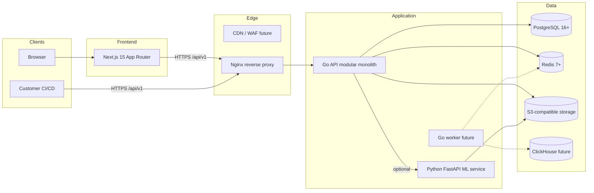

### Why a modular monolith

- **Solo-developer velocity:** one deployable unit, one database cluster, one CI pipeline.
- **Enterprise consistency:** auth, audit, RBAC, and tenant isolation are enforced in one place.
- **Clean extraction path:** each module uses ports and adapters; a hot module can later become a service without rewriting business logic.
- **Cost control:** one container fleet and one operational surface until scale justifies more.

### Deployment shape

- **Local and MVP production** use native services behind Nginx on an Ubuntu VM (ADR-003, ADR-009).
- **Future scale** moves to single Ubuntu VPS or a future managed option with single-Ubuntu-VPS systemd services and Let's Encrypt / optional CDN for CDN/WAF.
- The logical request flow is the same in all environments.

---

## Backend Clean Architecture

Every backend module follows Clean / Hexagonal Architecture. The dependency rule always points inward: handlers and repositories depend on domain and ports, not the other way around.

| Layer | Responsibility | Example |
|-------|----------------|---------|
| Domain | Entities, value objects, invariants | `testra/apps/api/internal/results/domain.go` |
| Application | Use cases, service orchestration | `testra/apps/api/internal/results/service.go` |
| Ports | Interfaces for repositories and external clients | `testra/apps/api/internal/results/ports.go` |
| Adapters | Concrete HTTP handlers, SQL repositories | `testra/apps/api/internal/results/handler.go`, `repository.go` |

### Shared cross-cutting packages

- `testra/apps/api/internal/shared/config` — environment configuration.
- `testra/apps/api/internal/shared/db` — database open/wrapper and tenant context propagation.
- `testra/apps/api/internal/shared/errors` — domain error constants.
- `testra/apps/api/internal/shared/http` — response envelope helpers.
- `testra/apps/api/internal/shared/jwt` — JWT signing and parsing (HS256).
- `testra/apps/api/internal/shared/middleware` — auth, tenant, RBAC, audit, idempotency, rate limit, max body.
- `testra/apps/api/internal/shared/pagination` — cursor pagination helpers.
- `testra/apps/api/internal/shared/password` — password hashing.
- `testra/apps/api/internal/shared/validation` — email/name validation.
- `testra/apps/api/internal/shared/server` — chi router wiring.
- `testra/apps/api/internal/shared/tenant` — tenant resolver.
- `testra/apps/api/internal/shared/idempotency` — PostgreSQL-backed idempotency store.

---

## Domain Modules

| Module | Status | Capabilities | Key code |
|--------|--------|--------------|----------|
| `identity` | [Implemented] | Register, login, refresh, password reset, TOTP MFA, /me | `testra/apps/api/internal/identity/` |
| `organization` | [Implemented] | Create, list, get organizations | `testra/apps/api/internal/organization/` |
| `workspace` | [Implemented] | Create, list, get, membership | `testra/apps/api/internal/workspace/` |
| `project` | [Implemented] | Create, list, get projects | `testra/apps/api/internal/project/` |
| `apikeys` | [Implemented] | Create, list, revoke scoped API keys | `testra/apps/api/internal/apikeys/` |
| `rbac` | [Implemented] | Roles, permissions, role assignments, SQL loader | `testra/apps/api/internal/rbac/`, `shared/middleware/rbac.go` |
| `testmanagement` | [Implemented] | Folders, suites, cases, versioning, full-text search | `testra/apps/api/internal/testmanagement/` |
| `results` | [Implemented] | Test runs and items, status updates, SSE progress | `testra/apps/api/internal/results/` |
| `automationhub` | [Implemented] | Ingest JUnit XML and Playwright/Cypress JSON | `testra/apps/api/internal/automationhub/` |
| `notification` | [Implemented] | In-app notifications, preferences, channels | `testra/apps/api/internal/notification/` |
| `audit` | [Implemented] | Immutable audit events on mutating endpoints | `testra/apps/api/internal/audit/`, `shared/middleware/audit.go` |
| `apitesting` | [Planned] | API test definitions, environments, execution | — |
| `defects` | [Implemented] | CRUD, lifecycle, severity/priority, tenant isolation | `testra/apps/api/internal/defects/` |
| `analytics` | [Planned] | Dashboards, trends, aggregations | — |
| `intelligence` | [Planned] | Flaky detection, failure classification, risk scores | — |
| `integrationhub` | [Planned] | Jira, GitHub, GitLab, CI/CD webhooks | — |
| `billing` | [Planned] | Subscriptions, usage, invoices | — |

---

## Dependency Graph

This graph shows the runtime and build-time dependencies between the major system layers.

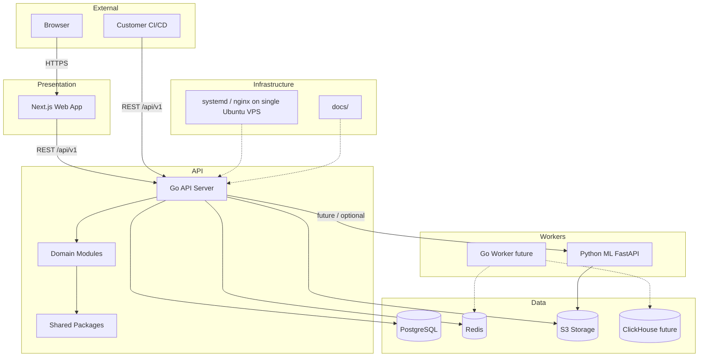

### Dependency explanations

- **Web depends on API.** The frontend is a Next.js application that consumes `testra/apps/web/lib/api.ts`. It never touches the database.
- **API depends on Shared, Database, Redis, S3, and optionally ML.** The Go API owns the business logic and all persistence.
- **ML is a separate runtime.** The Python service is called by the API for inference and may read from object storage. It does not own transactional state.
- **Workers are planned.** The Go worker will consume Redis/Asynq jobs and write analytical facts to ClickHouse. It does not own core transactional state.
- **Infrastructure is a deployment concern.** `native services`, `single VPS deployment runbooks`, and `single VPS deployment runbooks` describe where and how the application runs; they do not contain business logic.
- **Documentation is a peer dependency.** Docs guide implementation; they do not change runtime behavior.

---

## Module Dependency Matrix

The matrix below shows which modules are allowed to depend on which other modules. The arrow means "may depend on the module below." The rule is: depend on abstractions (ports) or on shared primitives, never on another module's concrete internals.

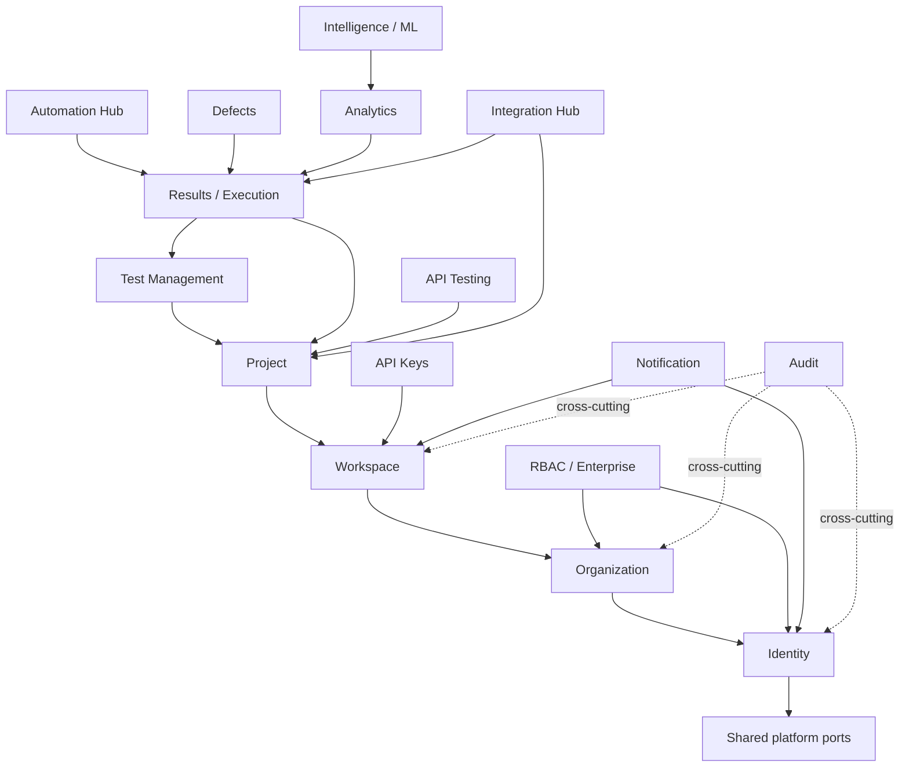

### Dependency explanations

- **Identity is foundational.** Almost every action needs a principal. Identity owns user records, password hashes, MFA secrets, refresh tokens, and session issuance.
- **Organization, Workspace, Project form the tenancy chain.** Each layer depends on the one above it. A workspace cannot exist without an organization; a project cannot exist without a workspace.
- **RBAC depends on Identity and Organization.** Permissions are scoped to an organization and checked after tenant resolution.
- **API Keys narrow to a Workspace.** They are managed by the `apikeys` module and used by CI/CD after the ingestion endpoint is wired to accept them.
- **Test Management depends on Project.** Folders, suites, and cases live inside a workspace/project scope.
- **Results depend on Project and Test Management.** A run can be attached to a suite and project; run items may reference test cases.
- **Automation Hub depends on Results.** It parses CI output and creates `test_runs` and `test_run_items` through the `results` module.
- **Defects, Analytics, and Intelligence depend on Results.** They consume run outcomes and metadata.
- **Notification depends on Identity and Workspace.** It sends messages to users within an organization/workspace.
- **Audit is cross-cutting.** It records mutating actions across modules without owning business logic.

---

## Request Lifecycle

Every protected request follows the same trust chain. A request is never trusted until authentication, tenant resolution, and authorization have all succeeded.

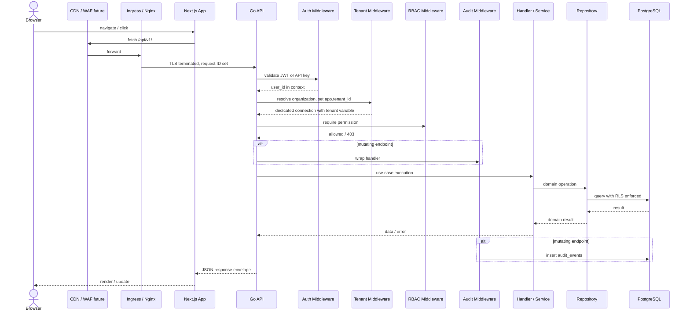

### Middleware order in `testra/apps/api/internal/shared/server/server.go`

1. `middleware.Logger`
2. `middleware.Recoverer`
3. `middleware.RequestID`
4. `Content-Type: application/json` header
5. CORS middleware
6. `MaxBodySize`
7. `RateLimit` (public auth endpoints and API-key ingestion route)
8. `Auth` (JWT) or `APIKeyAuth` on protected route groups
9. `TenantContext` (per-route group)
10. `RequirePermission` (per handler)
11. `AuditLog` (on mutating handlers)
12. Handler -> Service -> Repository

### Step-by-step explanation

1. **Ingress.** Nginx terminates TLS, sets `X-Request-Id`, and forwards to the Go API.
2. **Auth middleware.** Parses the `Authorization: Bearer <jwt>` header or an API key header, validates it, and stores `user_id` in the request context.
3. **Tenant middleware.** Resolves the target `organization_id` from the URL, query, or request body using `shared/tenant/resolver.go`, acquires a dedicated `*sql.Conn`, runs `SET app.tenant_id = '<org-id>'`, and verifies membership.
4. **RBAC middleware.** Loads permissions for the user in the resolved organization and checks the required permission string.
5. **Audit middleware.** On mutating endpoints, after the handler returns, writes an immutable record to `audit_events`.
6. **Handler / Service / Repository.** The handler validates input, calls the service, which calls the repository. The repository uses `shared/db/db.go` to pick up the tenant-scoped connection from the context.
7. **Database.** PostgreSQL enforces RLS policies using `current_setting('app.tenant_id')`.
8. **Response envelope.** The API returns `{"data": ..., "meta": ..., "error": null}` or a safe error object.

---

## Authentication Flow

### Authentication methods

| Method | Use case | Status | Storage |
|--------|----------|--------|---------|
| Email + password + TOTP MFA | Human users in the web app | [Implemented] | bcrypt password hash, encrypted MFA secret |
| JWT access token | Session state for API requests | [Implemented] | Signed token, 15-minute expiry, no DB lookup |
| Rotating refresh token | Long-lived sessions | [Implemented] | SHA-256 hashed opaque token in PostgreSQL |
| API key | CI/CD and service integrations | [Implemented] and wired to `/ingest` | SHA-256 hashed key with `testra_` prefix and scope checks |
| OAuth / SSO | Future enterprise identity | [Planned] | TBD per provider |

### JWT login and refresh flow

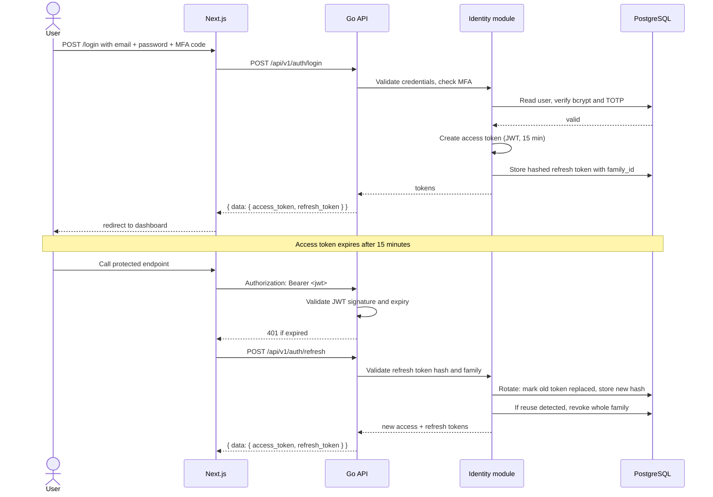

### API key flow

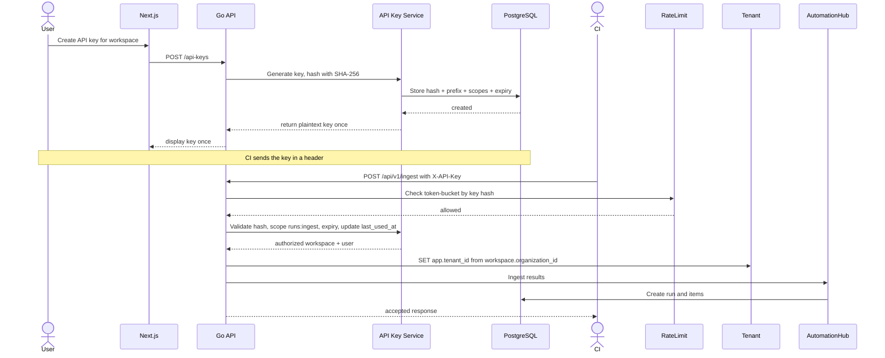

### Current vs future authentication

- **Current:** self-hosted email/password with bcrypt, TOTP MFA, JWT access tokens, rotating refresh tokens, and scoped API keys. `/ingest` is now protected by API-key authentication with scope enforcement and rate limiting. Browser `EventSource` connections authenticate via an `access_token` query parameter as a temporary MVP workaround. The web client now stores both access and refresh tokens, refreshes on 401, and uses client route guards; tokens are still in `localStorage` and should move to `httpOnly` cookies for production hardening.
- **Future OAuth:** enterprise customers may request Google, GitHub, or SAML-based SSO. This is deferred to Phase 6 and requires an ADR because it changes the identity model.
- **Future SSO / WorkOS:** WorkOS is listed as a conditional future option for SAML/SCIM, but it is not the default. Any SSO integration must keep the self-hosted path intact and cannot bypass RLS or RBAC.

---

## Multi-tenancy Deep Dive

### Tenancy hierarchy

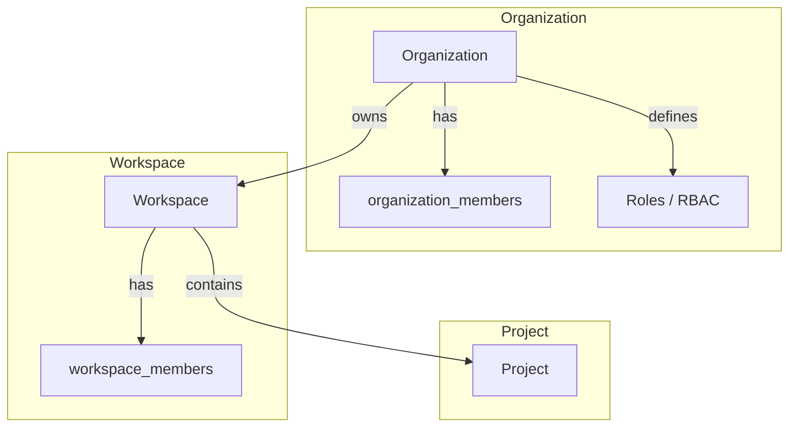

- **Organization** is the top-level billing and access boundary. Every tenant is an organization. A user can belong to many organizations.
- **Workspace** groups projects inside an organization. It is the primary day-to-day collaboration boundary.
- **Project** is the unit of work for tests and runs. Projects are scoped to a workspace.

### Tenant context lifecycle

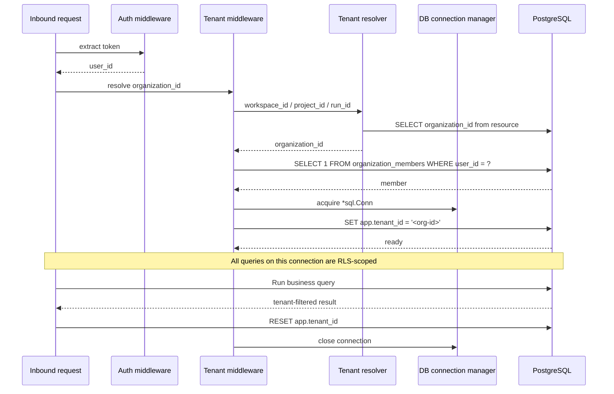

### Row Level Security

RLS is enabled on all tenant-scoped tables. The API database role does not bypass RLS. Policies use `current_setting('app.tenant_id', true)::uuid`.

**Example direct policy:**

```sql
CREATE POLICY organizations_tenant ON organizations
    USING (id = current_setting('app.tenant_id', true)::uuid);
```

**Example indirect policy through workspace:**

```sql
CREATE POLICY projects_tenant ON projects
    USING (workspace_id IN (
        SELECT id FROM workspaces WHERE organization_id = current_setting('app.tenant_id', true)::uuid
    ));
```

### Tables with RLS

- `organizations`, `organization_members`
- `workspaces`, `workspace_members`
- `projects`
- `api_keys`
- `role_assignments`
- `test_folders`, `test_suites`, `test_cases`, `test_case_versions`
- `test_runs`, `test_run_items`
- `idempotency_records`
- `notifications`, `notification_preferences`, `notification_channels`

### Tables without RLS

- `users` — cross-tenant by design.
- `roles`, `permissions`, `role_permissions` — system-wide reference data.
- `refresh_tokens`, `password_reset_tokens` — session tables tied to user identity.

### Tenant resolver

`testra/apps/api/internal/shared/tenant/resolver.go` provides helpers to derive `organization_id` from various resource identifiers:

- `workspace_id` — select `organization_id` from `workspaces`.
- `project_id` — join `projects` -> `workspaces`.
- `api_key_id` — look up by key hash and resolve workspace -> organization.
- `run_id` / `run_item_id` — join through `test_runs` -> `workspaces`.

The resolver also checks that the requesting user is a member of the resolved organization.

### Critical rule

Tenant resolution and RLS are non-negotiable. No repository call may run on a connection that does not have `app.tenant_id` set, and no handler may trust a client-supplied tenant ID without server-side resolution and membership verification.

---

## API Design and Routing

### Conventions

- Base path: `/api/v1`.
- Major URL versioning. Breaking changes require a new major version or an ADR.
- RESTful resource-oriented routes with plural nouns.
- Response envelope: `{ "data": ..., "meta": ..., "error": null }`.
- Errors: `{ "data": null, "meta": {}, "error": { "code": "...", "message": "..." } }`.
- Cursor pagination for list endpoints (`?cursor=` and `?limit=`).
- `Idempotency-Key` header required for `POST /ingest` and other mutating side-effect endpoints.
- Stable error codes: `INVALID_INPUT`, `UNAUTHORIZED`, `FORBIDDEN`, `NOT_FOUND`, `CONFLICT`, `INTERNAL_ERROR`, etc.
- `snake_case` JSON fields and RFC 3339 UTC timestamps.

### Implemented route groups

| Domain | Method | Path | Notes |
|--------|--------|------|-------|
| Auth | POST | /auth/register | Public |
| Auth | POST | /auth/login | Public, optional MFA |
| Auth | POST | /auth/refresh | Public, refresh token |
| Auth | POST | /auth/password-reset/request | Public |
| Auth | POST | /auth/password-reset/confirm | Public |
| Auth | GET | /auth/me | Authenticated |
| Auth | POST | /auth/mfa/setup | Authenticated |
| Auth | POST | /auth/mfa/verify | Authenticated |
| Auth | POST | /auth/mfa/disable | Authenticated |
| Organizations | POST/GET | /organizations | Authenticated |
| Organizations | GET | /organizations/{id} | `orgs:read` |
| Workspaces | POST | /workspaces | `workspaces:create` |
| Workspaces | GET | /workspaces | `workspaces:read` |
| Workspaces | GET | /workspaces/{id} | `workspaces:read` |
| Projects | POST | /projects | `projects:create` |
| Projects | GET | /projects | `projects:read` |
| Projects | GET | /projects/{id} | `projects:read` |
| API Keys | POST/GET | /api-keys | `apikeys:*` |
| API Keys | DELETE | /api-keys/{id} | `apikeys:delete` |
| Test Management | CRUD | /test-folders, /test-suites, /test-cases, /test-cases/{id}/versions | `tests:*` |
| Test Runs | CRUD | /test-runs, /test-runs/{id}, /test-runs/{id}/items, /test-runs/{id}/stream | `runs:*` |
| Run Items | PUT | /test-run-items/{id} | `runs:update` |
| Ingest | POST | /ingest | `runs:ingest`, `Idempotency-Key` required, currently JWT only (API-key auth pending) |
| API Testing | CRUD | /api-collections, /api-folders, /api-environments, /api-requests, /api-requests/search, /api-requests/{id}/history, /api-executions | `api_testing:*` (`api_testing:execute` for POST /api-executions) + `Idempotency-Key` on mutating endpoints, `AuditLog` on writes |
| Notifications | GET | /notifications | `notifications:read` |
| Notifications | POST | /notifications | `notifications:create` + AuditLog |
| Notifications | GET | /notifications/unread-count | `notifications:read` |
| Notifications | PATCH | /notifications/{id} | `notifications:update` |
| Notifications | DELETE | /notifications/{id} | `notifications:delete` |
| Notification Preferences | GET/PUT | /notification-preferences | `notification_preferences:read` / `notification_preferences:update` |
| Notification Channels | GET | /notification-channels | `notification_channels:read` |
| Notification Channels | POST | /notification-channels | `notification_channels:create` + AuditLog |
| Notification Channels | PUT | /notification-channels/{id} | `notification_channels:update` + AuditLog |
| Notification Channels | DELETE | /notification-channels/{id} | `notification_channels:delete` + AuditLog |
| Health | GET | /health | Public |

The full OpenAPI contract is `testra/docs/api/openapi/openapi.yaml` (v0.4.0).

---

## Event and Request Flow

### Request trust flow

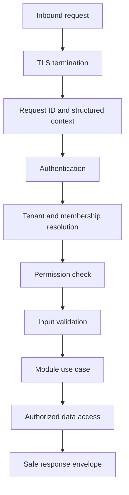

### Test run progress SSE flow

1. `POST /test-runs` creates a run in `pending` status with `test_run_item` rows for each selected test case.
2. Clients open `GET /test-runs/{id}/stream`. Browser `EventSource` clients pass the JWT in the `access_token` query parameter (the `Auth` middleware reads the header or the query parameter; see `docs/archive/historical/live-test-run-updates.md` for the original design note).
3. `results.Service.UpdateItemStatus` updates an item, recalculates run counts, and broadcasts a `RunProgressEvent` through an in-memory `progressHub`.
4. `StreamRunProgress` writes events as `text/event-stream`.
5. When the run reaches a terminal status, the hub closes all channels and removes the subscription list.

### Ingestion flow

1. `POST /ingest` with `Idempotency-Key` header and a JSON body containing `workspace_id`, `project_id`, optional `suite_id`, `name`, `format` (`junit`, `playwright`, `cypress`), and `payload`.
2. The idempotency middleware checks `(workspace_id, operation, key)`. If the same key and body fingerprint exist, the stored response is replayed. If the key exists with a different body, a 409 is returned.
3. `automationhub.Service.Ingest` parses the payload.
   - JUnit: XML unmarshals into `JUnitTestSuites`, maps cases to `test_run_items`.
   - Playwright/Cypress: JSON unmarshals into `PlaywrightReport`, maps tests to items.
4. A `test_runs` row is created with `source = ci`, status `running`, counts are computed, and the run is marked `passed` or `failed`.
5. Response returns `run_id`, `total`, `passed`, `failed`, `skipped`, `duration_ms`.

### Audit flow

`shared/middleware/audit.go` wraps mutating endpoints. After the handler returns, it calls `audit.Service.Log` with `user_id`, `action`, `resource`, `resource_id`, and `ip_address`. Events are appended to `audit_events`.

---

## Frontend Architecture

- **Framework:** Next.js 15 App Router, React, TypeScript.
- **Styling:** TailwindCSS, shadcn/ui + Radix primitives.
- **State:** Server state is fetched through a lightweight API client; forms use React Hook Form + Zod.
- **API client:** `testra/apps/web/lib/api.ts` fetches `NEXT_PUBLIC_API_URL`, stores the JWT in `localStorage` as `testra_token`, and attaches `Authorization: Bearer ...`.
- **Route groups:**
  - `(auth)` — login, register, forgot-password, reset-password, MFA setup.
  - `(dashboard)` — dashboard, projects, test-cases, test-runs, settings.
  - Onboarding at `/onboarding` creates the first organization and workspace.
- **Workspace/project context:** The dashboard reads `testra_workspace_id`, `testra_workspace_name`, `testra_project_id`, `testra_project_name` from `localStorage` for the current context UI.
- **Shared packages:** `packages/shared`, `packages/ui`, `packages/config`.

---

## Machine Learning Service

- **Runtime:** Python 3.12+ FastAPI service (`testra/apps/ml/api/main.py`).
- **Current state:** Skeleton with a `/health` endpoint [Implemented].
- **Planned capabilities (Phase 6):**
  - Flaky test detection using time-series variance scoring.
  - Failure classification with rule-based filtering + DBSCAN/HDBSCAN clustering and optional XGBoost.
  - Risk/health scores with logistic regression / XGBoost and SHAP explainability.
  - Release readiness thresholds and trends.
- **Principles:** No external LLM APIs; models trained per tenant on that tenant's data only; inputs limited to test metadata and results, never source code or secrets.

---

## Deployment and Infrastructure

### Local development [Implemented]

Per ADR-009, the official local workflow uses native services:

- PostgreSQL 16+, Redis 7+, Mailpit, MinIO.
- Go, Node.js, pnpm, Python installed locally.
- `pnpm dev` checks services, applies migrations, and starts API, web, worker, and ML services.
- All services must be installed and running locally; no Docker is used.

### MVP production [Approved]

- Ubuntu VM with systemd and Nginx reverse proxy.
- PostgreSQL, Redis, and S3-compatible object store.
- Go API and Next.js web as systemd services.
- TLS terminated by Nginx with a Let's Encrypt certificate (certbot).
- Migrations applied via `testra/apps/api/cmd/migrator/main.go` in CI/CD, never manually in production.

### Future [Planned]

- Future scale may move to a managed platform, but the default is still a single Ubuntu VPS.
- Separate worker and ML processes can run on the same VPS or be split later.
- systemd unit files and shell scripts for repeatable deployment.
- Multi-region deployment is not planned for MVP.

---

## Security, Privacy, and Compliance

- **Authentication:** Short-lived 15-minute JWTs, rotating refresh tokens, TOTP MFA, API key expiry and revocation, minimum 12-character passwords.
- **Authorization:** RBAC, tenant membership, and RLS at the database layer.
- **Secrets:** Passwords, refresh tokens, password reset tokens, and API keys are all hashed (bcrypt/SHA-256) before storage.
- **Transport:** TLS in production, CORS restricted to configured origins, `MaxBodySize` middleware.
- **Rate limiting:** Local in-memory rate limiter implemented; Redis-backed token bucket planned.
- **Audit:** Immutable `audit_events` for mutating actions.
- **Privacy:** Zero customer code retention, zero API collection retention, customer-owned data, no external LLM processing, tenant-isolated ML models.
- **Compliance posture:** Audit logs (7 years), RBAC, MFA, encryption, and data-residency path support SOC 2 readiness.

---

## Performance Targets

From `testra/docs/architecture/adrs/ADR-008-performance-targets.md`:

- API reads: p95 ≤ 300 ms, p99 ≤ 750 ms.
- API writes: p95 ≤ 500 ms, p99 ≤ 1000 ms.
- PostgreSQL queries: p95 ≤ 50 ms.
- Request timeout: 30 seconds.
- Background job timeout: 5 minutes.
- Upload size: max 50 MB.
- Capacity: 500 concurrent users, 50 req/s.
- ClickHouse ingestion: 10,000 records/minute (planned).

---

## Engineering Rules

The following rules are mandatory. Violating them is a blocking issue.

1. **Never bypass middleware.** A protected request must pass through `Auth`, `TenantContext`, and `RequirePermission` in that order. Do not write ad-hoc checks in handlers.
2. **Never query SQL directly from handlers.** All persistence goes through the repository port for the module.
3. **Never skip tenant validation.** Client-supplied IDs are selectors, not proof of access. Always resolve the organization server-side and verify membership.
4. **Never ignore RLS.** Every repository call on a tenant-scoped table must run on a connection with `app.tenant_id` set.
5. **Never return raw secrets.** Do not return password hashes, API key plaintext after creation, MFA secrets, or refresh tokens outside their intended issuance response.
6. **Never duplicate response envelopes.** Use `shared/http` helpers and the canonical `{ data, meta, error }` shape.
7. **Never mutate merged migrations.** Add a new `up`/`down` pair for schema changes.
8. **Never skip migration `down` files.** Every `up` must have a corresponding `down` for local and staging rollback.
9. **Never introduce a new library without justification.** Prefer the existing stack. New dependencies require an ADR or a tech-review note.
10. **Never create cross-module imports of internal packages.** Depend on ports or shared primitives.
11. **Always update OpenAPI before implementation.** The contract is the source of truth for HTTP behavior.
12. **Always update ADRs for architecture changes.** If a decision changes, record the new ADR; do not silently override an accepted one.
13. **Always update BIBLICAL when adding modules.** New modules, dependencies, or rules belong in this handbook.
14. **Always write tests for domain logic.** Unit tests for services and repositories; integration tests for ingestion and tenant boundaries.
15. **Always run migrations up and down locally before committing.** `make migrate-up` and `make migrate-down` must succeed.

---

## AI Rules

If you are an AI agent contributing to this codebase, follow these rules in addition to the engineering rules.

### Before writing or editing code

1. Read `testra/docs/BIBLICAL_TESTRA.md` (this handbook).
2. Read the relevant ADRs in `testra/docs/architecture/adrs/`.
3. Read `testra/docs/engineering/ROADMAP.md` for implementation status.
4. Read `testra/docs/api/openapi/openapi.yaml` for HTTP contracts.
5. Read the current module you are modifying under `testra/apps/api/internal/<module>/`.

### While writing code

1. **Never invent architecture.** Use the existing module structure, ports, and middleware.
2. **Never change accepted ADRs.** If an ADR needs to change, raise it for human review and create a new ADR.
3. **Never introduce new libraries without justification.** Use the dependency graph in this handbook.
4. **Never duplicate documentation.** Update BIBLICAL or the canonical doc, do not create parallel copies.
5. **Never bypass tenant isolation, RLS, RBAC, or audit logging.** These are hard constraints.
6. **Never hardcode tenant IDs, secrets, or environment assumptions.** Use config and context.
7. **Never call the database from handlers or UI components.** Use services and repositories.
8. **Never skip tests.** Add or update tests for changed behavior.
9. **Never change migration files that have been merged.** Add a new migration.
10. **Never expose internal error details to clients.** Return safe error envelopes.
11. **Always prefer existing patterns.** If a pattern exists in another module, mirror it.
12. **Always ask before creating cross-module dependencies.** Dependencies must follow the module dependency matrix.
13. **Always update OpenAPI and BIBLICAL when adding endpoints.** Documentation is a deliverable, not an afterthought.
14. **Always read `AI_CONTEXT.md`, `AI_MEMORY.md`, and `AI_RULES.md` before each session.** `AI_RULES.md` contains the full change-impact matrix; `AI_MEMORY.md` records permanent constraints.

---

## Do Not Break List

These architectural guarantees must remain intact. If a change threatens any of them, stop and escalate.

- **Tenant isolation.** No user may read or write data outside their organization without explicit cross-tenant operations.
- **RLS enforcement.** All tenant-scoped SQL must use the request-scoped `app.tenant_id`.
- **RBAC enforcement.** No protected action may run without permission verification.
- **Audit logs.** Mutating actions must produce immutable `audit_events` records.
- **Idempotency.** Side-effecting endpoints must accept and respect `Idempotency-Key`.
- **Response envelope.** All API responses must use the canonical `{ data, meta, error }` shape.
- **Cursor pagination.** List endpoints must use stable cursor pagination, never offset pagination.
- **Migration ordering.** Migration sequence must be monotonic and immutable.
- **API compatibility.** Breaking changes require a new major version or an approved migration plan.
- **Zero customer code retention.** Customer source code and test scripts are never stored.
- **Zero API collection retention unless created by Testra.** Customer API collections are not retained as artifacts.
- **No external LLM processing.** ML must be transparent, explainable, and tenant-isolated.
- **Secrets hashed at rest.** Passwords, tokens, and API keys are never stored plaintext.

---

## Feature Dependency Matrix

| Feature | Depends on | Notes |
|---------|------------|-------|
| API Keys | Identity, Workspace, RBAC | Management endpoints implemented. CI ingestion wiring pending. |
| Test Management | Project, Workspace, RBAC, Identity | Requires project and workspace context. |
| Results / Test Runs | Project, Test Management, RBAC, Identity | Run items may reference test cases. |
| Automation Hub | Results, API Keys (planned), Project, Workspace | Parses CI output and creates runs. |
| Ingestion | Automation Hub, Results, Idempotency, API Keys (planned) | Idempotency is mandatory. |
| Notifications | Identity, Workspace, Organization | Sends to users within a workspace. |
| Audit Logging | Identity, all mutating modules | Cross-cutting, writes for all mutations. |
| Analytics | Results, ClickHouse (planned) | Consumes run data for dashboards. |
| Intelligence / ML | Analytics, Results, ML Service | Phase 6, requires historical run data. |
| Defects | Results, Test Management, Project | Bug tracking linked to runs and cases. |
| Integration Hub | Project, Results, API Keys, Integration Providers | Jira / GitHub / GitLab sync. |
| Billing | Organization, Usage Tracking | Phase 5+, subscription management. |

---

## Repository Evolution Timeline

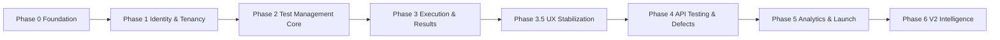

| Phase | Status | Deliverables |
|-------|--------|--------------|
| 0 — Foundation | Completed | CI, native dev env, OpenAPI skeleton, project module, go.work, pnpm workspace. |
| 1 — Identity & Tenancy | Completed | Auth, MFA, password reset, RBAC, API keys, web onboarding, migrations 000001-000011. |
| 2 — Test Management Core | Completed | Folders, suites, cases, versioning, full-text search, audit, migrations 000012-000014. |
| 3 — Execution & Results | Completed | Test runs, run items, manual execution, SSE, CI ingestion, idempotency, migrations 000015-000018. |
| 3.5 — Product UX Completion | Completed | Settings pages, placeholders, responsive UI, accessibility, build/lint/typecheck passes. |
| 4 — API Testing & Defects | Planned | API test definitions and execution, defects, Jira sync, notification channels. |
| 5 — Dashboard, Analytics & Launch | Planned | ClickHouse analytics, SDK generation, staging/production deployment. |
| 6 — V2 Intelligence | Planned | Flaky detection, failure classification, risk scores, Meilisearch, Stripe, WorkOS SSO, single-Ubuntu-VPS systemd services. |

---

## Future Architecture

| Decision | State | Why |
|----------|-------|-----|
| Modular monolith | Implemented | Solo-developer velocity and consistent cross-cutting concerns. Extraction path preserved through ports and adapters. |
| Self-hosted identity with JWT + TOTP MFA | Implemented | Avoids vendor lock-in, supports enterprise audit, zero external LLM dependency. |
| PostgreSQL for transactional and Phase 3 results data | Implemented | Single source of truth, RLS, ACID, and familiar operations. ClickHouse deferred per ADR-010. |
| Native local development | Implemented | Faster feedback loop, lower resource usage, no Docker required. Docker is optional per ADR-009. |
| API-first OpenAPI contract | Implemented | Drives web, SDK, and CI consumers from one contract. |
| ClickHouse for analytics | Planned | Cost-effective high-ingest analytical queries once result volume justifies it. |
| Asynq workers over Redis | Planned | Async ingestion, ML pipelines, and scheduled jobs without a separate queue system. |
| Generated TypeScript SDK | Planned | Created from OpenAPI once contracts stabilize. |
| single-Ubuntu-VPS systemd services + single-Ubuntu-VPS systemd services production | Planned | Scale, observability, and multi-region data residency. |
| Meilisearch for search | Deferred | PostgreSQL full-text search is sufficient for MVP; Meilisearch adds operational cost. |
| Stripe billing | Deferred | Billing is not part of MVP launch scope. |
| WorkOS SSO | Deferred | Conditional on enterprise deals; self-hosted path remains default. |
| Clerk / managed identity provider | Rejected | Adds vendor cost and operational risk; self-hosted auth aligns with privacy-first principles. |
| Microservices for MVP | Rejected | Distributed-system overhead exceeds solo-developer bandwidth and does not solve a current problem. |
| native services as default local environment | Rejected | Native services are faster and simpler; Docker remains optional. |
| External LLM features | Rejected | Violates transparent ML and no external LLM principles. |

---

## Data Model and Database Schema

The authoritative database schema is the set of `golang-migrate` files under `testra/apps/api/migrations/` (currently `000001` through `000018`). This section provides a high-level map.

### Schema groups

| Group | Tables | Purpose |
|-------|--------|---------|
| Identity | `users` | Cross-tenant user accounts, password hash, MFA state. |
| Session | `refresh_tokens`, `password_reset_tokens` | Opaque session and reset tokens. |
| Tenancy | `organizations`, `organization_members`, `workspaces`, `workspace_members`, `projects` | Organization/workspace/project hierarchy and membership. |
| RBAC | `roles`, `permissions`, `role_permissions`, `role_assignments` | System roles, permissions, and organization-scoped assignments. |
| API Keys | `api_keys` | Workspace-scoped hashed API keys with scopes and expiry. |
| Test Management | `test_folders`, `test_suites`, `test_cases`, `test_case_versions` | Folder tree, suites, case definitions, immutable version snapshots. |
| Execution | `test_runs`, `test_run_items` | Manual and CI run records with item-level status. |
| Idempotency | `idempotency_records` | Idempotency key replay storage. |
| Notifications | `notifications`, `notification_preferences`, `notification_channels` | In-app notifications and channel configuration. |
| Audit | `audit_events` | Immutable mutating-action log. |

### Key invariants

- UUID primary keys for all entities.
- Tenant-scoped rows carry `organization_id` or a resolvable `workspace_id`/`project_id`.
- `created_at` and `updated_at` timestamps where mutable lifecycle data exists.
- Foreign keys and indexes for relationships and common filters.
- Merged migrations are immutable; corrections use a new migration.
- RLS policies are mandatory for all tenant-scoped tables in staging and production.

For the complete column-level schema, see `testra/apps/api/migrations/` and `testra/docs/architecture/DATABASE_GUIDE.md`.

---

## AI Contributor Reference

This section is the primary orientation point for automated agents. It points to detailed documents and gives a decision framework so an AI can find the right canonical source without searching the whole repository.

### AI Reading Guide

| I want to ... | Read first |
|---|---|
| Understand product vision and business goals | [`testra-master-context.md`](../../testra-master-context.md), [`PROJECT_OVERVIEW.md`](PROJECT_OVERVIEW.md) |
| Understand the architecture and boundaries | [`SYSTEM_FLOWS.md`](architecture/SYSTEM_FLOWS.md), [`MODULE_DEPENDENCIES.md`](architecture/MODULE_DEPENDENCIES.md), this handbook §System Architecture and §Backend Clean Architecture |
| Understand tenancy, RLS, and security | [`SECURITY_CHECKLIST.md`](security/SECURITY_CHECKLIST.md), [`ADR-004-tenant-isolation-strategy.md`](architecture/adrs/ADR-004-tenant-isolation-strategy.md), this handbook §Multi-tenancy Deep Dive |
| Add or change an HTTP endpoint | [`api/openapi/openapi.yaml`](api/openapi/openapi.yaml), [`API_DESIGN_GUIDELINES.md`](api/API_DESIGN_GUIDELINES.md), [`ROUTES.md`](ROUTES.md), [`AI_RULES.md`](AI_RULES.md) |
| Add or change a database table | [`DATABASE_GUIDE.md`](architecture/DATABASE_GUIDE.md), [`ONBOARDING.md`](engineering/ONBOARDING.md) §6, [`AI_RULES.md`](AI_RULES.md) |
| Add a new backend module | [`MODULE_DEPENDENCIES.md`](architecture/MODULE_DEPENDENCIES.md), [`ONBOARDING.md`](engineering/ONBOARDING.md) §3-5, [`AI_RULES.md`](AI_RULES.md) |
| Check what is implemented or planned | [`ROADMAP.md`](engineering/ROADMAP.md), [`FEATURE_MATRIX.md`](FEATURE_MATRIX.md) |
| Understand the full AI rule set | [`AI_CONTEXT.md`](AI_CONTEXT.md), [`AI_MEMORY.md`](AI_MEMORY.md), [`AI_RULES.md`](AI_RULES.md) |

### Decision Tree

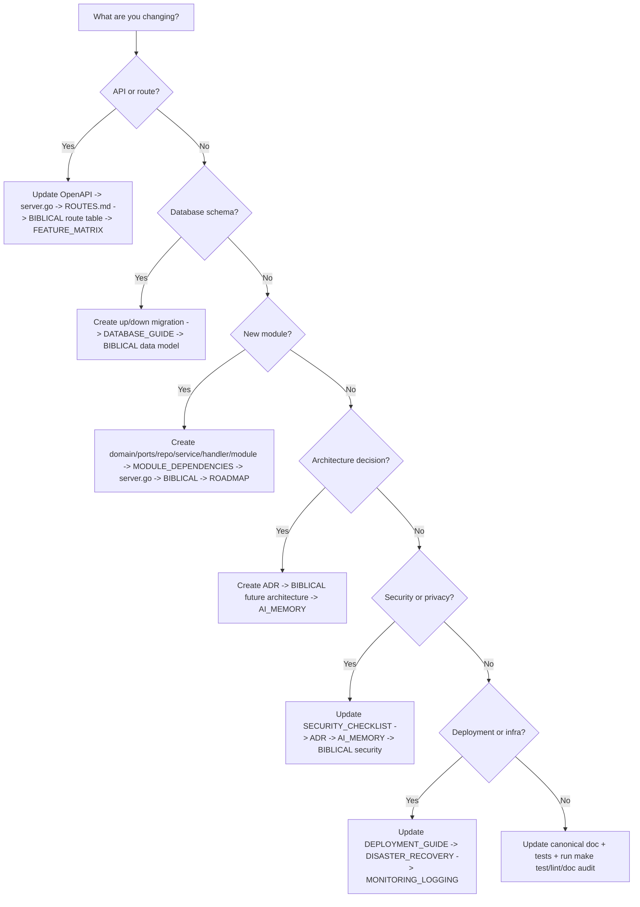

### Knowledge Graph

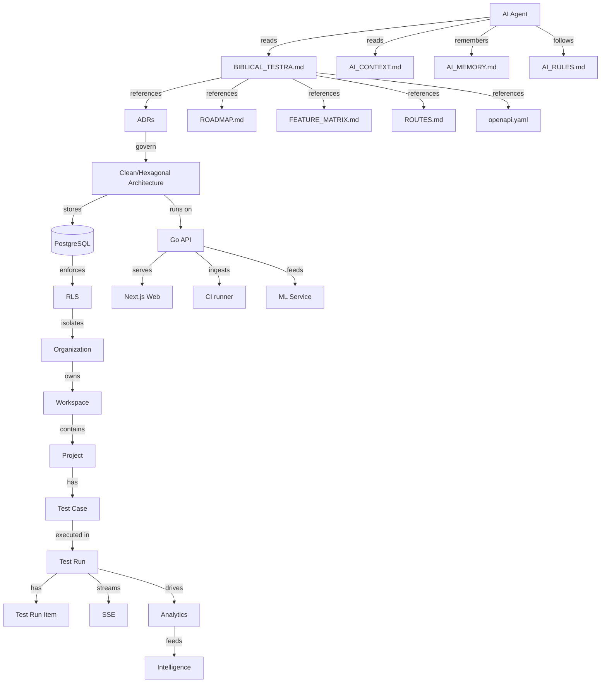

### Where To Find Information

| Information | Canonical owner |
|---|---|
| Product vision, mission, business goals | `testra-master-context.md`, `testra-product-strategy.md`, `testra-brd.md`, `PROJECT_OVERVIEW.md` |
| Engineering overview and current state | `PROJECT_OVERVIEW.md` |
| Implementation status and phase plan | `ROADMAP.md` |
| Feature matrix | `FEATURE_MATRIX.md` |
| Architecture and diagrams | `BIBLICAL_TESTRA.md` + `SYSTEM_FLOWS.md` |
| Module dependencies | `MODULE_DEPENDENCIES.md` |
| Database schema, migrations, RLS, ERD | `DATABASE_GUIDE.md` + `apps/api/migrations/` |
| API contract | `docs/api/openapi/openapi.yaml` |
| API conventions | `API_DESIGN_GUIDELINES.md` |
| Frontend/backend routes | `ROUTES.md` |
| Coding and review standards | `ENGINEERING_STANDARDS.md` |
| Contributor workflow, onboarding, DoD | `ONBOARDING.md` |
| Security checklist | `SECURITY_CHECKLIST.md` |
| Deployment and operations | `DEPLOYMENT_GUIDE.md`, `DISASTER_RECOVERY_GUIDE.md`, `MONITORING_LOGGING_GUIDE.md` |
| AI-specific guidance | `AI_CONTEXT.md`, `AI_MEMORY.md`, `AI_RULES.md` |

### How-To Update Guides

For the full change-impact matrix, see [`AI_RULES.md`](AI_RULES.md). The guides below are the most common paths.

#### How to update documentation
1. Identify the canonical owner for the topic from `BIBLICAL_TESTRA.md` §Canonical Sources Map or `AI_RULES.md`.
2. Update only the canonical doc; link from other docs instead of copying.
3. Update `docs/README.md` when files are added, archived, or renamed.
4. Run `python testra/scripts/doc_audit_check.py` and fix any broken active links.

#### How to update APIs
1. Update `docs/api/openapi/openapi.yaml` before implementation.
2. Add/register the route in `apps/api/internal/shared/server/server.go`.
3. Update `docs/ROUTES.md` and `BIBLICAL_TESTRA.md` route table.
4. Update `docs/FEATURE_MATRIX.md` and `docs/engineering/ROADMAP.md` if phase status changes.
5. Add or update tests.

#### How to update the database
1. Create a new numbered `up`/`down` migration pair in `apps/api/migrations/`.
2. Run `make migrate` and `make migrate-down` locally.
3. Update `docs/architecture/DATABASE_GUIDE.md` (migration catalog, ERD, RLS matrix, column summary).
4. Update `BIBLICAL_TESTRA.md` data model section.
5. Update `docs/api/openapi/openapi.yaml` if API representations changed.

#### How to update an ADR
1. Do not edit an accepted ADR. Create `docs/architecture/adrs/ADR-XXX-<topic>.md`.
2. Update `BIBLICAL_TESTRA.md` future architecture, canonical sources, and do-not-break list if rules change.
3. Update `AI_MEMORY.md` if the decision establishes a new permanent fact.
4. Update `ROADMAP.md` if the decision changes phase scope.

#### How to update OpenAPI
1. Edit `docs/api/openapi/openapi.yaml` before writing handler code.
2. Regenerate or update SDK/types if generation is in place.
3. Update `docs/ROUTES.md` and `BIBLICAL_TESTRA.md` route table.
4. Update `FEATURE_MATRIX.md` OpenAPI column.

#### How to update the Feature Matrix
1. Edit `docs/FEATURE_MATRIX.md` only when a feature's backend, frontend, OpenAPI, tests, or production-ready status changes.
2. Keep the legend consistent and each row tied to a real module or feature.
3. Cross-check against `ROADMAP.md` and `BIBLICAL_TESTRA.md` module list.

#### How to update the Roadmap
1. Edit `docs/engineering/ROADMAP.md` when a phase starts, completes, or scope changes.
2. Keep the Technical Debt Register honest; do not mark open debt as closed.
3. Update `FEATURE_MATRIX.md` and `PROJECT_OVERVIEW.md` if roadmap changes affect current state.

### AI Context, Memory, and Rules

Three new files support automated agents without duplicating `BIBLICAL_TESTRA.md`:

- [`AI_CONTEXT.md`](AI_CONTEXT.md) — start here for the AI reading order, verification workflow, forbidden actions, and canonical ownership map.
- [`AI_MEMORY.md`](AI_MEMORY.md) — permanent architectural facts that must remain true (JWT lifetimes, RLS enforcement, migration immutability, etc.).
- [`AI_RULES.md`](AI_RULES.md) — complete change-impact matrix by change type and forbidden shortcuts.

---

## Documentation Maintenance Guide

### When to update documentation

| Trigger | Update |
|---------|--------|
| New module | This handbook, `ROADMAP.md`, OpenAPI, ADR if it changes architecture. |
| New endpoint | OpenAPI first, then this handbook route table. |
| Schema change | Migration + `DATABASE_GUIDE.md` + this handbook data model section. |
| Auth/tenant change | This handbook, ADR, and security checklist. |
| Deployment change | ADR, `DEPLOYMENT_GUIDE.md`, runbooks, and this handbook deployment section. |
| Performance target change | ADR-008 and this handbook performance section. |
| Process or rule change | This handbook engineering/AI/do-not-break sections and `ONBOARDING.md`. |

### Canonical documents

| Document | Role |
|----------|------|
| `testra/docs/BIBLICAL_TESTRA.md` | This consolidated handbook. |
| `testra/docs/PROJECT_OVERVIEW.md` | Product vision, goals, MVP scope, and current state. |
| `testra/docs/engineering/ROADMAP.md` | Implementation phases, priorities, and technical debt. |
| `testra/docs/engineering/ONBOARDING.md` | Onboarding, governance, DoD, and contributor rules. |
| `testra/docs/engineering/ENGINEERING_STANDARDS.md` | Coding and process standards. |
| `testra/docs/architecture/adrs/ADR-*.md` | Accepted architecture decisions. |
| `testra/apps/api/migrations/*.sql` | Authoritative database schema. |
| `testra/docs/api/openapi/openapi.yaml` | Authoritative HTTP contract. |
| `testra/apps/api/internal/**/*.go` | Authoritative runtime behavior. |

### Historical documents

- `04_Architecture/testra-software-architecture-decisions.md` is a draft and is not canonical. It is preserved for reconciliation.
- `testra/docs/archive/` contains historical, superseded, and merged-source documents. They are kept for reference but are not current sources of truth.

### Documents that must never be edited

- Merged migration files under `testra/apps/api/migrations/`.
- `.env.example` default values (add new variables, do not alter documented semantics).
- ADRs that have been accepted and merged (add a new ADR to supersede, do not rewrite).

### Archiving

When a document is superseded, move it to `testra/docs/archive/` (under `historical/`, `superseded/`, or `merged-sources/` as appropriate) or mark it prominently as `STALE / ARCHIVED` in the header. Do not leave conflicting drafts in active directories.

---

## Canonical Sources and Document Health

### Authoritative sources per ADR-002

| Concern | Source of truth |
|---------|-----------------|
| HTTP API contracts | `testra/docs/api/openapi/openapi.yaml` and `testra/apps/api/internal/shared/server/server.go` |
| Database schema and runtime | `testra/apps/api/migrations/*.sql` and `testra/apps/api/internal/**/*.go` |
| Implementation status | `testra/docs/engineering/ROADMAP.md` |
| Architectural decisions | `testra/docs/architecture/adrs/ADR-*.md` |
| Frontend behavior | `testra/apps/web/**/*.tsx` |
| Product vision, strategy, and business requirements | `testra-master-context.md`, `testra-product-strategy.md`, `testra-brd.md` |
| Documentation index | `testra/docs/README.md` |
| Documentation consolidation | `testra/docs/archive/superseded/DOCUMENTATION_CONSOLIDATION_REPORT.md` |
| Documentation QA / audit | `testra/docs/reports/DOCUMENTATION_QA_REPORT.md` |
| Documentation release certification | `testra/docs/reports/DOCUMENTATION_RELEASE_v1.md` |
| This handbook | `testra/docs/BIBLICAL_TESTRA.md` |
| AI entry point | `testra/docs/AI_CONTEXT.md` |
| AI memory / permanent facts | `testra/docs/AI_MEMORY.md` |
| AI change-impact rules | `testra/docs/AI_RULES.md` |

> **Non-canonical draft:** `04_Architecture/testra-software-architecture-decisions.md` is a pre-implementation draft that conflicts with accepted ADRs. Do not treat it as current. `ENGINEERING_VALIDATION_REPORT.md` is a historical snapshot (2025-11-25) and is not a current source of truth.

### Documentation consolidation

The documentation was consolidated into a maintainable knowledge base. The resulting index, canonical-doc list, archive, and change summary are in `testra/docs/archive/superseded/DOCUMENTATION_CONSOLIDATION_REPORT.md`.

The most important documentation rules in `BIBLICAL_TESTRA.md` are:

1. Never duplicate documentation — update the canonical doc or create an ADR.
2. Merged migration files and accepted ADRs are immutable; supersede them with new migrations/ADRs.
3. OpenAPI and migrations are the source of truth for HTTP and schema behavior; BIBLICAL is the source of truth for engineering rules and architecture.

---

## Glossary

- **ADR** — Architecture Decision Record. An accepted decision stored in `testra/docs/architecture/adrs/`.
- **API** — Application Programming Interface. The RESTful JSON API under `/api/v1`.
- **AutomationHub** — Module that ingests CI results (JUnit, Playwright, Cypress) into Testra runs.
- **CI/CD** — Continuous Integration / Continuous Delivery.
- **Cursor pagination** — Stable pagination using a cursor and limit, avoiding offset-based page drift.
- **Folder** — A hierarchical container for test suites inside a workspace.
- **Idempotency** — Property that ensures repeating a request with the same key produces the same result without extra side effects.
- **JWT** — JSON Web Token. Short-lived access token signed with HS256.
- **MFA** — Multi-Factor Authentication. Implemented as TOTP.
- **ML service** — Python FastAPI service for transparent, tenant-isolated intelligence.
- **Module** — A bounded domain in the Go API with its own domain, service, ports, and adapters.
- **Notification channel** — A configured delivery destination such as email, Slack, or webhook.
- **Notification preference** — Per-user settings for receiving notifications.
- **Organization** — The top-level tenant boundary. Users can belong to many organizations.
- **Project** — The unit of work for tests and runs, scoped to a workspace.
- **RBAC** — Role-Based Access Control. Permission strings assigned to roles and roles assigned to users.
- **RLS** — PostgreSQL Row Level Security. Enforces tenant isolation at the database layer.
- **Role assignment** — Link between a user, a role, and a scope (organization).
- **Run** — A `test_runs` record representing an execution with aggregate counts.
- **Run item** — A `test_run_items` record representing a single test execution result.
- **SSE** — Server-Sent Events. Used for live test run progress streams.
- **Suite** — A collection of test cases, optionally inside a folder.
- **Tenant** — An organization and all of its workspaces and projects.
- **Tenant context** — The request-scoped `organization_id` and database connection with `app.tenant_id` set.
- **TOTP** — Time-based One-Time Password. MFA implementation.
- **TSV** — Full-text search vector (`tsvector`) used for test case search.
- **Workspace** — A collaboration boundary inside an organization; contains projects.

---

## Index of Key Files

- `testra/apps/api/cmd/api/main.go` — API server entrypoint.
- `testra/apps/api/cmd/migrator/main.go` — Migration runner.
- `testra/apps/api/cmd/worker/main.go` — Background worker stub (standalone `apps/worker` planned for Phase 5+).
- `testra/apps/api/internal/shared/server/server.go` — Route tree and middleware wiring.
- `testra/apps/api/internal/shared/middleware/auth.go` — JWT authentication.
- `testra/apps/api/internal/shared/middleware/tenant.go` — Tenant context and RLS connection setup.
- `testra/apps/api/internal/shared/middleware/rbac.go` — Permission enforcement.
- `testra/apps/api/internal/shared/middleware/idempotency.go` — Idempotency-Key middleware.
- `testra/apps/api/internal/shared/db/db.go` — DB wrapper and transaction tenant handling.
- `testra/apps/api/internal/identity/service.go` — Registration, login, MFA, refresh, password reset.
- `testra/apps/api/internal/apikeys/service.go` — API key generation, hashing, validation.
- `testra/apps/api/internal/results/service.go` — Run lifecycle and SSE progress hub.
- `testra/apps/api/internal/automationhub/service.go` — JUnit / Playwright / Cypress ingestion.
- `testra/apps/web/lib/api.ts` — Web API client and token management.
- `testra/apps/ml/api/main.py` — ML service skeleton.
- `testra/docs/architecture/adrs/ADR-001-hybrid-auth.md` — Self-hosted auth decision.
- `testra/docs/architecture/adrs/ADR-004-tenant-isolation-strategy.md` — Tenant isolation decision.
- `testra/docs/architecture/adrs/ADR-009-native-development-environment.md` — Native dev environment decision.
- `testra/docs/engineering/ROADMAP.md` — Implementation phases and engineering priorities.
- `testra/docs/engineering/ONBOARDING.md` — Onboarding, governance, and development workflow.
- `testra/docs/api/API_DESIGN_GUIDELINES.md` — API conventions (includes versioning and OpenAPI maintenance).
- `testra/docs/architecture/DATABASE_GUIDE.md` — Storage responsibilities, schema, RLS, and ERD.
- `testra/docs/architecture/SYSTEM_FLOWS.md` — System, request, and sequence diagrams.
- `testra/docs/PROJECT_OVERVIEW.md` — Product vision, goals, MVP scope, and current state.
- `testra/docs/ROUTES.md` — Frontend and backend route inventory.
- `testra/docs/archive/superseded/DOCUMENTATION_CONSOLIDATION_REPORT.md` — Consolidation summary and canonical doc changes.
- `testra/docs/reports/DOCUMENTATION_QA_REPORT.md` — Documentation health QA and audit results.
- `testra/docs/reports/DOCUMENTATION_RELEASE_v1.md` — Final documentation architecture release report and certification.
- `testra/docs/AI_CONTEXT.md` — AI entry point and verification workflow.
- `testra/docs/AI_MEMORY.md` — Permanent architectural facts for AI agents.
- `testra/docs/AI_RULES.md` — Change-impact matrix and AI-specific rules.
- `testra-master-context.md` — Vision, mission, ICP, and product scope.
- `testra-product-strategy.md` — North star, release sequencing, and go-to-market strategy.
- `testra-brd.md` — Business requirements and market opportunity.

## See Also

- [`AI_CONTEXT.md`](AI_CONTEXT.md) — AI entry point and verification workflow
- [`AI_MEMORY.md`](AI_MEMORY.md) — permanent architectural facts
- [`AI_RULES.md`](AI_RULES.md) — change-impact matrix for AI agents
- [`ROADMAP.md`](engineering/ROADMAP.md) — implementation phases and technical debt
- [`FEATURE_MATRIX.md`](FEATURE_MATRIX.md) — feature completion matrix
