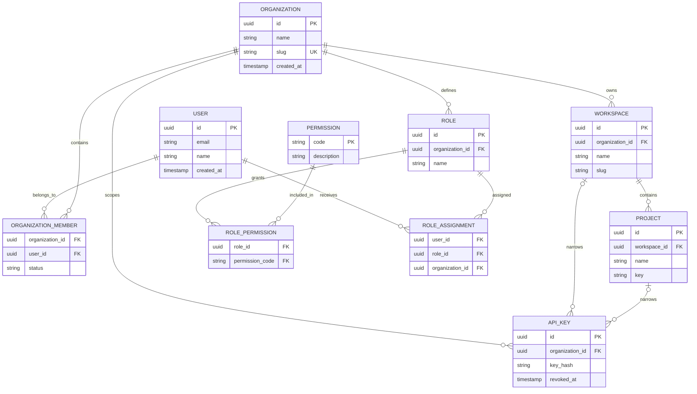

# Testra Database Guide

**Purpose:** Catalog schema evolution, entity relationships, RLS policies, permission model, and storage responsibilities.
**Owner:** Data Architect / Engineering Lead
**Scope:** `testra/apps/api/migrations/000001_*.sql` through `000027_*.sql` (up migrations), plus related down files. Migration `000018` adds notifications, notification preferences, and notification channels; migrations `000019` through `000027` add API-key tenant lookup, defects, analytics, intelligence, integration hub, billing, additional permissions, the worker queue, and user-lookup RLS policies; migrations `000028` through `000032` add role-assignment and queue dead-letter fixes, idempotency org scope, performance indexes, and the API Testing Engine schema.
**Status:** Review complete. This document catalogs the schema evolution, entity relationships, security policies, and permission model as expressed in the migration files.
**Source of Truth:** `apps/api/migrations/*.sql` for authoritative schema; DATABASE_GUIDE.md for interpretation.
**Last Updated:** July 2026
**Related documents:**
- [`BIBLICAL_TESTRA.md`](../BIBLICAL_TESTRA.md)
- [`SYSTEM_FLOWS.md`](SYSTEM_FLOWS.md)
- [`ADR-004-tenant-isolation-strategy.md`](adrs/ADR-004-tenant-isolation-strategy.md)
- [`ADR-005-backup-disaster-recovery.md`](adrs/ADR-005-backup-disaster-recovery.md)

---

## 1. Migration Catalog

| File | Purpose |
|------|---------|
| `000001_create_users.up.sql` | Creates `users` table with email/password/name/timestamps and an email index. |
| `000002_create_organizations.up.sql` | Creates `organizations` and `organization_members`. |
| `000003_create_workspaces.up.sql` | Creates `workspaces` and `workspace_members`. |
| `000004_create_projects.up.sql` | Creates `projects` with `workspace_id` + unique `key`. |
| `000005_add_mfa_and_password_reset.up.sql` | Adds `mfa_secret`/`mfa_enabled` to users and `password_reset_tokens`. |
| `000006_add_rbac.up.sql` | Creates `roles`, `permissions`, `role_permissions`, `role_assignments`; seeds system roles and a base permission set. |
| `000007_add_api_keys.up.sql` | Creates `api_keys` with hash/prefix/scopes/expires/revoked metadata. |
| `000008_add_rbac_permissions.up.sql` | Adds org/workspace/API-key permissions and assigns them to roles. |
| `000009_add_rls_policies.up.sql` | Enables RLS on tenant-scoped tables and defines policies using `app.tenant_id`. |
| `000010_add_refresh_tokens.up.sql` | Creates `refresh_tokens` with token family and revocation. |
| `000011_add_audit_events.up.sql` | Creates `audit_events` with user/action/resource/metadata. |
| `000012_add_test_management.up.sql` | Creates `test_folders`, `test_suites`, `test_cases`, `test_case_versions` with full-text search. |
| `000013_add_test_management_permissions.up.sql` | Adds `tests:*` permissions and maps them to roles. |
| `000014_add_test_management_rls.up.sql` | Enables RLS on test-management tables. |
| `000015_add_test_runs.up.sql` | Creates `test_runs`, `test_run_items`, and enables RLS. |
| `000016_add_execution_permissions.up.sql` | Adds `runs:update`, `runs:delete`, `runs:ingest` permissions. |
| `000017_add_idempotency_records.up.sql` | Creates `idempotency_records` with workspace/operation/key uniqueness and RLS. |
| `000018_add_notifications.up.sql` | Creates `notifications`, `notification_preferences`, and `notification_channels` with RLS. |
| `000028_fix_role_assignments_rls_policy.up.sql` | Adjusts RLS policy on `role_assignments` to allow self-assignment flows. |
| `000029_queue_dead_letter_status.up.sql` | Adds dead-letter status to the worker queue. |
| `000030_idempotency_org_scope.up.sql` | Moves idempotency records to organization scope. |
| `000031_add_performance_indexes.up.sql` | Adds secondary indexes for hot query paths. |
| `000032_add_api_testing.up.sql` | Creates `api_collections`, `api_folders`, `api_environments`, `api_requests`, and `api_request_history` tables with RLS and `api_testing:*` permissions. |

Each migration has a corresponding `.down.sql` file for rollback.

---

## 2. Entity Relationship Model

### 2.1 Core tenancy hierarchy

```
users
  └─ organization_members (user <-> organization)
  └─ organizations (owner_id -> users.id)
       └─ workspaces (organization_id)
            └─ workspace_members (user <-> workspace)
            └─ projects (workspace_id)
                 └─ test_cases (project_id, workspace_id)
            └─ test_folders (workspace_id, parent_id self-reference)
            └─ test_suites (workspace_id, folder_id)
            └─ api_keys (workspace_id)
            └─ test_runs (workspace_id, project_id, suite_id)
            └─ idempotency_records (workspace_id)
            └─ api_collections (workspace_id)
                 └─ api_folders (collection_id, parent_id)
                 └─ api_requests (collection_id, folder_id, environment_id)
            └─ api_environments (workspace_id)
            └─ api_request_history (workspace_id, request_id, environment_id)
```

### 2.2 RBAC

```
roles  <- role_permissions ->  permissions
  ^
  └─ role_assignments (role_id + user_id + scope_type + scope_id)
```

### 2.3 Test management

```
test_folders (parent_id -> test_folders.id)
  └─ test_suites (folder_id)
       └─ test_cases (suite_id)
            └─ test_case_versions (test_case_id)

test_cases (project_id, workspace_id, suite_id?)
```

### 2.4 Test execution

```
test_runs (workspace_id, project_id, suite_id?, created_by)
  └─ test_run_items (run_id, test_case_id?)
```

### 2.5 Identity and security

```
users
  └─ refresh_tokens (user_id, family_id)
  └─ password_reset_tokens (user_id)
  └─ audit_events (user_id, nullable)
```

### 2.6 API Testing

```
api_collections (workspace_id)
  └─ api_folders (collection_id, parent_id self-reference)
       └─ api_requests (collection_id, folder_id, environment_id?)
api_environments (workspace_id) -- variables as JSONB key/value pairs
api_request_history (workspace_id, request_id?, environment_id?)
```

---

## 3. Column Summary by Table

### `users`
- `id` UUID PK
- `email` VARCHAR(255) UNIQUE, indexed
- `password` (hashed)
- `name` VARCHAR(100)
- `mfa_secret`, `mfa_enabled`
- `created_at`, `updated_at`

### `organizations`
- `id` UUID PK
- `name` VARCHAR(255)
- `slug` VARCHAR(100) UNIQUE
- `owner_id` -> `users(id)`
- `created_at`, `updated_at`

### `organization_members`
- `id` UUID PK
- `organization_id`, `user_id` -> `organizations/users`
- `role` VARCHAR(50) (legacy member role string)
- `created_at`
- Unique on `(organization_id, user_id)`

### `workspaces`
- `id` UUID PK
- `organization_id` -> `organizations(id)` ON DELETE CASCADE
- `name`, `slug`
- Unique `(organization_id, slug)`

### `workspace_members`
- `id` UUID PK
- `workspace_id`, `user_id`
- `role` VARCHAR(50)
- Unique `(workspace_id, user_id)`

### `projects`
- `id` UUID PK
- `workspace_id` -> `workspaces(id)` ON DELETE CASCADE
- `name`, `key` (VARCHAR(20)), `description`
- Unique `(workspace_id, key)`

### `roles`, `permissions`, `role_permissions`
- `roles.id` UUID PK, `name` UNIQUE, `is_system`
- `permissions.id` UUID PK, `name` UNIQUE
- `role_permissions` composite PK `(role_id, permission_id)`

### `role_assignments`
- `id` UUID PK
- `role_id`, `user_id`
- `scope_type` VARCHAR(50), `scope_id` UUID
- Unique `(role_id, user_id, scope_type, scope_id)`
- Indexed on `user_id` and `(scope_type, scope_id)`

### `api_keys`
- `id` UUID PK
- `workspace_id` -> `workspaces(id)` ON DELETE CASCADE
- `name` VARCHAR(255)
- `key_hash` VARCHAR(255) UNIQUE, `key_prefix` VARCHAR(10)
- `scopes` TEXT[]
- `last_used_at`, `expires_at`, `revoked_at`
- `created_by` -> `users(id)`
- `created_at`, `updated_at`
- Indexes on `workspace_id` and `key_hash`

### `refresh_tokens`
- `id` UUID PK
- `user_id` -> `users(id)` ON DELETE CASCADE
- `token_hash` VARCHAR(255) UNIQUE
- `family_id` UUID
- `expires_at`, `absolute_expires_at`, `revoked_at`, `replaced_by`
- `created_at`
- Indexes on `user_id` and `token_hash`

### `password_reset_tokens`
- `id` UUID PK
- `user_id` -> `users(id)` ON DELETE CASCADE
- `token_hash`, `expires_at`, `used_at`, `created_at`
- Index on `token_hash`

### `audit_events`
- `id` UUID PK
- `user_id` -> `users(id)` ON DELETE SET NULL
- `action`, `resource`, `resource_id`, `ip_address`, `metadata` JSONB
- `created_at`
- Indexes on `user_id`, `action`, `created_at DESC`

### `test_folders`
- `id` UUID PK
- `workspace_id`, `parent_id` (self)
- `name`, `created_at`, `updated_at`
- Indexes on `workspace_id`, `parent_id`

### `test_suites`
- `id` UUID PK
- `workspace_id`, `folder_id` -> `test_folders(id)` ON DELETE SET NULL
- `name`, `description`
- Indexes on `workspace_id`, `folder_id`

### `test_cases`
- `id` UUID PK
- `workspace_id`, `project_id` (CASCADE), `suite_id` (SET NULL)
- `title`, `description`, `preconditions`
- `steps` JSONB, `status` VARCHAR(20), `priority` VARCHAR(20)
- `tags` TEXT[], `version` INTEGER
- `created_by` -> `users(id)`
- `search_tsv` TSVECTOR with GIN index and triggers
- Indexes on workspace, project, suite, status, search

### `test_case_versions`
- `id` UUID PK
- `test_case_id` -> `test_cases(id)` ON DELETE CASCADE
- `version`, `title`, `description`, `preconditions`, `steps` JSONB, `changed_by`
- Indexes on `test_case_id` and `(test_case_id, version DESC)`

### `test_runs`
- `id` UUID PK
- `workspace_id`, `project_id` (CASCADE), `suite_id` (SET NULL)
- `name`, `status`, `total`, `passed`, `failed`, `skipped`, `blocked`, `duration_ms`
- `source` VARCHAR(20), `metadata` JSONB, `created_by`
- `started_at`, `completed_at`
- Indexes on workspace, project, suite, status, created_by, created_at DESC

### `test_run_items`
- `id` UUID PK
- `run_id` -> `test_runs(id)` ON DELETE CASCADE
- `test_case_id` (SET NULL), `title`, `status`, `duration_ms`
- `error_message`, `stack_trace`, `artifacts` JSONB, `sort_order`
- Indexes on run, case, status, `(run_id, sort_order)`

### `idempotency_records`
- `id` UUID PK
- `workspace_id` -> `workspaces(id)` ON DELETE CASCADE
- `operation`, `key`, `request_fingerprint`, `response_body` JSONB, `status_code`
- `created_at`, `expires_at`
- Unique `(workspace_id, operation, key)`
- Indexes on `(workspace_id, operation, key)` and `expires_at`

### `api_collections`
- `id` UUID PK
- `workspace_id` -> `workspaces(id)` ON DELETE CASCADE
- `name`, `description`
- `created_by` -> `users(id)`, `created_at`, `updated_at`

### `api_folders`
- `id` UUID PK
- `workspace_id`, `collection_id` -> `api_collections(id)` ON DELETE CASCADE
- `parent_id` -> `api_folders(id)` ON DELETE CASCADE, `name`
- `created_at`, `updated_at`

### `api_environments`
- `id` UUID PK
- `workspace_id` -> `workspaces(id)` ON DELETE CASCADE
- `name`, `variables` JSONB array of `{key, value, enabled}`
- `created_at`, `updated_at`

### `api_requests`
- `id` UUID PK
- `workspace_id`, `collection_id` -> `api_collections(id)` ON DELETE CASCADE
- `folder_id` -> `api_folders(id)` ON DELETE SET NULL
- `environment_id` -> `api_environments(id)` ON DELETE SET NULL
- `name`, `method`, `url`
- `headers`, `query_params`, `variables` JSONB arrays of `{key, value, enabled}`
- `auth_type`, `auth_config` JSONB, `body_type`, `body_content`
- `created_by` -> `users(id)`, `created_at`, `updated_at`

### `api_request_history`
- `id` UUID PK
- `workspace_id`, `request_id` -> `api_requests(id)` ON DELETE SET NULL
- `environment_id` -> `api_environments(id)` ON DELETE SET NULL
- `name`, `method`, `url`
- `request_headers` JSONB, `request_body`
- `response_status`, `response_status_text`, `response_headers` JSONB, `response_body`
- `response_time_ms`, `error`, `created_by`, `created_at`

---

## 4. Row Level Security Policy Matrix

| Table | Policy | Rule |
|-------|--------|------|
| `organizations` | `org_tenant_isolation` | `id = app.tenant_id` |
| `organization_members` | `org_members_tenant` | `organization_id = app.tenant_id` |
| `workspaces` | `workspaces_tenant` | `organization_id = app.tenant_id` |
| `workspace_members` | `workspace_members_tenant` | `workspace_id IN (workspaces of tenant)` |
| `projects` | `projects_tenant` | `workspace_id IN (workspaces of tenant)` |
| `api_keys` | `api_keys_tenant` | `workspace_id IN (workspaces of tenant)` |
| `role_assignments` | `role_assignments_tenant` | `scope_id = app.tenant_id` |
| `test_folders` | `test_folders_tenant` | `workspace_id IN (workspaces of tenant)` |
| `test_suites` | `test_suites_tenant` | `workspace_id IN (workspaces of tenant)` |
| `test_cases` | `test_cases_tenant` | `workspace_id IN (workspaces of tenant)` |
| `test_case_versions` | `test_case_versions_tenant` | `test_case_id IN (test_cases of tenant)` |
| `test_runs` | `test_runs_tenant` | `workspace_id IN (workspaces of tenant)` |
| `test_run_items` | `test_run_items_tenant` | `run_id IN (test_runs of tenant)` |
| `idempotency_records` | `idempotency_records_tenant` | `workspace_id IN (workspaces of tenant)` |
| `api_collections` | `api_collections_tenant` | `workspace_id IN (workspaces of tenant)` |
| `api_folders` | `api_folders_tenant` | `workspace_id IN (workspaces of tenant)` |
| `api_environments` | `api_environments_tenant` | `workspace_id IN (workspaces of tenant)` |
| `api_requests` | `api_requests_tenant` | `workspace_id IN (workspaces of tenant)` |
| `api_request_history` | `api_request_history_tenant` | `workspace_id IN (workspaces of tenant)` |

"workspaces of tenant" means:

```sql
SELECT id FROM workspaces WHERE organization_id = current_setting('app.tenant_id', true)::uuid
```

### Tables intentionally without RLS

- `users` — global identity table.
- `password_reset_tokens` — scoped to a user, not an org.
- `roles`, `permissions`, `role_permissions` — global lookup tables.

---

## 5. Permission Catalog

### 5.1 Seeded in `000006_add_rbac`

| Permission ID (prefix) | Name | Description |
|------------------------|------|-------------|
| `...0101` | `projects:create` | Create projects |
| `...0102` | `projects:read` | View projects |
| `...0103` | `projects:update` | Update projects |
| `...0104` | `projects:delete` | Delete projects |
| `...0201` | `testcases:create` | Create test cases |
| `...0202` | `testcases:read` | View test cases |
| `...0203` | `testcases:update` | Update test cases |
| `...0204` | `testcases:delete` | Delete test cases |
| `...0301` | `runs:create` | Create test runs |
| `...0302` | `runs:read` | View test runs |
| `...0303` | `runs:execute` | Execute test runs |
| `...0401` | `defects:create` | Create defects |
| `...0402` | `defects:read` | View defects |
| `...0403` | `defects:update` | Update defects |
| `...0404` | `defects:delete` | Delete defects |
| `...0501` | `results:write` | Ingest test results via CI |
| `...0502` | `results:read` | View test results |
| `...0601` | `settings:read` | View workspace settings |
| `...0602` | `settings:update` | Update workspace settings |
| `...0701` | `members:read` | View workspace members |
| `...0702` | `members:manage` | Invite and manage members |

### 5.2 Added in `000008_add_rbac_permissions`

Adds `orgs:create/read/update/delete`, `workspaces:create/read/update/delete`, and `apikeys:create/read/update/delete`, then assigns them to owner/admin/viewer roles. This migration also updates the seed mappings for `projects:*`, `testcases:*`, `runs:*`, and `settings:*`.

### 5.3 Added in `000013_add_test_management_permissions`

| Permission ID | Name | Description |
|---------------|------|-------------|
| `...1101` | `tests:create` | Create test cases, suites, and folders |
| `...1102` | `tests:read` | View test cases, suites, and folders |
| `...1103` | `tests:update` | Update test cases, suites, and folders |
| `...1104` | `tests:delete` | Delete test cases, suites, and folders |

Mapped to:

- `owner` and `admin`: all four
- `qa_engineer`: `create/read/update`
- `viewer`: `read`

### 5.4 Added in `000032_add_api_testing`

| Permission ID | Name | Description |
|---------------|------|-------------|
| `...1401` | `api_testing:create` | Create API collections, folders, environments, and requests |
| `...1402` | `api_testing:read` | View API collections, folders, environments, requests, and execution history |
| `...1403` | `api_testing:update` | Update API collections, folders, environments, and requests |
| `...1404` | `api_testing:delete` | Delete API collections, folders, environments, and requests |
| `...1405` | `api_testing:execute` | Execute API requests |

Mapped to:

- `owner` and `admin`: all five
- `qa_engineer`: `create/read/update/execute`
- `viewer`: `read`

### 5.5 Added in `000016_add_execution_permissions`

| Permission ID | Name | Description |
|---------------|------|-------------|
| `...1203` | `runs:update` | Update test runs and execution status |
| `...1204` | `runs:delete` | Delete test runs and results |
| `...1205` | `runs:ingest` | Ingest CI/CD test results via API |

Mapped to:

- `owner` and `admin`: all three
- `qa_engineer`: `runs:update`

### 5.5 Note on permission drift

The original `000006` permissions `testcases:*`, `runs:execute`, `results:*`, `defects:*`, `settings:*`, and `members:*` are not used in the current HTTP routes. The routes rely on:

- `orgs:read`
- `workspaces:create/read`
- `projects:create/read`
- `apikeys:create/read/delete`
- `tests:create/read/update/delete`
- `runs:create/read/update/delete/ingest`

This creates a naming mismatch that should be reconciled in a future migration.

---

## 6. Schema Security & Design Notes

1. **Tenant isolation is database-enforced.** Every tenant-scoped table has an RLS policy keyed to `app.tenant_id`, which is set per connection by the application middleware.
2. **Cascading deletes are explicit.** Org deletion will cascade to workspaces, projects, test cases, etc. Child tables use `ON DELETE CASCADE` or `SET NULL` as appropriate.
3. **Full-text search is native.** `test_cases.search_tsv` is populated by PostgreSQL triggers; queries can use `to_tsquery`/`search_tsv`.
4. **Audit is append-only.** `audit_events` has no update/delete path in migrations and no RLS (global table).
5. **Idempotency records have TTL semantics.** `expires_at` is part of the table and an index supports cleanup, but no recurring cleanup is defined in migrations.
6. **Refresh token families enable rotation and revocation.** The schema supports detection of reuse (a revoked family member triggers full family revocation).
7. **API key hashes are stored, not plaintext.** `key_hash` UNIQUE and `key_prefix` allow lookup and display prefix only.

---

## 7. Findings & Recommendations

1. **Permission names drift.** Consolidate `testcases:*`/`runs:execute`/`results:*` with the `tests:*` and `runs:*` names that the route tree actually checks.
2. **`000008_add_rbac_permissions` re-grants old permission names and introduces new ones.** It is a large migration that could be split into smaller, idempotent additions.
3. **Role assignment `scope_type` is seeded as `organization` everywhere.** If workspace-level roles are needed, migrations and application code must align on scope handling.
4. **`test_cases` references `project_id` as NOT NULL and CASCADE.** If a project is deleted, all test cases in that project are deleted automatically. This matches the service logic but is destructive.
5. **No migration indexes `test_cases` by `created_at` for pagination.** The repository orders by `created_at DESC, id DESC` and uses the PK; adding a composite index `(workspace_id, created_at DESC, id DESC)` may improve list performance.
6. **RLS policies use subqueries against `workspaces`.** At scale, a `UNION ALL` or direct `organization_id` column on child tables would be more performant than a subquery per row. For current size this is acceptable.
7. **No `ON DELETE` behavior for `role_assignments` when an organization is removed.** The `scope_id` is a UUID without a foreign key, so orphaned assignments are possible if not cleaned by application code.
8. **`test_run_items` has `test_case_id` nullable and `ON DELETE SET NULL`.** This preserves historical run results even if the associated test case is deleted, which is correct for auditability.
9. **No explicit constraint on `test_case_versions.version`.** The combination of `test_case_id` and `version` is indexed but not UNIQUE; the application increments `version` transactionally.
10. **Idempotency records `id` is a UUID but `UNIQUE` is on `(workspace_id, operation, key)`.** This is correct for replay semantics.


## Database Overview

> For the authoritative migration catalog, column-level schema details, RLS policy matrix, and permission catalog, see Sections 1–6 above. For how the application sets the tenant context and accesses the database, see [`BIBLICAL_TESTRA.md`](../BIBLICAL_TESTRA.md) and the accepted ADRs (especially ADR-004 and ADR-005).


## Storage and Operational Rules

### 1. Storage Responsibilities

| Store | Responsibility | Non-responsibilities |
|---|---|---|
| PostgreSQL 16 | transactional identity, tenancy, configuration, relational business data, audit records | high-volume analytical event querying |
| ClickHouse 24 | test results, events, and time-series analytical data | transactional authority, user/session state |
| Redis 7 | sessions, rate limiting, and Asynq job queues | durable business records |
| S3-compatible storage | attachments, exports, and model artifacts | relational metadata authority |

These responsibilities follow the engineering standards. Actual implementation status is tracked by phase documentation.

### 2. Relational Invariants

- UUID primary keys are used for entities.
- Tenant-scoped rows carry `organization_id` or an equivalent tenant identifier.
- Tables have UTC `created_at` and `updated_at` timestamps where mutable lifecycle data exists.
- Foreign keys and indexes are required for relationships and common filters.
- Parent-owned children use cascading deletion only where product retention and audit requirements permit it.
- Migrations are sequential `golang-migrate` files with both up and down directions.
- Merged migrations are immutable; corrections use a new migration.

> For tenancy and authorization rules, see the Row Level Security Policy Matrix above and ADR-004. For the current entity catalog, see the Migration Catalog and Column Summary above.

### 3. ClickHouse Rules

ClickHouse is append-oriented analytical storage using the MergeTree family. Every event/result record includes tenant identity and event time. Partition by event month and order by tenant, project, and event time as the default analytical layout. Deduplicate ingestion using stable domain event/result identifiers. Retain analytical results for 13 months by default, with daily backups retained 14 days and weekly backups 8 weeks. Transactional status and authorization metadata remain authoritative in PostgreSQL. Full recovery rules are defined in ADR-005.

### 4. Redis Rules

Use the `testra:` namespace. Keys must encode purpose and scope, and have explicit TTLs where data is ephemeral. Redis loss must not destroy the only copy of business data. Queue jobs require retry policy, dead-letter handling, and idempotent consumers.

### 5. Migration Operations

1. Review migration SQL and its down migration.
2. Confirm lock, duration, index, and backfill impact.
3. Apply in staging against a representative backup.
4. Verify schema and application compatibility.
5. Promote through the deployment pipeline; migrations are not manually applied in production.
6. Record completion and rollback/forward-fix decision.

Destructive or long-running changes require an expand/contract plan and explicit production-readiness approval.


## Entity Relationship Diagram

### Status

This is a documentation-level model. As of Phase 3, the core identity, tenancy, RBAC, API keys, test management, test runs, audit events, and notification entities are implemented in the migrations. Planned entities include API testing, defects, analytics, integrations, and marketplace extensions. The authoritative schema remains the `apps/api/migrations/*.sql` files.

### Core ERD



### Relationship Rules

- A user may belong to multiple organizations.
- An organization owns workspaces; a workspace owns projects.
- Membership is represented by an organization membership relationship keyed by organization and user; membership is the prerequisite for all tenant access.
- Roles and assignments are organization-scoped. Permission narrowing is enforced by resource scope in the service layer.
- API keys are stored as hashes and may be narrowed to workspace/project scope; plaintext is displayed only at creation.
- PostgreSQL RLS and request-scoped tenant propagation are mandatory as defined in ADR-004.

### Planned Domain Extensions

Phases 2 and 3 are complete: test cases, suites, folders, audit events, test runs, test run items, and notifications are now in the schema. Phase 4 and beyond add API testing definitions, defects, integration records, and analytics. Those entities are omitted from the current ERD until ownership and retention rules are approved.

### Review Requirement

Any schema change must update this document, the relevant migration plan, and OpenAPI when the change affects an API representation. The diagram is not a substitute for migration SQL.

---

## See Also

- [`BIBLICAL_TESTRA.md`](../BIBLICAL_TESTRA.md) — engineering handbook, request lifecycle, and canonical sources map.
- [`SYSTEM_FLOWS.md`](SYSTEM_FLOWS.md) — sequence diagrams and system trust flows.
- [`ADR-004-tenant-isolation-strategy.md`](adrs/ADR-004-tenant-isolation-strategy.md) and [`ADR-005-backup-disaster-recovery.md`](adrs/ADR-005-backup-disaster-recovery.md) — tenant isolation and data retention decisions.
- [`ENGINEERING_STANDARDS.md`](../engineering/ENGINEERING_STANDARDS.md) — coding and review standards.
- [`ONBOARDING.md`](../engineering/ONBOARDING.md) — how to add migrations, modules, and endpoints.
