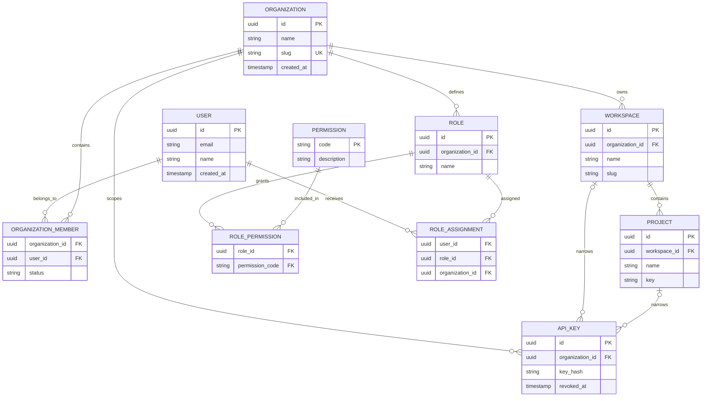

# Testra Entity Relationship Diagram

## Status

This is a documentation-level model. Solid entities are recorded as current in project progress; planned entities are approved roadmap items and must be reconciled with migrations before implementation.

## Core ERD

## Relationship Rules

- A user may belong to multiple organizations.
- An organization owns workspaces; a workspace owns projects.
- Membership is represented by an organization membership relationship keyed by organization and user; membership is the prerequisite for all tenant access.
- Roles and assignments are organization-scoped. Permission narrowing is enforced by resource scope in the service layer.
- API keys are stored as hashes and may be narrowed to workspace/project scope; plaintext is displayed only at creation.
- PostgreSQL RLS and request-scoped tenant propagation are mandatory as defined in ADR-004.

## Planned Domain Extensions

Phase 2 adds test cases, suites, folders, and immutable audit events. Phase 3 adds runs and analytical results. Phase 4 adds defects, notifications, and integration records. Those entities are intentionally omitted from the current ERD until ownership and retention rules are approved.

## Review Requirement

Any schema change must update this document, the relevant migration plan, and OpenAPI when the change affects an API representation. The diagram is not a substitute for migration SQL.
