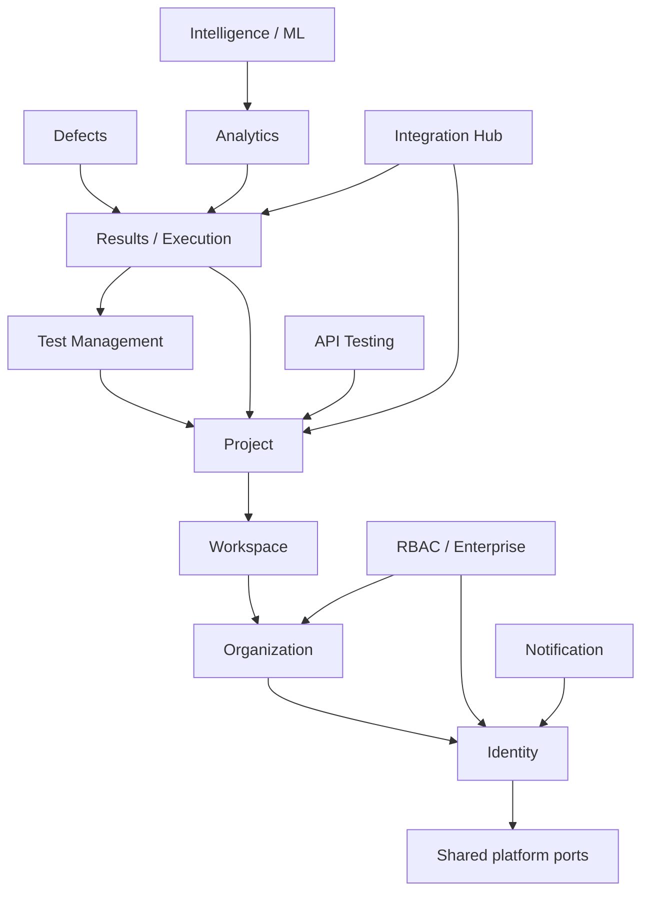

# Testra Module Dependency Documentation

## Architectural Rule

Testra is a Go modular monolith with Clean Architecture boundaries. Each module owns its domain and communicates through consumer-defined ports. Modules must not import another module's internal implementation details.

## Module Map

## Dependency Rules

- `shared` provides cross-cutting primitives, not business ownership.
- `identity` owns authentication credentials and session issuance.
- `organization`, `workspace`, and `project` own their respective tenancy resources.
- RBAC may depend on identity and organization context but must expose authorization through ports.
- Test and result modules may depend on project scope, not on identity repository internals.
- Analytics and intelligence consume published facts or ports; they must not become transaction owners for core entities.
- Integrations use ports for external systems and must not spread vendor SDKs through domain modules.

## Dependency Review Checklist

- Does the change belong to exactly one module?
- Is the dependency directed toward an abstraction or domain contract?
- Could the dependency create a cycle?
- Is tenant authorization enforced at the use-case boundary?
- Does the module need an event/port instead of a direct import?
- Is an ADR required for a new cross-cutting dependency?

The module list and dependency direction are approved logical architecture. Exact package-level dependencies must continue to be checked against implementation during each phase review, and any new cross-cutting dependency requires an ADR before implementation.
