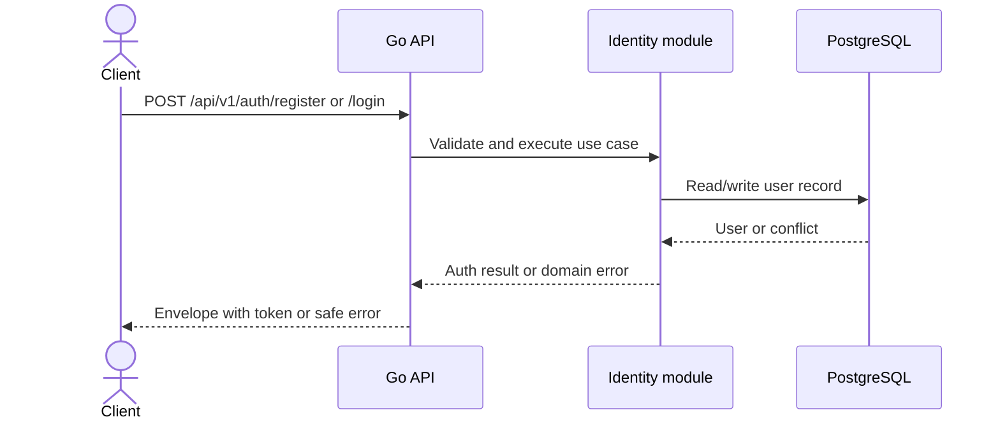
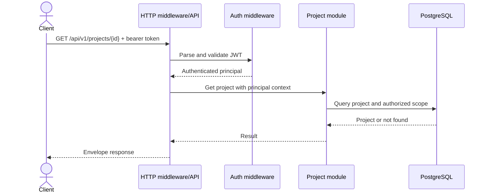
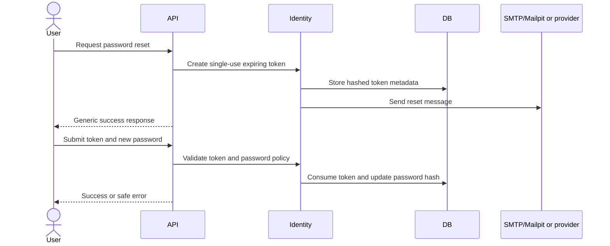
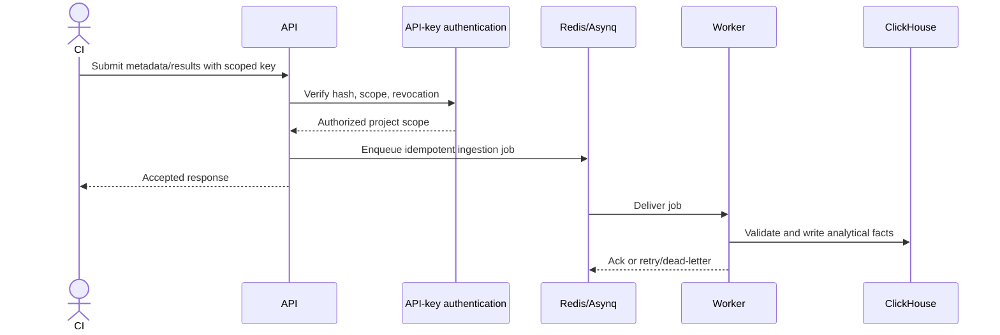

# Testra Sequence Diagrams

These diagrams describe approved/current boundaries and planned flows. A planned diagram is not evidence of implementation.

## Registration and Login — current contract

## Tenant-Scoped Project Read — current contract

## Planned Password Reset

## Planned Automation Result Ingestion

Ingestion endpoints require `Idempotency-Key`, acknowledge accepted batches within 500 ms for batches up to 1,000 result records, and deduplicate with stable domain event/result identifiers. The MVP processing target is 10,000 result records/minute. Accepted formats are documented in OpenAPI before implementation. Testra must not retain customer source code or raw API collection payloads.
