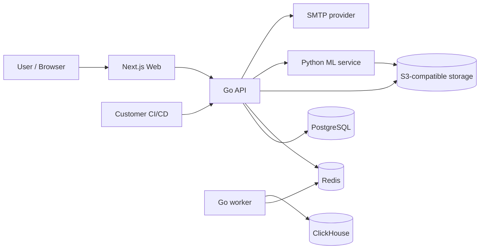
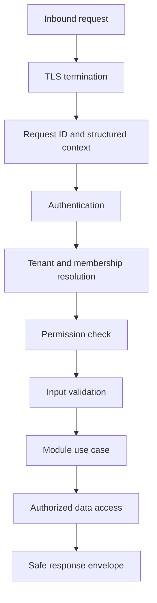
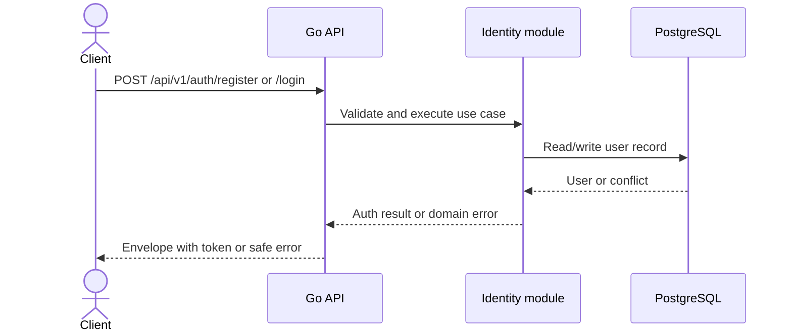
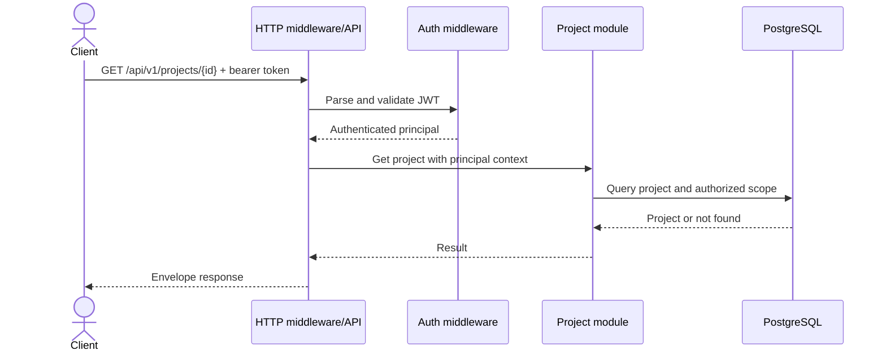
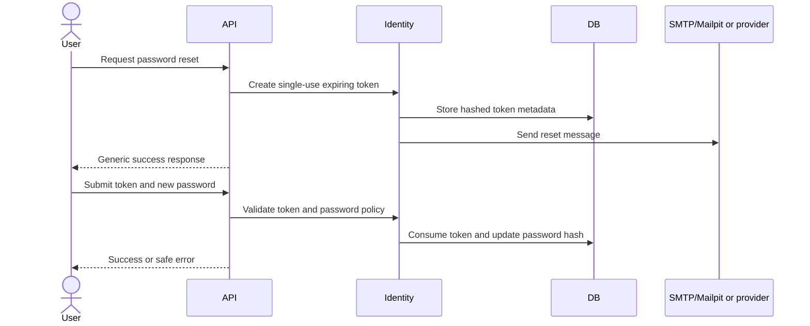
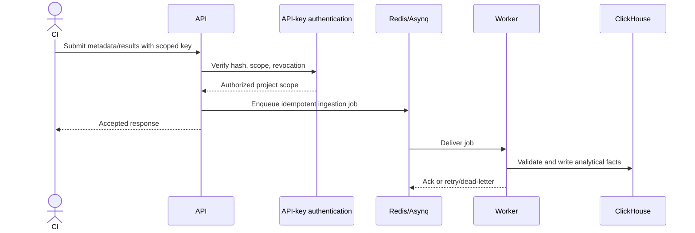

# Testra System Flow Diagrams

**Purpose:** Provide platform context, request trust, data classification, and sequence diagrams for key flows.
**Owner:** CTO / Engineering Lead
**Scope:** System, request, and sequence diagrams.
**Source of Truth:** SYSTEM_FLOWS.md for diagrams; BIBLICAL_TESTRA.md for architecture narration.
**Last Updated:** July 2026
**Related documents:**
- [`BIBLICAL_TESTRA.md`](../BIBLICAL_TESTRA.md)
- [`DATABASE_GUIDE.md`](DATABASE_GUIDE.md)
- [`ADR-004-tenant-isolation-strategy.md`](adrs/ADR-004-tenant-isolation-strategy.md)

## Platform Context

## Request Trust Flow

Every protected path must preserve this order conceptually. Middleware and module design may combine steps, but authorization must not be bypassed by direct repository access.

## Data Classification Flow

- PostgreSQL: authoritative transactional records.
- ClickHouse: derived analytical facts and result events.
- Redis: ephemeral coordination and queue state.
- Object storage: explicitly approved artifacts/exports.
- Logs/metrics/traces: operational metadata only; never credentials or customer source code.

## Failure Boundaries

- Database failure: fail closed for writes; return safe transient error; do not silently acknowledge durable work.
- Queue failure: retain or reject ingestion according to idempotency policy; alert on backlog.
- ML failure: degrade optional intelligence features without blocking core test management unless the use case explicitly requires prediction.
- External SMTP/integration failure: retry boundedly and expose operational state without leaking credentials.

Production ingress is Nginx on an Ubuntu VM (MVP) terminating TLS and reverse-proxying to systemd-managed application services. A future managed platform may add a CDN/WAF and load balancing if scale justifies it, but the logical flow remains valid for local native development and the single-Ubuntu-VPS roadmap in ADR-003 (amended by ADR-009).

## Sequence Diagrams

These diagrams describe approved/current boundaries and planned flows. A planned diagram is not evidence of implementation.

### Registration and Login — current contract

### Tenant-Scoped Project Read — current contract

### Planned Password Reset

### Planned Automation Result Ingestion

Ingestion endpoints require `Idempotency-Key`, acknowledge accepted batches within 500 ms for batches up to 1,000 result records, and deduplicate with stable domain event/result identifiers. The MVP processing target is 10,000 result records/minute. Accepted formats are documented in OpenAPI before implementation. Testra must not retain customer source code or raw API collection payloads.

---

## See Also

- [`BIBLICAL_TESTRA.md`](../BIBLICAL_TESTRA.md) — engineering handbook and canonical sources map.
- [`DATABASE_GUIDE.md`](DATABASE_GUIDE.md) — schema, RLS, migrations, and ERD.
- [`API_DESIGN_GUIDELINES.md`](../api/API_DESIGN_GUIDELINES.md) — REST, versioning, and idempotency conventions.
- [`ROUTES.md`](../ROUTES.md) — frontend and backend route inventory.
- [`ADR-004-tenant-isolation-strategy.md`](adrs/ADR-004-tenant-isolation-strategy.md), [`ADR-011-synchronous-ingestion-for-mvp.md`](adrs/ADR-011-synchronous-ingestion-for-mvp.md), and [`ADR-012-idempotency-key-for-ingestion.md`](adrs/ADR-012-idempotency-key-for-ingestion.md).
