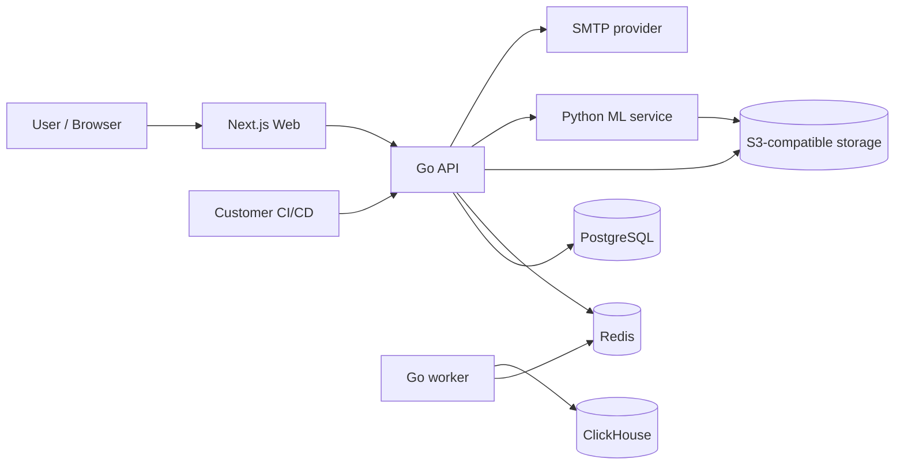
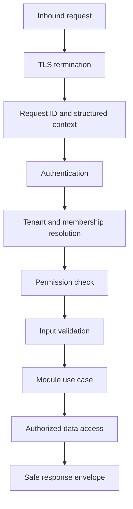

# Testra System Flow Diagrams

## Platform Context

## Request Trust Flow

Every protected path must preserve this order conceptually. Middleware and module design may combine steps, but authorization must not be bypassed by direct repository access.

## Data Classification Flow

- PostgreSQL: authoritative transactional records.
- ClickHouse: derived analytical facts and result events.
- Redis: ephemeral coordination and queue state.
- Object storage: explicitly approved artifacts/exports.
- Logs/metrics/traces: operational metadata only; never credentials or customer source code.

## Failure Boundaries

- Database failure: fail closed for writes; return safe transient error; do not silently acknowledge durable work.
- Queue failure: retain or reject ingestion according to idempotency policy; alert on backlog.
- ML failure: degrade optional intelligence features without blocking core test management unless the use case explicitly requires prediction.
- External SMTP/integration failure: retry boundedly and expose operational state without leaking credentials.

Production ingress is Nginx on an Ubuntu VM (MVP) terminating TLS and reverse-proxying to systemd-managed application services. Future AWS deployment uses Cloudflare CDN/WAF to AWS load balancing/CloudFront and ECS Fargate. TLS uses Cloudflare/ACM in the AWS path. The logical flow remains valid for local native development and the deployment roadmap in ADR-003 (amended by ADR-009).
