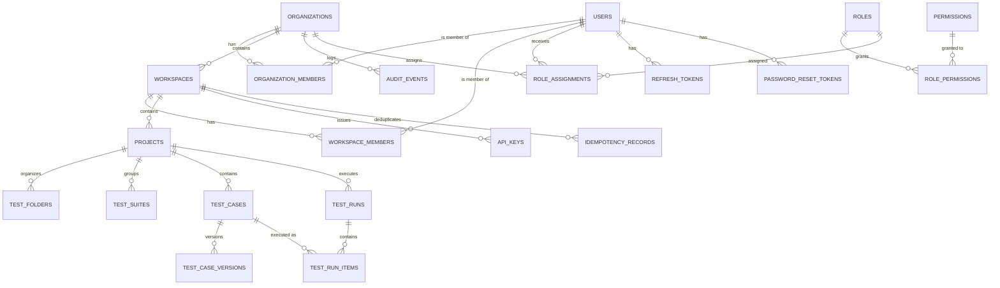

# Database Overview

> For the full migration catalog, schema details, RLS policy matrix, and permission catalog, see [`migration-review.md`](migration-review.md). For how the application accesses the database, see [`ARCHITECTURE.md`](ARCHITECTURE.md) and [`backend-audit.md`](backend-audit.md).

## Entity relationships



## Tenant ownership hierarchy

```
User (no tenant — global identity)
  └── Organization (tenant root, RLS tenant_id = organization.id)
        ├── OrganizationMember
        ├── Workspace
        │     ├── WorkspaceMember
        │     ├── Project
        │     │     ├── TestFolder
        │     │     ├── TestSuite
        │     │     ├── TestCase
        │     │     │     └── TestCaseVersion
        │     │     └── TestRun
        │     │           └── TestRunItem
        │     ├── APIKey
        │     └── IdempotencyRecord
        ├── RoleAssignment
        └── AuditEvent
```

- Every tenant-scoped table stores an `organization_id` or resolves to an organization through `workspace_id` / `project_id`.
- The application sets `SET app.tenant_id = '<organization_id>'` on a dedicated connection per request.
- PostgreSQL RLS policies compare `app.tenant_id` to the row's owning `organization_id`.

## Main table groups

### Identity & security

| Table | Purpose | Tenant-owned | Notes |
|-------|---------|--------------|-------|
| `users` | Global user accounts (email, password hash, MFA secret) | No | No RLS; accessed by user ID |
| `refresh_tokens` | Opaque refresh token families per user | No | `token_hash` stored; family rotation |
| `password_reset_tokens` | Time-bound reset tokens | No | Single-use, expires |
| `roles` | System roles (`owner`, `admin`, `qa_engineer`, `viewer`) | No | Seed data |
| `permissions` | Permission catalog (`tests:create`, `runs:ingest`, etc.) | No | Seed data |
| `role_permissions` | Many-to-many role ↔ permission | No | Seed data |
| `role_assignments` | User ↔ role ↔ scope | Yes | Scope currently `organization` only |

### Platform & access

| Table | Purpose | Tenant-owned | RLS |
|-------|---------|--------------|-----|
| `organizations` | Customer tenant boundary | Yes | Enabled |
| `organization_members` | User membership in org | Yes | Enabled |
| `workspaces` | Org subdivision | Yes | Enabled |
| `workspace_members` | User membership in workspace | Yes | Enabled |
| `projects` | Software component under test | Yes | Enabled |
| `api_keys` | Scoped automation keys | Yes | Enabled |

### Test management tables

| Table | Purpose | Tenant-owned | RLS |
|-------|---------|--------------|-----|
| `test_folders` | Hierarchical folders within a project | Yes | Enabled |
| `test_suites` | Grouping of test cases | Yes | Enabled |
| `test_cases` | Test case definition with steps/tags | Yes | Enabled |
| `test_case_versions` | Immutable snapshots of test case edits | Yes | Enabled |

### Execution tables

| Table | Purpose | Tenant-owned | RLS |
|-------|---------|--------------|-----|
| `test_runs` | Manual or automated run metadata | Yes | Enabled |
| `test_run_items` | Individual case results within a run | Yes | Enabled |

### Supporting tables

| Table | Purpose | Tenant-owned | RLS |
|-------|---------|--------------|-----|
| `audit_events` | Timestamped, attributable actions | Yes | Enabled |
| `idempotency_records` | Deduplicate `POST /ingest` | Yes | Enabled |

## RLS coverage

| Table | RLS Enabled | Tenant Column | Resolution |
|-------|-------------|---------------|------------|
| `organizations` | ✅ | `id` | Direct |
| `organization_members` | ✅ | `organization_id` | Direct |
| `workspaces` | ✅ | `organization_id` | Direct |
| `workspace_members` | ✅ | `workspace_id` | Via workspace |
| `projects` | ✅ | `workspace_id` | Via workspace |
| `api_keys` | ✅ | `workspace_id` | Via workspace |
| `role_assignments` | ✅ | `scope_id` (org UUID) | Direct |
| `test_folders` | ✅ | `workspace_id` | Via project/workspace |
| `test_suites` | ✅ | `workspace_id` | Via project/workspace |
| `test_cases` | ✅ | `workspace_id` | Via project/workspace |
| `test_case_versions` | ✅ | `workspace_id` (via `test_cases`) | Via test_case/project/workspace |
| `test_runs` | ✅ | `workspace_id` | Via project/workspace |
| `test_run_items` | ✅ | `workspace_id` (via `test_runs`) | Via test_run/project/workspace |
| `audit_events` | ✅ | `organization_id` | Direct |
| `idempotency_records` | ✅ | `workspace_id` | Via workspace |
| `users` | ❌ | N/A | Global identity table |
| `refresh_tokens` | ❌ | N/A | Global; queried by user |
| `password_reset_tokens` | ❌ | N/A | Global; queried by user |
| `roles` / `permissions` / `role_permissions` | ❌ | N/A | Global seed catalogs |

> **Important:** RLS policies are defense-in-depth. They do **not** replace membership checks in the service layer. The `users`, `refresh_tokens`, and `password_reset_tokens` tables are intentionally global because they exist outside any tenant.

## Migration summary

Migrations are stored in `apps/api/migrations/` and applied with `golang-migrate` via `apps/api/cmd/migrator/main.go`.

| Migration | Files | What it creates |
|-----------|-------|-----------------|
| `000001_create_users` | `.up.sql`, `.down.sql` | `users` table |
| `000002_create_organizations` | `.up.sql`, `.down.sql` | `organizations`, `organization_members` |
| `000003_create_workspaces` | `.up.sql`, `.down.sql` | `workspaces`, `workspace_members` |
| `000004_create_projects` | `.up.sql`, `.down.sql` | `projects` |
| `000005_add_mfa_and_password_reset` | `.up.sql`, `.down.sql` | `mfa_enabled`, `mfa_secret`, `password_reset_tokens` |
| `000006_add_rbac` | `.up.sql`, `.down.sql` | `roles`, `permissions`, `role_permissions`, `role_assignments` + seed data |
| `000007_add_api_keys` | `.up.sql`, `.down.sql` | `api_keys` |
| `000008_add_rbac_permissions` | `.up.sql`, `.down.sql` | Additional RBAC permissions |
| `000009_add_rls_policies` | `.up.sql`, `.down.sql` | Row-level security policies on tenant tables |
| `000010_add_refresh_tokens` | `.up.sql`, `.down.sql` | `refresh_tokens` table |
| `000011_add_audit_events` | `.up.sql`, `.down.sql` | `audit_events` table |
| `000012_add_test_management` | `.up.sql`, `.down.sql` | `test_folders`, `test_suites`, `test_cases`, `test_case_versions` |
| `000013_add_test_management_permissions` | `.up.sql`, `.down.sql` | Test-management permission catalog |
| `000014_add_test_management_rls` | `.up.sql`, `.down.sql` | RLS for test-management tables |
| `000015_add_test_runs` | `.up.sql`, `.down.sql` | `test_runs`, `test_run_items` |
| `000016_add_execution_permissions` | `.up.sql`, `.down.sql` | Run/ingest permissions |
| `000017_add_idempotency_records` | `.up.sql`, `.down.sql` | `idempotency_records` table |

### Migration notes

- **Every migration has a down file.** Rollback is supported.
- **RLS and permissions are added separately** from tables (`000009`, `000013`, `000014`, `000016`).
- **Seeding is done in migrations** for roles and permissions, not in application code.
- **Column additions are not in place:** history is preserved as discrete migrations. Check `migration-review.md` for full column breakdowns and security findings.
