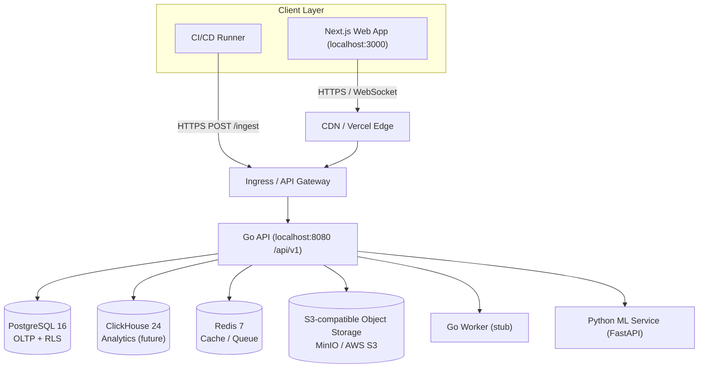
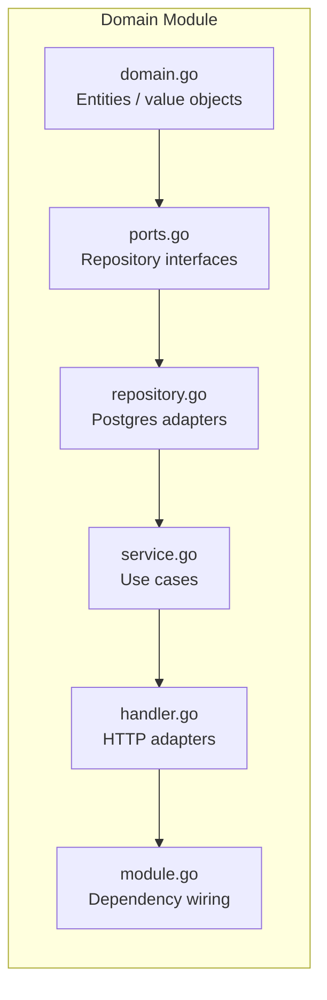
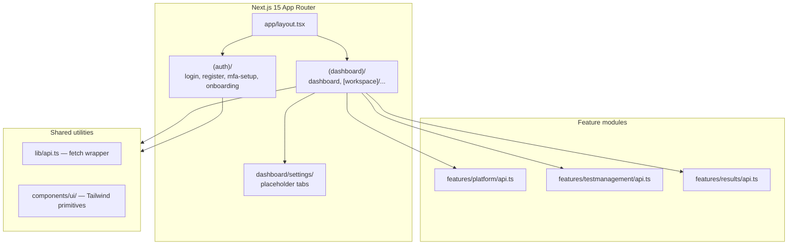
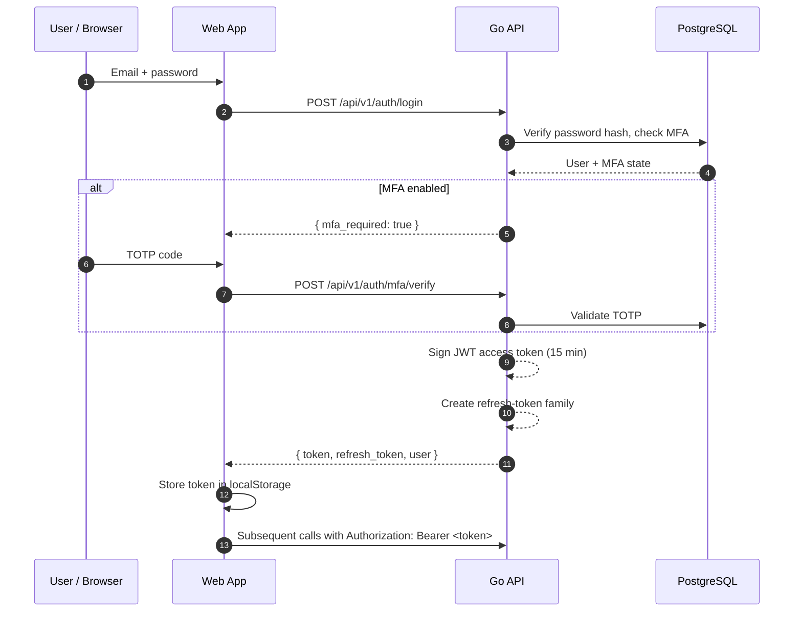
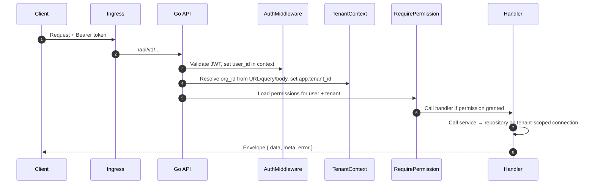
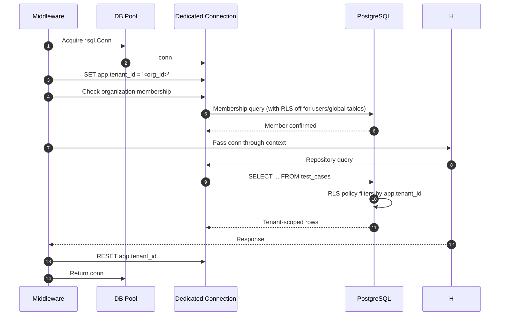
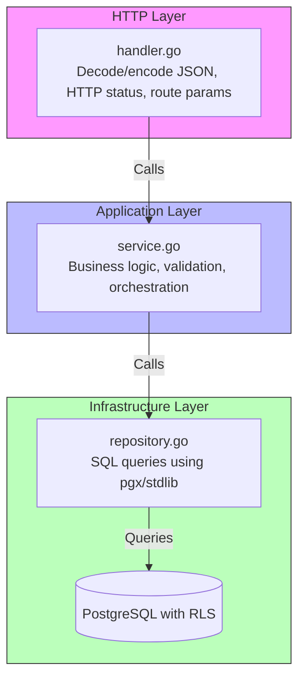
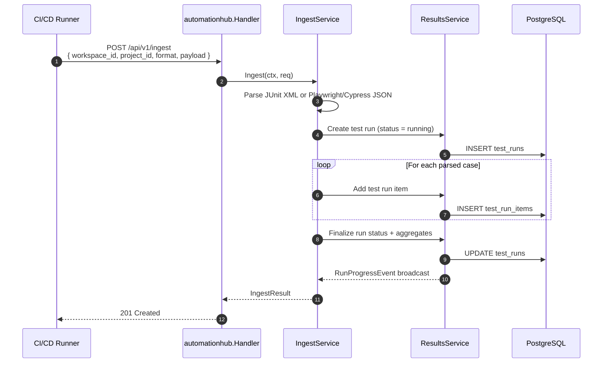
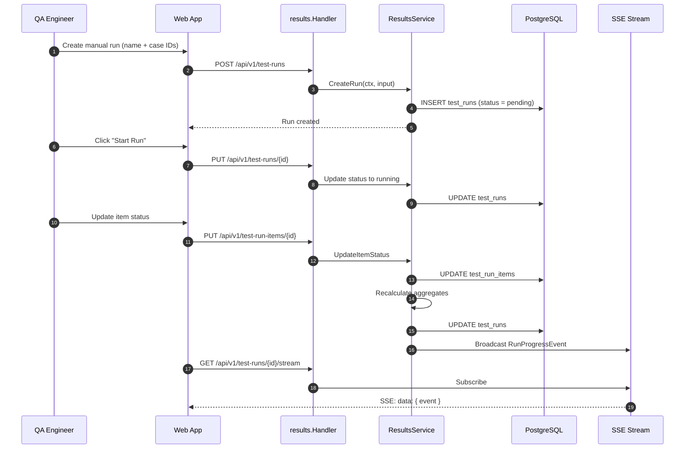

# Architecture

> This document is the high-level architecture guide for Testra. For module-level details, see [`backend-audit.md`](backend-audit.md), [`frontend-audit.md`](frontend-audit.md), [`migration-review.md`](migration-review.md), and [`infra-audit.md`](infra-audit.md).

## System context



## Backend architecture

Testra uses a **modular monolith** in Go. Every backend module follows the same Clean Architecture layers:



### Module list

| Module | Backend path | Responsibility |
|--------|--------------|----------------|
| `identity` | `apps/api/internal/identity/` | Registration, login, JWT, refresh tokens, MFA, password reset |
| `organization` | `apps/api/internal/organization/` | Organization CRUD and membership |
| `workspace` | `apps/api/internal/workspace/` | Workspace CRUD within an organization |
| `project` | `apps/api/internal/project/` | Project CRUD within a workspace |
| `apikeys` | `apps/api/internal/apikeys/` | Scoped API key lifecycle |
| `testmanagement` | `apps/api/internal/testmanagement/` | Test folders, suites, cases, versions, search |
| `results` | `apps/api/internal/results/` | Test runs, run items, status updates, SSE progress |
| `automationhub` | `apps/api/internal/automationhub/` | Ingest JUnit/Playwright/Cypress reports into runs |
| `audit` | `apps/api/internal/audit/` | Audit event persistence |
| `rbac` | `apps/api/internal/rbac/` | Permission loading for middleware |
| `shared` | `apps/api/internal/shared/` | Config, DB wrapper, JWT, errors, pagination, tenant resolver, middleware |

### Entry points

| Program | Path | Purpose |
|---------|------|---------|
| API server | `apps/api/cmd/api/main.go` | Loads env, opens DB, builds router, listens on `PORT` |
| Migrator | `apps/api/cmd/migrator/main.go` | Runs `golang-migrate` from `apps/api/migrations` |
| Worker | `apps/api/cmd/worker/main.go` | Stub; no background processing yet |

## Frontend architecture



### Frontend stack

| Layer | Technology |
|-------|------------|
| Framework | Next.js 15 App Router |
| Language | TypeScript 5 |
| Runtime | React 18 |
| Styling | TailwindCSS 3, tailwind-merge, clsx |
| Forms | react-hook-form + Zod + @hookform/resolvers |
| Icons | lucide-react |
| State | Local `useState/useEffect` + `localStorage` (no global state library yet) |
| Package manager | pnpm 9.5 workspace |

See [`frontend-audit.md`](frontend-audit.md) for page-level details and findings.

## Database architecture

| Store | Technology | Role |
|-------|------------|------|
| Primary OLTP | PostgreSQL 16 | Users, orgs, workspaces, projects, test cases, runs, audit events |
| Analytics OLAP | ClickHouse 24 | Time-series test results, events, telemetry (not yet used) |
| Cache / Queue | Redis 7 | Sessions, rate limits, future Asynq jobs (not yet used) |
| Object Storage | MinIO / AWS S3 | Attachments, artifacts, exports (not yet used) |
| Search | PostgreSQL Full-Text Search | Test case search via `search_tsv` (Meilisearch planned for V2) |

### Multi-tenancy model

- **Shared database, shared schema** with `tenant_id` injected per HTTP request.
- PostgreSQL Row-Level Security (RLS) policies compare `app.tenant_id` against the row's organization or workspace chain.
- Tenant isolation is defense-in-depth: application layer resolves the tenant and sets it on a dedicated DB connection before any query executes.

See [`DATABASE_OVERVIEW.md`](DATABASE_OVERVIEW.md) and [`migration-review.md`](migration-review.md) for the full model.

## Authentication flow



### Token model

| Token | Type | Storage | Lifetime |
|-------|------|---------|----------|
| Access token | JWT HS256 (`user_id`, `email`) | Client `localStorage` | 15 minutes (configurable) |
| Refresh token | Opaque `rt_` prefix + 32 bytes, SHA-256 stored | Client `localStorage` | 30 days sliding, 90 days absolute |

## Authorization flow



### Permission model

- System roles: `owner`, `admin`, `qa_engineer`, `viewer`.
- Permissions are namespaced strings such as `tests:create`, `runs:read`, `projects:create`.
- `RequirePermission` loads permissions once per request and caches them in context.
- Current scope is organization-only; workspace/project-level roles are not yet implemented.

## Tenant isolation and RLS flow



### Tables with RLS enabled

`organizations`, `organization_members`, `workspaces`, `workspace_members`, `projects`, `api_keys`, `role_assignments`, `test_folders`, `test_suites`, `test_cases`, `test_case_versions`, `test_runs`, `test_run_items`, `idempotency_records`.

Tables without RLS: `users`, `password_reset_tokens`, `roles`, `permissions`, `role_permissions`.

## Request lifecycle

```
HTTP request
  → Logger / Recoverer / RequestID / CORS / MaxBodySize (global)
  → Auth middleware (if protected)
  → TenantContext middleware (if tenant-scoped)
  → RequirePermission middleware (if permission required)
  → AuditLog / Idempotency middleware (write/idempotent operations)
  → Chi router dispatches to handler
  → Handler decodes request, calls service
  → Service executes business logic, calls repository
  → Repository uses context-aware DB connection (with tenant set)
  → Service returns domain model
  → Handler maps to JSON response envelope
  → Middleware post-processing (audit, idempotency store)
  → Response
```

## Middleware pipeline

All middleware lives in `apps/api/internal/shared/middleware/`.

| Middleware | Order | Purpose |
|------------|-------|---------|
| `Logger` | First | Request logging |
| `Recoverer` | Early | Panic recovery |
| `RequestID` | Early | Inject request correlation ID |
| `Content-Type` | Early | Default JSON content type |
| `CORS` | Early | Origin/method/header allow list |
| `MaxBodySize` | Before handlers | Limit body to 1 MB |
| `Auth` | Protected routes | Validate Bearer JWT and set `user_id` |
| `TenantContext` | Tenant-scoped routes | Resolve tenant and set `app.tenant_id` on a dedicated DB connection |
| `RequirePermission` | Per-route | Load and check required permission |
| `AuditLog` | Write routes | Fire-and-forget audit event write |
| `IdempotencyKey` | `POST /ingest` | Replay or store response keyed by idempotency key + body fingerprint |

## Repository → Service → Handler flow



### Shared DB abstraction

`internal/shared/db/db.go` provides a `DB` wrapper that transparently uses either a transaction or a dedicated connection stored in `context`. This ensures `TenantContext` sets `app.tenant_id` once per request and all repository calls reuse that same connection.

## Automation Hub ingestion flow



### Ingestion details

- Supported formats: `junit`, `playwright`, `cypress`.
- Playwright and Cypress share the same JSON parser.
- The endpoint is protected by `runs:ingest` and the `IdempotencyKey` middleware.
- The current implementation requires a user JWT; scoped API-key auth is planned but not wired.

## Test execution flow



### SSE progress stream

- `GET /api/v1/test-runs/{id}/stream` returns `text/event-stream`.
- The backend uses an in-memory `progressHub` to broadcast `RunProgressEvent` structs.
- **Known limitation:** `EventSource` in browsers cannot send custom headers; if the endpoint requires the `Authorization` header (as configured), browser clients will fail. See [`TECHNICAL_DEBT.md`](TECHNICAL_DEBT.md) and [`frontend-audit.md`](frontend-audit.md).

## Cross-cutting concerns

| Concern | Implementation |
|---------|----------------|
| **Configuration** | `internal/shared/config/config.go` reads env vars with typed defaults |
| **Errors** | Sentinel errors in `internal/shared/errors/errors.go`; handlers map to HTTP status |
| **HTTP envelope** | `internal/shared/http/response.go` returns `{ data, meta, error }` |
| **Pagination** | Cursor-based by `created_at DESC, id DESC` |
| **Validation** | `internal/shared/validation` for email, name, slug helpers |
| **Password hashing** | `bcrypt` via `internal/shared/password` |
| **JWT** | `golang-jwt/jwt/v5` in `internal/shared/jwt/jwt.go` |
| **Tenant resolution** | `internal/shared/tenant/resolver.go` joins workspaces/projects/keys/runs to resolve `organization_id` |
| **Rate limiting** | `LocalRateLimiter` exists but is **not wired** to any route |
